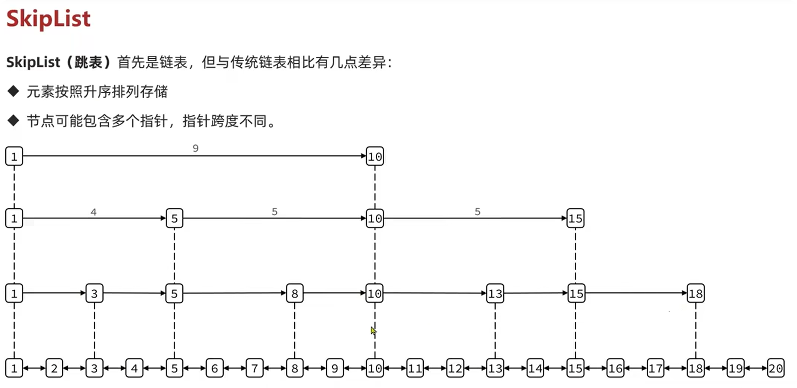
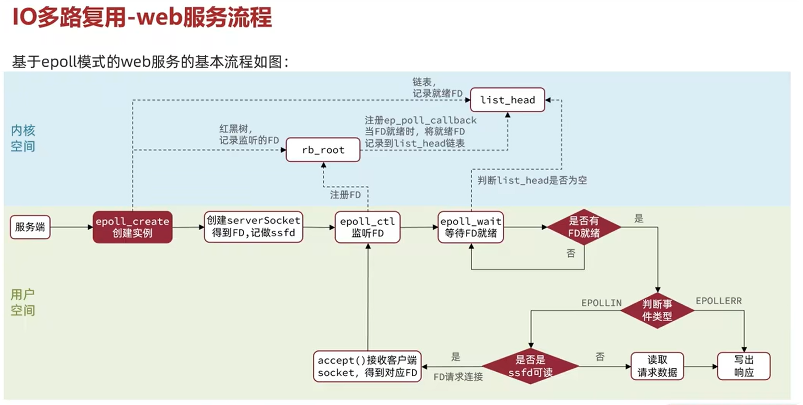
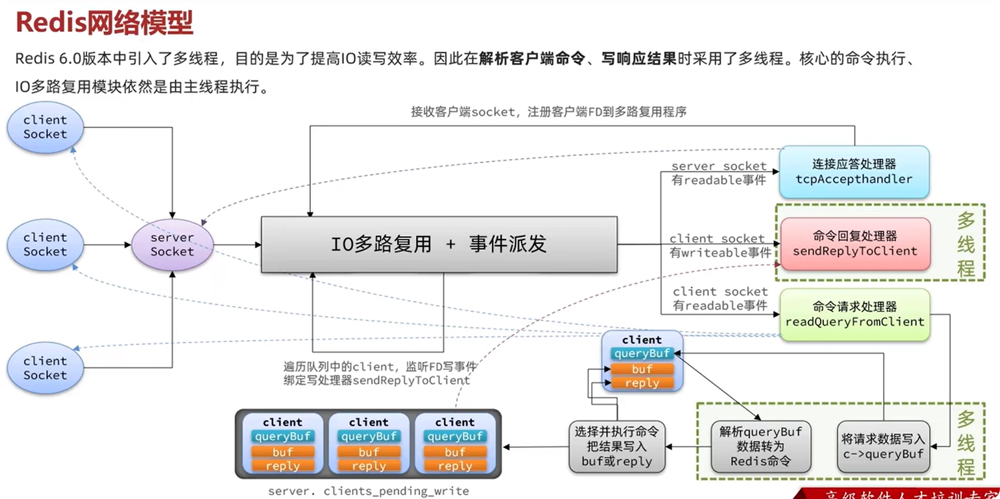
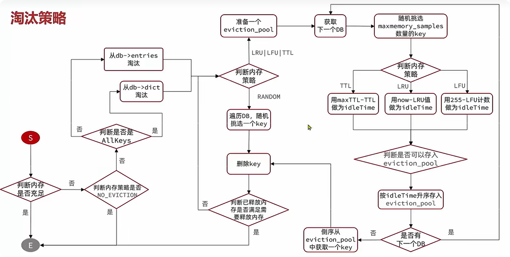

# Redis基础部分

----

## 1. 基础语法

#### 1.1.数据类型

1. **String**: 最基本的类型，可以存储任何数据，例如文本或数字。示例值为 `hello world`。
2. **Hash**: 用于存储键值对，适合存储对象或结构体。示例值为 `{"name": "Jack", "age": 21}`。
3. **List**: 有序的字符串列表，适用于队列等场景。示例值为 `[A -> B -> C]`。
4. **Set**: 不重复的元素集合，适用于需要唯一性的场景。示例值为 `{A, B, C}`。
5. **SortedSet**: 有序且唯一的元素集合，每个元素有一个对应的分数，用于排序。示例值为 `{A: 1, B: 2, C: 3}`。
6. **GEO**: 用于处理地理数据，比如位置的经纬度。示例值为 `{A: (120.3, 30.5)}`。
7. **Bitmap**: 用于存储位图，可以支持高效的位运算。示例值为 `011011010110101011`。
8. **HyperLog**: 一种用于基数估算的数据结构，节省空间。示例值为 `011011010110101011`。

----

#### 1.2.通用命令

> 1. **`help @数据类型`**：得到相应数据类型会用到的命令.
> 2. **`KEYS ***???`**：获取符合模糊匹配的所有关键字，"?"代表一个字符，"*"代表任意个字符。
> 3. **`del [keyname] [keyname]....`**：删除key。
> 4. **`EXISTS [keyname]`**：查询key是否存在。
> 5. **`EXPIRE [keyname]`**：设置过期时间。
> 6. **`TTL [keyname]`**：查看过期时间，-1表示永久有效，-2表示不存在这个key。

----

#### 1.3.String类型

> 1. **`SET [key] [value]`**: 添加或修改一个已有的String类型的键值对。
> 2. **`GET [key]`**: 根据key获取String类型的value。
> 3. **`MSET [key1 value1] [key2 value2] ...`**: 批量添加多个String类型的键值对。
> 4. **`MGET [key1] [key2] ...`**: 根据多个key获取多个String类型的value。
> 5. **`INCR [key]`**: 让一个整型的key自增1。
> 6. **`INCRBY [key] [increment]`**: 让一个整型的key自增并指定步长，例如：`INCRBY num 2`让num值自增2。
> 7. **`INCRBYFLOAT [key] [increment]`**: 让一个浮点类型的数字自增并指定步长。
> 8. **`SETNX [key] [value]`或者`SET [key] [value] NX`**: 添加一个String类型的键值对，前提是这个key不存在，否则不执行。
> 9. **`SETEX [key] [seconds] [value]`或者`SET [key] EX [value]`**: 添加一个String类型的键值对，并且指定有效期（单位：秒）。

----

#### 1.4.key的层级结构

由于Redis中没有表这一结构，于是我们会需要key按照`项目名:业务名:类型:主键id`的方式命名，但并不固定，比如mysql里面的shopping库中的goods表的id为1的数据的 key 可以表示为 `shopping:goods:1`，而这一个 key 对应的 value 可以是结构体(对象)序列化后的 json 字符串,这里值得一提的是，如果你用的`RDM`的 redis 图形化界面，这样的命名在图形化界面里面会以`树`的形式出现，显示很清晰，但是 `Datagrip` 这类软件貌似并不支持这个功能。

#### 1.5.Hash类型

```sql
key
├── field1: value1
├── field2: value2
└── field3: value3
...
```

哈希类型，它的value是一个无序字典，可以理解为key里面又存储了多个key的键值对，相较于上面json字符串形式存储数据有着一定的优势，那就是对json字符串中的单个数据进行修改很不方便，而hash类型则可以对单个字段进行CRUD。

**常用命令**:

> 1. **`HSET [key] [key] [field1] [value1] [field2] [value2]...`**: 添加或修改 hash 类型 key 的 field 的值。注：hmset也行，不过已经弃用了.
> 2. **`HGET [key] [field]`**: 获取一个 hash 类型 key 的 field 的值。
> 3. **`HMGET [key] [field1] [field2] ...`**: 批量获取多个 hash 类型 key 的 field 的值。
> 4. **`HGETALL [key]`**: 获取一个 hash 类型的 key 中的所有 field 和 value。
>    1. **`HKEYS [key]`**: 获取一个 hash 类型的 key 中的所有 field。
> 5. **`HVALS [key]`**: 获取一个 hash 类型的 key 中的所有 value。
> 6. **`HINCRBY [key] [field] [increment]`**: 让一个 hash 类型 key 的指定 field 值增加并指定步长。
> 7. **`HSETNX [key] [field] [value]`**: 添加一个 hash 类型 key 的 field 的值，前提是这个 field 不存在，否则不执行。

----

#### 1.6.List类型

可以看作是一个双向队列结构

**特征**：

- 有序
- 元素可以重复
- 支持插入和删除操作
- 查询速度一般

**常用命令**

> 1. **`LPUSH [key] [element] ...`**: 向列表左侧插入一个或多个元素。
> 2. **`LPOP [key]`**: 移除并返回列表左侧的第一个元素，没有则返回 nil。
> 3. **`RPUSH [key] [element] ...`**: 向列表右侧插入一个或多个元素。
> 4. **`RPOP [key]`**: 移除并返回列表右侧的第一个元素。
> 5. **`LRANGE [key] [start] [end]`**: 返回一段角标范围内的所有元素。
> 6. **`BLPOP [key] [timeout]`**: 与 `LPOP` 类似，在没有元素时等待指定时间。
> 7. **`BRPOP [key] [timeout]`**: 与 `RPOP` 类似，在没有元素时等待指定时间。

----

#### 1.7.Set类型

 相当于C++的 `unordered_set` 或者Java的`HashSet`，可以用于查看共同好友等，底层使用字典。

**特征**：

- 无序
- 元素不可重复
- 查找快
- 支持交集、并集、差集等功能

**常用命令**

> 1. **`SADD [key] [member] ...`**: 向 set 中添加一个或多个元素。
> 2. **`SREM [key] [member] ...`**: 移除 set 中的指定元素。
> 3. **`SCARD [key]`**: 返回 set 中元素的个数。
> 4. **`SISMEMBER [key] [member]`**: 判断一个元素是否存在于 set 中。
> 5. **`SMEMBERS [key]`**: 获取 set 中的所有元素。
> 6. **`SINTER [key1] [key2] ...`**: 求 key1 与 key2 的交集。
> 7. **`SDIFF [key1] [key2] ...`**: 求 key1 与 key2 的差集。
> 8. **`SUNION [key1] [key2] ...`**: 求 key1 和 key2 的并集。

---

#### 1.8.SortedSet类型

可以理解为C++中的Map,可以用于排行榜系统，跳表结合字典实现。

**特征**：

- 可排序
- 元素不重复
- 查询速度快

**常用命令**

> - **`ZADD [key] [score] [member]`**: 添加一个或多个元素到 sorted set，如果已存在则更新其 score 值。
> - **`ZREM [key] [member]`**: 删除 sorted set 中的指定元素。
> - **`ZSCORE [key] [member]`**: 获取 sorted set 中指定元素的 score 值。
> - **`ZRANK [key] [member]`**: 获取 sorted set 中指定元素的排名。
> - **`ZCARD [key]`**: 获取 sorted set 中的元素个数。
> - **`ZCOUNT [key] [min] [max]`**: 统计 score 值在指定范围内的所有元素的个数。
> - **`ZINCRBY [key] [increment] [member]`**: 让 sorted set 中的指定元素自增，步长为指定的 increment 值。
> - **`ZRANGE [key] [min] [max]`**: 按照 score 升序排序，获取指定排名范围内的元素，在这里，查询的排名的范围为(min, max]
> - **`ZREVRANGE [key] [min] [max]`**: 按照 score 降序排序。
> - **`ZRANGEBYSCORE [key] [min] [max]`**: 按照 score 排序，获取指定 score 范围内的元素。
> - **`ZDIFF`、`ZINTER`、`ZUNION`**: 求差集、交集、并集。


----

## 2. 数据结构

redis底层使用C语言实现，这里主要分析底层数据结构

#### 2.1 **动态字符串(SDS)**

由于C底层的字符串数组一旦遇到'\0'就会认为这个字符串数组已经结束，意味着无法存储二进制数据（如图片、音频等），为此，redis底层维护了一种数据结构:

```c
struct __attribute__ ((__packed__)) sdshdr8 {
    
    uint8_t len;       // 当前字符串长度（不包含终止符 '\0'）
    
    uint8_t alloc;     // 分配的总容量（不包含 '\0'）
    
    unsigned char flags; // 低 3 位用于标识 SDS 类型（8/16/32/64）
    
    char buf[];        // 字符串数据（最后包含 '\0'）
};

```

这样，SDS便能自己控制字符串数组的结束，事实上，为了兼容C语言，在buf中的最后也会有'\0'。

另外，除了8bit位的sds，向上还有16/32/64bit位类型的sds数据结构，用于保存不同长度的字符串。

除此之外，SDS具有动态扩容的能力，在追加字符串的时候，会分配新的内存空间，并且和go中的切片类似，在字符串很小的时候，扩容的比例很大，字符串更大的时候，扩容的比例就会逐渐变小，这就是**内存预分配**。

**优势**：

1. 获取字符串长度时间复杂度为O(1)
2. 支持动态扩容，同时允许缩短字符串，但不会主动释放空间，而是等待未来的追加操作。
3. 由于分配的内存空间会在一定程度上大于使用的空间，所以会减少内存分配次数，提高性能
4. 二进制安全

----

#### 2.2 **IntSet**

字面意思，就是整数的Set集合，基于c语言中的整数数组实现，有序(二分查找实现)，支持动态扩容，数据结构如下：

```c
typedef struct intset {
    
    uint32_t encoding;	//编码方式，支持16/32/64位整数
    
    uint32_t length;	//元素个数
    
    int8_t contents[];	//保存集合的数据
    
} intset;
```

这里值得注意的是，数据的类型并不是由contents的类型`int8_t`决定的，而是由`encoding`字段决定的.

> 虽然`intset`结构将`contents`属性声明为`int8_t`类型的数组，但实际上`contents`数组并不保存任何`int8_t`类型的值，`contents`数组的真正类型取决于`encoding`属性的。

由于这里没有遵循C语言的规范，所以之后的关于IntSet的增删改查都是由redis自己实现的。

IntSet还支持**动态升级**，当新插入的数字超出了当前数字编码所能表示的范围，当前集合的所有数据都会被升级，比如说，当前集合存储的所有数据都是int16，而当前插入一个114514，超出了这个集合能表示的范围，此时，集合中的所有数据的数据类型都会升级为int32，并更新编码方式为32位编码，具体过程如下：

1. 更新编码方式，扩容。
2. 倒序将元素重新插入数组(正序插入会导致数据覆盖)。
3. 将待添加的元素插入在数组中合适的位置

----

#### 2.3 **Dict(字典)**

redis中的K-V键值对的映射关系，正是Dict这一数据结构实现的，也正相当于我们所熟知的哈希表。

一个节点的数据结构：

```c
struct dictEntry {
    void *key;  // 存储键（Key）

    union {  // 存储值（Value），支持不同类型
        void *val;      // 通用指针，可存储字符串、结构体等
        uint64_t u64;   // 存储无符号整数
        int64_t s64;    // 存储有符号整数
        double d;       // 存储双精度浮点数
    } v;

    struct dictEntry *next;  // 指向下一个 `dictEntry`，用于解决哈希冲突（拉链法法）
};
```

一个节点很好懂，并且可以看出，redis底层的哈希表是通过拉链法来实现的，当产生哈希冲突的时候，采取的是头插法，效率更高。

在最新的版本中，dictht被合并到了dict结构体中，数据结构如下：

```c
struct dict {
    dictType *type;           //哈希函数

    dictEntry **ht_table[2];  // 两个哈希表指针（ht_table[0] 正常使用，ht_table[1] 进行 rehash）
    unsigned long ht_used[2]; // 记录两个哈希表中存储的 entry 数量

    long rehashidx;           // 记录 rehash 进度，-1 表示没有进行 rehash

    //为了减少结构体的填充
    unsigned pauserehash : 15;  // 是否暂停 rehash
    unsigned useStoredKeyApi : 1; // 是否使用存储的 key API（内部优化）

    signed char ht_size_exp[2]; // 存储哈希表大小的指数（size = 1 << exp）
    int16_t pauseAutoResize;   // 是否暂停自动调整大小
    void *metadata[];          // 额外的元数据（可扩展）
};
```

**为什么这里会有两个哈希表指针？**

和go语言类似，这里涉及到我们的扩容操作，redis中也有着**负载因子**(存储元素和桶的比值)的概念，每次插入新的kv的时候，都会检查负载因子，同时在以下情况会触发rehash：

1. 当哈希表的负载因子 > 1.0，并且此时没有执行后台进程的时候
2. 负载因子 > 5.0的时候，会强制扩容

除了扩容，当然也有缩容的操作，当负载因子小于1/8，允许缩容(可能会受到其他条件的限制，而导致无法缩容)，当负载因子小于1/32时，会强制缩容。

两个方法的终点都是`int _dictResize(dict *d, unsigned long size, int* malloc_failed)`这个方法，在这里，会重新分配给`h_table[1]`新的空间，而`h_table[0]`作为我们旧的哈希表继续存在，一般来说，扩容时当前已经使用空间**used + 1**距离最近的一个2的n次方，而缩容则是**used**距离最近的2的n次方，此时，**rehash**才要刚刚开始。

##### **Rehash**

Rehash这一步的时候，扩容已经完成，此时首先为h_table[0]中的元素重新计算哈希值，并迁移到h_table[1]中，随后将h_table[0]的指针指向h_table[1]指向的空间，随后将h_table[1]指针置为NULL，此时我们的rehash就算完成了。

**重点来了**，事实上，重新分配内存之后，并没有直接进行数据迁移，而是进行**渐进式rehash**，每次在进行增删查改的时候，只迁移一个桶中的数据，所以并不会带给cpu过大的压力，因为如果一次性迁移完成的话，会导致cpu阻塞而无法执行其他操作，对用户十分不友好。

同时，在执行增删查改的时候，增只在新表中执行；删则是先从旧表中找，如果找到了直接删除，没找到再从新表中找；查询操作则是先查旧表，如果没找到，则查新表；修改操作则是先在旧表中找数据，找到则修改，没找到就在新表中找。


----

#### 2.4 **ZipList**

被称作**双端链表**，可以在头部和尾部实现O(1)的插入和删除，根据这个性质我感觉更像双端队列

ziplist是由一段特殊编码的**连续**内存块组成的，结构如下：

> zlbytes(存储链表占用的内存长度) -> zltail(记录头节点到尾节点的距离) -> zllen(节点数量) -> entry(节点) -> entry -> entry... -> zlend(结束标识)

其中，每个节点(entry)的长度并不固定，虽然源码中的结构体并不是真正的编码方式，还是在这里列一下吧：

```c
/* 该结构体用于解析 ziplist 中的条目元信息（非实际存储格式，仅为操作方便而设计） */
typedef struct zlentry {
    unsigned int prevrawlensize; // 存储【前一个节点长度】所需的字节数（1或5字节）
                                 // 规则：若前节点长度<254则用1字节，否则首字节0xFE+4字节长度
    
    unsigned int prevrawlen;     // 前一个节点的实际长度（字节数）
                                 // 作用：通过【当前地址 - prevrawlen】可快速定位前节点
    
    unsigned int lensize;        // 存储【当前节点类型/长度】所需的字节数
                                 // 字符串：1/2/5字节头 | 整数：固定1字节（类型和长度合并编码）
    
    unsigned int len;            // 当前节点数据的实际长度（字节数）
                                 // 字符串：字符数量（如"abc"为3）| 整数：根据类型占1/2/3/4/8字节
    
    unsigned int headersize;     // 节点头总大小 = prevrawlensize + lensize
                                 // 关键用途：p + headersize 直接跳转到数据区域
    
    unsigned char encoding;      // 编码类型标记（ZIP_STR_* 或 ZIP_INT_*）
                                 // 注意：0~12的4位小整数直接存于encoding，需特殊处理
    
    unsigned char *p;            // 指向当前节点起始地址（即prevrawlensize字段的位置）
                                 // 用途：修改节点时可直接操作原始内存
} zlentry;
```

看起来很复杂，我们可以简化为以下结构：

> previous_entry_length -> encoding(字符串/整数/长度) -> content

以上的数据在实际的存储结构中都可以灵活改变，也就是说**entry**长度并不固定，这节省了很大的内存

我们可以看到，每个节点事实上并没有存储前一个节点的指针和后一个节点的指针，而是记录了前一段节点和当前节点的长度来实现了一个**链表**，可以满足逆序和正序遍历，为什么不用指针呢？因为指针更占空间，我们知道，redis是内存存储数据，所以内存很宝贵！

值得一提的是，当存储类型为整数，且在一定范围内的时候，会直接将数值存储在encoding中！

##### **连锁更新问题**

**连锁更新**问题是什么？比方说，我们有很多长度为250\~253的entry节点，此时，往前面插入一个254长度的节点，那么此时previous_entry_length需要记录的长度>253，所以需要升级为5个字节来表示前一个节点的长度，那么此时，这个节点的总长度也会变，也就是说，之后的长度在250\~253之间的节点都会发送连锁的改变，进而导致插入更新一个节点会导致整个ziplist的变化，每次变化都会涉及到内存的申请，迁移，销毁，还有可能会牵扯到内核态的切换，进而带来性能开销。

虽然ziplist这个问题并没有被官方解决掉，但是却引入了一个新的数据结构**listpack**来解决这个问题，同时，这个问题发生的概率也是极低的，但是不代表不会发生！


----

#### 2.5 **QuickList**

是一个真正的**双端链表**，每一个节点都是一个**ZipList**

**为什么要这样做？**

ziplist虽然节省内存，但是如果内存占用过多，申请内存的效率就会很低，我们需要限制ziplist的大小，而怎么来存储大量的数据呢？答案就是使用多个ziplist，将他进行分片存储数据，然后由QuickList统一管理，同时，通过`list-max-ziplist-size`这个配置项来管理ziplist的最大大小，同时还会有一个压缩的配置选项`list-compress-depth`来控制压缩，压缩算法采取LZF，压缩可以减少内存占用，提高存储效率


---

#### 2.6 **SkipList(跳表)**

跳表首先是链表，以上两种表，虽然在头尾读写的时候性能优异，但是如果要在中间随机查找，性能就会大打折扣了，因此，还有一种数据结构叫做**跳表**，他有以下特点：

1. 元素升序排列
2. 每个节点可能包含多个指针，且跨度不同(跨越多个节点)，最多32层指针。

由于是升序排列，所以性能比较高，再加上**多个指针**的优势，查找的性能就更高了，这里加个图，来源于黑马程序员的redis教程的ppt，这个结构看起来其实很像B+树，而上方的指针则相当于索引，插入和查找的效率均为O(logN)

另外的，skiplist的底层存储的数据就是**SDS**，而排序则是利用的索引，有一个字段score来帮助排序，性能和红黑树差不多，但是实现更为简单。(这很明显)


----

#### 2.7 **RedisObject**

redis中任意数据类型的键和值都会被封装非RedisObject，也叫做redis对象，数据结构如下：

```c
struct redisObject {
    unsigned type:4;      // 4 位表示对象的类型，zset，string，hash等类型
    unsigned encoding:4;  // 4 位表示对象的编码方式
    unsigned lru:LRU_BITS; // 最近一次被访问的时间
    int refcount;         // 引用计数，为0时，可以被回收
    void *ptr;            // 指向底层数据的指针
};
```

同时如果string类型被频繁的使用，那么每一个string都会有一个redisObject头来表示string，这就造成了更多的空间浪费，所以如果存储大量数据的时候，最好还是采取集合的形式。

同时，redis中的基本数据类型都是由这些底层设计的数据结构衍生而来：

| **Redis 数据类型**   | **小数据量的底层结构**    | **大数据量的底层结构**                         |
| -------------------- | ------------------------- | ---------------------------------------------- |
| **String**（字符串） | **SDS（简单动态字符串）** | **SDS（同样是 SDS，只是更大）**                |
| **List**（列表）     | **listpack（列表包）**    | **quicklist（快速列表，listpack + 双端链表）** |
| **Hash**（哈希）     | **listpack（列表包）**    | **dict（哈希表）**                             |
| **Set**（集合）      | **intset（整数集合）**    | **dict（哈希表，值为 NULL）**                  |
| **Zset**（有序集合） | **listpack（列表包）**    | **skiplist（跳表）+ dict（哈希表）**           |

对于redis7.0之前的版本，那么listpack替换为Ziplist即可。

#### --------------

#### 2.8 **String**

基本编码方式为Raw，存储上限为512MB，如果存储的SDS长度小于44字节，则会采用EMBSTR编码，此时object head和SDS是一段连续的空间，申请内存只需要调用一次内存分配函数，具有更高的效率，所以使用string时尽量不要超过这个值。

如果存储的字符串是整数，并且在范围内，则会采取INT编码，直接保存在RedisObject head的ptr指针上面，这样更加节省了内存。

#### 2.9 **List**

Redis中的list支持快速操作首尾的元素。

因此，list由Quicklist和ZipList(最新版为listPack)实现

当数据量很小的时候，会采用ListPack作为底层数据结构，而在数据逐渐增多的时候，则会升级为QuickList，在源代码中，list底层结构的升级和降级具体体现在`static void listTypeTryConversionRaw(参数)`，会根据当前list的状态，判断是否需要升级或者降级操作。

----

#### 2.10 **Set**

Set，也就是集合，具有无序性，唯一性(需要判断元素是否存在)，可以求交集并集和差集。(梦回高中数学)

综上，Set对**查询**的要求比较高，于是底层采用了Dict(字典)编码，Key来存储数值，而Value统一为NULL，与此同时，当存储的数据都为整数的时候，如果元素数量不超过一定值，统一采取IntSet编码，这个定值可以通过修改`set-max-intset-entries`来修改。

#### 2.11 **ZSet**

有序的集合，每个元素都需要设置一个member和score值，member就相当于是Set中的元素，具有唯一性，顺序通过score来确定。

 有序，同时还需要member->score的映射，具有快速查找的功能，Skiplist可以存储member和score，实现有序性，而Dict可以存储member到score的映射，实现快速查找，因此，ZSet底层采用的是SkipList和Dict结合的形式来实现这样的**有序集合**。

除此之外，当元素数量比较小的时候，跳表和字典的优势并不明显，且更消耗内存，所以在元素数量比较小，且元素长度不大的时候，会使用ZipList(最新版为ListPack)来作为ZSet的底层实现，以此来节省内存，**但是**由于ziplist本身并没有排序功能，怎么办呢？此时会按照两个原则进行存储：

1. score和element紧挨一起
2. score越小，越靠近队首，越大，越靠近队尾。

这样也能实现ZSet的需求。


---

#### 2.12 **Hash**

和ZSet很类似，但是它的value可以存储任何值，且无序。

所以在数据量较少的时候，也是通过ZipList编码，以节省内存，而数据量较大(超过了`hash-max-ziplist-entries`)或者某个entry过大(超出`hash-max-ziplist-value`)的时候，就会将ziplist转换成Dict编码。


----

## 3. 网络模型

#### 3.1 **用户空间和内核空间**

为了避免用户应用导致重读甚至内核崩溃，用户应用和内核是分离的，而进程的寻址空间会划分为两部分：内核空间和用户空间。

命令分有等级，r0，r1, r2, r3，用户空间只能执行受限的命令，而想要执行特权命令，只能通过内核提供的接口来访问；而内核空间可以调用一切系统资源。

Linux为了提高IO效率，用户空间和内核空间都有**缓冲区**，写数据时，要把用户缓冲数据拷贝到内核缓冲区，然后写入设备，读数据时，要从设备读取数据到内核缓冲区，然后拷贝到用户缓冲区。

**tips**：用户和内核的读写操作很像Client和Server之间的读写交互，以我现在的知识来看，和[Orpc](https://github.com/R-Goys/Orpc)是很相似的，各种地方都很相似。

#### 3.2 **I/O**

**阻塞I/O**

阻塞I/O，字面意思，即在发起读，或者写请求的时候都会陷入阻塞等待的状态，期间无法执行其他操作。

**非阻塞I/O**

非阻塞I/O则是会立即返回结果，如果没有读取到数据，则会立刻返回错误，但是用户应用会不停地去重新调用读取，直到数据准备就绪，但是在拷贝数据的时候，依旧是阻塞的状态，但是这种性能不仅没有提高，反而还降低了。

在这个时候，就需要结合我们的**I/O多路复用技术**，同时，这里还需要引入一个**文件描述符(fd)**的概念，IO多路复用就是利用单个线程同时监听多个fd，并在某个fd可读/可写的时候得到通知，从而避免了无效的等待，充分利用cpu的资源。

另外，监听FD的方式，通知的方式还有以下常见的实现：

**select**

- 只会监听一组fd(最多1024个)的状态，并且每次select都会将所有要监听的fd拷贝到内核，之后再拷贝回来，而且虽然能够知道返回了信号，但是无法知道信号来自哪个fd，只能线性扫描所有的fd来判断。

**poll**

- 可以同时监听任意数量的fd，但是局限性依旧与select一样，无法知道信号来自那里，只能线性扫描fd。

**epoll**

- 高效，不仅能够监听大量fd，同时用红黑树维护所有被监听的fd，fd的插入/删除/修改操作均为O(logN)，除此之外，不像以上两种轮询模型，epoll采取的是事件驱动模型，在事件返回时，内核会将该就绪的fd放入就绪链表，然后拷贝回用户空间，这样一来就避免了遍历所有fd，实现了O(1)的查找。
- 每个fd都只会执行一次epoll_ctl来将fd添加到红黑树中，而epoll_wait无需传递任何参数，无需重复拷贝。

#### 3.3 **事件通知**

epoll默认的通知模式是**LT(Level Triggered)**，在有事件返回的时候，会不断通知用户有事件准备就绪，直到事件全部处理完成，然后还有一种事件通知模式叫做**ET(Edge Triggered)**，只有在事件从无事件到有事件的时候，才会通知一次，在之后就不会反复触发了，这个情况下，可能导致缓冲区的数据没有被读取完，从而造成数据丢失。

那么ET怎么解决这个问题呢？事实上，我们在每次读取数据之后，如果没有读取完，可以再调用epoll_ctl将没有被读取完的数据再放回到内核的就绪链表中，然后再次通知，但是这就相当于LT的模式了，并不是标准的处理方式。

思想很单纯，由于通知只有一次，所以在通知的时候，直接将所有的数据都读取完就可以了，如何实现？

实现的方法一般是**非阻塞I/O + recv()循环读取**，当没有数据返回时，就会立即返回EAGAIN，从而结束循环。

这样，ET就能防止反复调用epoll_wait，从而具有更高的性能和稳定性，但是实现更加复杂。

#### 3.4 **Web服务流程**

在web服务中，通常都是基于tcp协议，而在tcp协议中，服务端在linux内部，也会被看成一个文件，叫做ssfd(server socket fd)，随后将ssfd通过epoll_ctl注册到红黑树中来监听，随后进入到epoll_wait去检查就绪链表中是否存在就绪的fd，如果存在，还需要判断当前时间就绪的对象，如果是ssfd(这表示新的客户端来了)，那么则调用accept()去拿到客户端的fd，随后注册到红黑树上，继续监听；如果当前就绪的是client_fd，则说明客户端socket有数据需要读取，随后读取其中的请求参数去处理业务逻辑，处理完成后，发生http相应给客户端。

这里借用一下黑马程序员的流程图：

除此之外，go的netpoll也是基于epoll实现的。

**信号驱动I/O**

首先执行系统调用`sigaction`与内核建立sigio的信号关联并且设置回调函数，等待期间可以执行其他业务，**真正的阻塞**，当内核有fd就绪时，会发送sigio信号通知用户，同时，在接受数据的时候，也是阻塞的。**但是**，这种模式看起来很好，但是事实上的SIGIO是在内核中以队列的形式维护的，一旦并发量过大，就可能会造成信号丢失，并且内核和用户态频繁的信号交互性能也会受到影响，所以这种方法不太常用。

**异步I/O**

完全的非阻塞，从发送信号到等待事件就绪，到数据拷贝完成，都是非阻塞的。**但是**，这种方法也是不太常用的，因为也是在高并发的情况下，用户态会不停的向内核发送信号，使得内核的任务不断积压，而内核的读写效率是比较慢的，最终可能会因为内核内存占用过大而导致崩溃。

我们又提到了异步，关于同步还是异步，他们的区别就在于向内核发起事件之后的第二阶段(数据拷贝)是阻塞还是非阻塞的。


----

#### 3.5 **Redis的网络模型**

**Q**：redis到底是单线程还是多线程的？

**A**：Redis 核心数据操作是单线程的**，但 **某些操作是多线程的**，具体如下：

| 组件                        | 单线程 / 多线程 | 说明                                                         |
| --------------------------- | --------------- | ------------------------------------------------------------ |
| **数据读写（SET/GET/DEL）** | **单线程**      | 主要的数据操作是单线程的，避免了锁争用，提高性能。           |
| **事件处理（网络 I/O）**    | **单线程**      | 采用 `epoll`（Linux）等多路复用技术，单线程处理多个连接。    |
| **持久化（RDB / AOF）**     | **多线程**      | RDB 快照和 AOF 重写是由 **后台线程** 进行的，不影响主线程性能。 |
| **IO 线程（Redis 6.0+）**   | **多线程**      | `io-threads` 选项允许多个线程处理网络 I/O，提高吞吐量。      |

> **Redis V4.0** 的时候，引入多线程异步处理耗时较长的任务(比如删除bigkey)
>
> **Redis V6.0** 的时候，在网络模型中引入多线程，提高对于多核CPU的利用率。

此时又有一个问题，**为什么Redis选择了单线程？**

1. Redis是纯内存操作，执行速度非常快，其性能瓶颈是网络延迟而不是执行速度，多线程不会带来巨大的性能提升。
2. 多线程频繁的上下文切换回带来不必要的性能开销
3. 多线程面临线程安全问题，会引入锁不仅导致复杂度提高，性能也会下降

----

**Redis的运行流程**：

1. 在src/server.c中的main函数中，会调用`initServer()`来初始化Redis服务端，在这个函数中，会调用`aeCreateEventLoop()`来创建一个事件循环，也就是epoll的实例，多路复用的程序。
2. 回到main函数，由 `initListeners()` 设置监听套接字并注册到事件循环，同时，在这里会为服务端事件监听注册回调函数，这个回调函数会将监听到的客户端也注册到事件之中，同时该客户端的回调函数和服务端的回调函数并不相同，客户端的回调函数是将返回的信息写入，返回给客户端，
3. 随后调用`aeMain()`来运行事件循环，开始监听服务端的事件，一旦有服务端准备就绪，此时说明有客户端请求连接，需要调用`tcpAccepthandler`将客户端fd注册到事件中，那么当客户端发送数据请求的时候，触发`readQueryFromClient()`从客户端读取数据，开始处理请求，随后写入到写出缓冲区，当然，如果缓冲区不够写了，就会写入到`reply`链表中(理论无限大)，然后去处理其他请求，**注意**，此时并没有将响应写回给客户端！
4. 而在beforeSleep这个函数中，会再次注册一个客户端的socketfd事件，当监听到客户端可写的时候，就会调用`sendReplyToClient`真正的将缓冲区的数据写回到客户端的socket中。

而在Redis 6.0之后，虽然核心命令依旧是单线程执行，但是为了提高I/O读写效率，在解析客户端命令，写响应结果的时候采用了多线程执行。

源于黑马的整个流程图：



## 4. 通信协议和内存回收

#### 4.1 **RESP协议**

redis是一个**C**(Client)/**S**(Server)架构的软件，通信分两步：

1. Client向Server发送命令
2. Server解析并执行，返回相应结果给Client

因此发送命令，返回响应的格式需要有一个规范，这就是通信协议

虽然在Redis 6.0版本中，RESP2协议升级到了RESP3，但是默认依旧是RESP2。

**数据类型**

RESP中，通过首字节的字符来区分不同的数据类型，比如：

- 单行字符串的首字节为'+'，以"\r\n"结尾，返回"OK"，则表示为"+OK\r\n"
- 错误信息：首字节为'-'，其余都和单行字符串一样。
- 数值：首字节为':'，结尾"\r\n"。
- 多行字符串：以'$'开头，二进制安全的字符串，通过记录字符串的长度来维护字符串，无需担心特殊字符，大小为0，表示空字符串，大小为-1，表示不存在。
- 数组：首字节为'*'，记录数组元素个数，再跟上元素，数据类型不限。比如像`set name 原神`这个命令就是以数组的格式发送的。

了解完这些，就可以用socket去手撕一个redis客户端了~

#### 4.2 **内存回收**

Redis具有强大的性能，最主要的原因就是基于内存存储，然而单节点的redis内存不宜过大，会影响主从同步和持久化的性能，我们可以通过`maxmemory`来修改内存上限。

我们能够通过给Redis的Key设置TTL过期时间，从而达到释放对应的内存，那么此时有这两个问题：

1. **Redis是如何知道有一个Key要过期了？**

2. **TTL到期就立刻删除key吗？**

下面来解释一下这两个问题。

首先要看看RedisDB的结构体：

```c
/* Redis 数据库结构表示
 * 每个 Redis 实例可以包含多个数据库（默认 16 个），
 * 通过从 0 开始的整数 ID 进行标识（默认数据库 ID 为 0）。
 */
typedef struct redisDb {
    kvstore *keys;  /* 该数据库的 key-value 存储（取代旧版的 dict 结构） */

    kvstore *expires;  /* 存储 key 的过期时间（取代旧版的 dict *expires） */

    ebuckets hexpires;  /* 哈希类型 key 的过期时间存储结构：记录下一个最早要过期的字段 */

    dict *blocking_keys;  /* 记录因阻塞操作（如 BLPOP）而等待数据的 key */

    dict *blocking_keys_unblock_on_nokey;  /* 记录因 `XREADGROUP` 等命令阻塞的 key，
                                            * 并且在 key 被删除时应解除阻塞 */

    dict *ready_keys;  /* 记录已经解除阻塞的 key（因为有新的数据被 PUSH 进来） */

    dict *watched_keys;  /* 事务中使用的 WATCH 机制，存储被监视的 key */

    int id;  /* 数据库 ID（默认 0 号数据库，最大值由配置决定） */

    long long avg_ttl;  /* 该数据库 key 的平均 TTL（仅用于统计） */

    unsigned long expires_cursor;  /* 过期 key 主动清理时使用的游标 */

    list *defrag_later;  /* 记录需要逐步进行碎片整理的 key */
} redisDb;
```

在这个结构体中，第一个dict字典保存的是所有的键值对的信息(包括具有过期属性的key)，而expires字典仅保存设置了过期时间的key，这里我们重点关注这两个字段。知道了这一点，我们就能够回答第一个问题了。

第二个问题，由于在大量的key环境下，去监听每一个key的过期时间会造成巨大的性能损耗，所以redis中的Key执行的是**惰性删除**，当一个Key到期的时候，我们不需要去管他，直到我们需要访问这个Key的时候，去判断他过没过期，如果过期了，就直接删除，返回nil，如此，便能减少性能损耗，**但是**如果一个Key已经过期了，而且很久都不去访问，内存很宝贵，这时候惰性删除就无法满足我们的需求，Redis又引入了一个**周期删除**的策略，顾名思义，周期性的抽样部分过期的key，然后执行删除，有以下两种方式：

- 设置定时任务serverCron()，按照server.hz的频率(默认为10)执行过期的key清理，模式为SLOW。(耗时较长，所以低频长期清理)
  - SLOW模式：执行频率默认为0，每个执行周期100ms；执行清理耗时不超过一次执行周期的25%；逐个遍历db中的bucket，保证每个key都能够被抽样到；如果没有达到时间上限没有超过25ms，并且当前过期的key的比例比例过大，则会再执行一次抽样。
- Redis每个事件循环前都会调用beforeSleep()，执行过期的Key清理，模式为FAST。(用时短，所以频率较高)
  - FAST模式：执行频率就是beforeSleep()的频率，两次FAST间隔不低于2ms；执行清理耗时不超过1ms；同样也是逐个遍历bucket；如果没有达到1ms，并且过期key比例过大，则再执行一次抽样。

简单来说，Redis的删除就是**惰性删除 + 周期删除**的模式，在节省内存和性能优化方面做到了平衡。

#### 4.3 **内存淘汰策略**

当redis内存使用到达设置的阈值时，Redis需要主动挑选部分Key来释放内存，而如何挑选，就是我们需要了解的redis的淘汰策略了。

在任何命令执行之前，都会执行内存的检查，如果超出了限制，则会删除部分Key来释放内存，当然，如果释放失败了，则会拒绝命令的执行。

Redis支持的淘汰策略：

- 默认不淘汰任何Key，内存满时不允许写入新数据。
- 过期时间越短，越先淘汰。
- 随机淘汰。
- 有过期时间的Key随机淘汰。
- 全体LRU(最少最近使用)/LFU(最少频率使用)。
- 设置过期时间的Key进行LRU/LFU。

那么，LRU和LFU是如何统计的呢？这就需要回到我们的RedisObject对象了：

```c
struct redisObject {
    unsigned type:4;          // 4 位表示对象的类型，zset，string，hash等类型
    
    unsigned encoding:4;     // 4 位表示对象的编码方式
    
    unsigned lru:LRU_BITS;  // LRU:以秒为单位最近一次被访问的时间
    							//LFU:高16位以分钟为单位记录最近一次访问的时间，低								  
    ·							//八位保存逻辑访问次数(每次访问+1的概率越来越小)
    							//且会随时间进行衰减。
    int refcount;         // 引用计数，为0时，可以被回收
    
    void *ptr;            // 指向底层数据的指针
};
```

虽然有这样一个字段帮助我们来统计过期时间，但是如果有成千上万个Key，我们应该逐个去比较然后执行LRU/LFU吗？实际上Redis并没有这样做，而是维护了一个`eviction_pool`淘汰池，在其中会抽样挑选一些Key来进行LRU/LFU的淘汰策略，总体的流程图如下(源自黑马程序员):




----

## 5. 分布式缓存

单点redis具有数据丢失，并发能力，存储能力和故障恢复的问题，所以就需要我们提供一定的解决方案。

#### 5.1 **持久化**

**RDB持久化**

全称`Redis Database Backup file`，就是将redis所有数据记录到磁盘上，当redis实例故障重启后，从磁盘读取快照文件，恢复数据，RDB文件默认保存在当前运行目录。

通过`save`命令可以阻塞地保存快照(不推荐)，`bgsave`可以开启子进程执行RDB。

虽然Redis每次停机都会自动做RDB保存，但是如果故障宕机，是不会进行保存的，这样数据就全丢了！所以我们需要redis定期进行RDB保存。

而在redis.conf文件中，可以找到形如

```c
//900秒内，若至少有一个Key被修改，则执行bgsave.
save 900 1
save 300 10
save 60 10000
//是否压缩，不推荐，压缩会消耗cpu，且硬盘不值钱
rdbcompression yes
//RDB文件名称
dbfilename dump.rdb
//文件保存的路径目录
dir ./
```

的配置文件，如果是`save ""`则表示禁用RDB。

除此之外，bgsave是通过fork()来得到一个子进程，在子进程中读取内存数据，然后写入RDB文件，在这里事实上就是操作系统的知识了，值得一提的是，fork()采取了写时复制(Copy On Write)的策略，在fork()一个进程的时候，仅仅是复制了页表，并不会真正将数据拷贝到新的地址空间，事实上这两个进程在底层最开始是共享地址空间的，而当其中一个进程进行写入操作时，才会真正的将**部分数据(数据被修改的页)**进行拷贝，让这部分数据迁移到新的地址空间，从而实现父进程和子进程互不干扰，Redis采取**fork()** + **COW**这样避免大规模内存复制，从而提高了性能，但是这种模式可能会导致**脏页**和**数据不一致**的情况发生。


**AOF持久化**

AOF，全称Append Only File(追加文件)。redis处理的每一个写命令都会追加到AOF文件中，可以看成是日志文件。

而故障宕机，再恢复，只需要一个一个再将AOF文件中保存的命令再执行一遍即可，默认关闭。

相比与RDB，数据具有一致性，不会产生脏页的情况，配置文件如下：

```c
appendonly yes //是否开启AOF功能
appendfilename "appendonly.aof"  //AOF文件的名称
    
appendfsync always  //是否每执行一条写命令，立即记录到aof文件(性能差)
appendfsync everysec   //写命令执行完先放入aof缓冲区，然后每隔一秒将缓冲区数据写道AOF(默认，性能大于always)
appendfsync no		//写命令执行完放入AOF缓冲区，由操作系统决定何时写回磁盘，(性能最高，但是可靠性差)
```

缺点是数据冗余更多，如果多次对一个key进行复制，那么就会产生冗余的记录，但是可以通过执行`bgrewriteaof`(后台异步处理)命令让AOF文件执行重写功能，对命令进行优化，尽管如此，AOF文件依旧很大。

`bgrewriteaof`也存在配置文件使得可以自动重写aof文件：

```c
auto-aof-rewirte-percentage 100  //AOF文件比上次增长超过多少百分比触发重写
auto-aof-rewrite-min-size 64mb  //AOF文件体积最小多大以上才触发重写
```

**两者对比**

| 特性           | RDB                                          | AOF                                                      |
| -------------- | -------------------------------------------- | -------------------------------------------------------- |
| 持久化方式     | 定时对整个内存做快照                         | 记录每一次执行的命令                                     |
| 数据完整性     | 不完整，两次备份之间会丢失                   | 相对完整，取决于刷盘策略                                 |
| 文件大小       | 会有压缩，文件体积小                         | 记录命令，文件体积很大                                   |
| 宕机恢复速度   | 很快                                         | 慢                                                       |
| 数据恢复优先级 | 低，因为数据完整性不如AOF                    | 高，因为数据完整性更高                                   |
| 系统资源占用   | 高，大量CPU和内存消耗                        | 低，主要是磁盘IO资源，但AOF重写时会占用大量CPU和内存资源 |
| 使用场景       | 可以容忍数分钟的数据丢失，追求更快的启动速度 | 对数据安全性要求较高场景                                 |

**混合持久化**

混合持久化融合了两者的优点，保证了尽可能地少丢数据以及故障恢复更快。

何意味？我们的混合持久化并非两者的文件都要使用，而是将 rdb 文件和 aof 文件混合写入到一个文件来实现持久化，前半使用 rdb 模式，后半段使用 aof 模式，我们的快照恢复会自行识别这种快照文件。

AOF 重写日志时，会将当前 fork 出来和主进程共享的数据以 rdb 的形式写入到快照文件的前半部分，而过程中执行的指令写到 aof 缓冲区，之后会以 aof 的形式写入到快照文件中，正常数据写入的时候，都会使用 aof 模式进行追加，于是有了两者的优点。

---

#### 5.2 **主从集群**

首先如何快速搭建一个redis集群？docker-compose才是版本答案。

```c
networks:
  redis-net: 

services:
  redis-master:
    image: redis:latest
    container_name: redis-master
    restart: always
    networks:
      - redis-net
    ports:
      - "6379:6379"
    command: "redis-server /etc/redis-config/redis.conf"
    volumes:
      - "./data/master:/data/"
      - "./config/redis-master:/etc/redis-config"
      
  redis-slave1:
    image: redis:latest
    container_name: redis-slave1
    restart: always
    depends_on:
      - redis-master
    networks:
      - redis-net
    ports:
      - "6380:6379"
    command: "redis-server /etc/redis-config/redis.conf --replicaof redis-master 6379"
    volumes:
      - "./data/slave1:/data/"
      - "./config/redis-slave:/etc/redis-config"

  redis-slave2:
    image: redis:latest
    container_name: redis-slave2
    restart: always
    depends_on:
      - redis-master
    networks:
      - redis-net
    ports:
      - "6381:6379"
    command: "redis-server /etc/redis-config/redis.conf --replicaof redis-master 6379"
    volumes:
      - "./data/slave2:/data/"
      - "./config/redis-slave:/etc/redis-config"


  sentinel1:
    image: redis:latest
    container_name: redis-sentinel1
    networks:
      - redis-net
    ports:
      - "26379:26379"
    command: "redis-server /etc/redis-config/redis1.conf --sentinel"
    volumes:
      - "./config/redis-sentinel:/etc/redis-config"
    depends_on:
      - redis-master
      - redis-slave1
      - redis-slave2

  sentinel2:
    image: redis:latest
    container_name: redis-sentinel2
    networks:
      - redis-net
    ports:
      - "26380:26379"
    command: "redis-server /etc/redis-config/redis2.conf --sentinel"
    volumes:
      - "./config/redis-sentinel:/etc/redis-config"
    depends_on:
      - redis-master
      - redis-slave1
      - redis-slave2
      
  sentinel3:
    image: redis:latest
    container_name: redis-sentinel3
    networks:
      - redis-net
    ports:
      - "26381:26379"
    command: "redis-server /etc/redis-config/redis3.conf --sentinel"
    volumes:
      - "./config/redis-sentinel:/etc/redis-config"
    depends_on:
      - redis-master
      - redis-slave1
      - redis-slave2
      

volumes:
  redis-master-data:
  redis-slave1-data:
  redis-slave2-data:
  sentinel_data1:
  sentinel_data2:
  sentinel_data3:

```

如果不想要用docker部署咋办？[看这里](https://www.bilibili.com/video/BV1cr4y1671t?vd_source=0bf1193df544e31410c7f86025afb72b&spm_id_from=333.788.player.switch&p=101)。

----

**为什么需要主从集群？**

单节点的Redis并发能力是有上限的，为了提高redis的并发能力，就需要这样一个集群，从而实现读写分离。

**主从同步原理**

主从第一次同步是全量同步，我们可以看到，在docker-compose里面有一个replicaof命令，这就是建立主从同步的连接，在执行这个命令的时候，先会尝试**增量同步**，如果判断为无法进行增量同步，即判断为不是第一次执行该命令，此时则先要返回主节点数据的版本信息，然后从节点将版本信息保存，确保版本信息的记录，这样可以做一个版本控制，然后主节点执行`bgsave`命令，生成RDB文件之后，将RDB文件发给从节点，保持数据**基本一致**，我们知道RDB是可能产生数据不一致的情况的，所以我们的Redis还有一个缓冲区`repl_baklog`记录我们在执行bgsave之后输入的命令，随后发送给从节点。

master如何知道从节点是否为第一次同步？，这里有两个概念：

**replid(Replication Id)**，id一致说明是同一个数据集，每一个master都有唯一的replid，slave则会继承master的replid，如果请求同步的时候，ID不一致，主节点会拒绝增量同步，同时将RDB文件发给slave做全量同步，然后slave清空本地数据，加载master的RDB

**offset**：随着记录在repl_baklog的数据增多，offset也会增大，这表示slave同步的位置，有了它，master便能持续向slave同步数据。

如此，master便能判断如何同步数据(replid)，是否需要同步数据，需要同步哪些数据(offset)。

除此之外，`repl_baklog`实际上是一个**环形**的**数组**，大小具有上限，记录也是以环形的方式记录，主从的差异不超过`repl_baklog`缓冲区的大小，理论上都能进行增量同步，但是一旦slave宕机，master不断记录数据，使得两者的差距超过了缓冲区，此时，只能去做全量同步，这种情况，如果主节点宕掉，我们之后讲到的选拔机制，会优先选择offset最新的slave作为主节点。

但是可以通过以下方式减小影响：

1. 在master中配置`repl-diskless-sync yes`来启动无磁盘复制，这里直接在写入数据的时候，将数据写到网络中，发送给slave(适用于网络带宽快的场景)
2. 尽量减小Redis单节点内存占用，防止RDB导致的过多的磁盘IO。
3. 适当提高`repl_baklog`的大小，尽快恢复宕机的slave。
4. 限制一个master的slave节点，可以采取主-从-从的链式结构扩展集群。

**全量和增量的区别？**

- **全量同步**：master将完成内存数据生成RDB发送给slave，过程中写入的命令存入`repl_baklog`，逐个发送给slave。

- **增量同步**：slave提交自己的offset给master，master获取`repl_baklog`在offset之后的命令同步给slave。

**何时执行全量同步？**

- 主从节点第一次连接时(两者的replid不一样)
- slave节点断开太久，offset在`repl_baklog`中(主从命令差距过大)已经被覆盖的时候。

**何时执行增量同步？**

- slave断开又恢复，同时offset未被覆盖。

#### 5.3 **哨兵(Sentinel)**

综上所述，在主从集群中，虽然slave宕机之后，还可以持续进行同步，但是如果master宕机之后怎么办？这里就需要引入我们的**哨兵(Sentinel)集群**来监控我们的主从集群了，在刚刚的docker-compose文件中，我已经引入了哨兵节点。

- **监控**：sentinel会不断检查master和slave是否按预期工作。
- **自动故障恢复**：若master故障，sentinel会主动的选拔一个slave为新的master，故障恢复之后，一会以这个新的master为主。
- **通知**：通过go-redis通知我们新的master。

而Sentinel是基于心跳机制检测服务状态，每隔1s会向集群的每个实例发送ping命令，如果没有响应，则该Sentinel**主观**地认为该实例下线，如果超过`quorum`配置设定的数量的sentinel认为该节点下线，则该实例**客观下线**。

但是如果我们的golang-redis客户端需要连接到redis就会出现问题，因为地址已经写死了，但是**go-redis**是支持通过sentinel访问当前的主节点的！[go-redis](https://redis.uptrace.dev/zh/guide/go-redis-sentinel.html)

```go
func main() {
	client := redis.NewFailoverClient(&redis.FailoverOptions{
		MasterName:    "mymaster",
		SentinelAddrs: []string{":26379", ":26380", ":26381"},
	})
	fmt.Println("Redis client created")
	defer client.Close()
	ctx := context.Background()
	pong, err := client.Ping(ctx).Result()
	if err != nil {
		panic(err)
	}
	fmt.Println("Ping result:", pong)
}
```

在终端输入`go run main.go`就可以得到：

```c
Redis client created
redis: 2025/03/16 18:52:28 sentinel.go:745: sentinel: discovered new sentinel="172.21.0.5:26379" for master="mymaster"
redis: 2025/03/16 18:52:28 sentinel.go:745: sentinel: discovered new sentinel="172.21.0.6:26379" for master="mymaster"
redis: 2025/03/16 18:52:28 sentinel.go:709: sentinel: new master="mymaster" addr="172.21.0.4:6379"
Ping result: PONG
```

这一流程也可以看作是**服务的发现和注册**，相当于是sentinel将用户的命令分发给了相对应的master。

而当我们主动的去`docker-compose stop redis-master`哨兵集群可以重新执行选举。

```c
Redis client created
redis: 2025/03/16 19:45:30 sentinel.go:745: sentinel: discovered new sentinel="172.21.0.6:26379" for master="mymaster"
redis: 2025/03/16 19:45:30 sentinel.go:745: sentinel: discovered new sentinel="172.21.0.7:26379" for master="mymaster"
redis: 2025/03/16 19:45:30 sentinel.go:709: sentinel: new master="mymaster" addr="172.21.0.3:6379"
Ping result: PONG
```

如果失败的话，很有可能是防火墙没有开启，当然如果有其他问题，欢迎留言。

在仓库的config中，给定了相对应的配置文件，在其中可以配置判断master断连的时间长度，以及故障转移地超时时间

而`slave-priority`也是一个从节点被选举为主节点的权重，如果为0，永远不参与选举，除此之外就是`offset`参数，值越大，代表数据越新，优先级也越高。

**故障转移的过程是怎么样的？**

1. sentinel给被选拔的slave1节点发送`slaveof no one`命令，使其成为master
2. sentinel给所有其他的slave发送`slave of [新master的ip] [新master的port]`，让这些slave成为新master的从节点，开始从新的master上同步数据。
3. 最后，sentinel将故障节点标记为slave，恢复之后会成为新的master的slave。


---

#### 5.4 **分片集群**

如何用docker-compose启动集群？

```go
services:
  redis-7001:
    image: redis:latest
    container_name: redis-7001
    command: redis-server /usr/local/etc/redis/redis.conf
    volumes:
      - ./7001:/usr/local/etc/redis
      - ./7001/data:/data
    ports:
      - "7001:7001"
    networks:
      redis-cluster:
        ipv4_address: 172.21.0.2

  redis-7002:
    image: redis:latest
    container_name: redis-7002
    command: redis-server /usr/local/etc/redis/redis.conf
    volumes:
      - ./7002:/usr/local/etc/redis
      - ./7002/data:/data
    ports:
      - "7002:7002"
    networks:
      redis-cluster:
        ipv4_address: 172.21.0.3
      
  redis-7003:
    image: redis:latest
    container_name: redis-7003
    command: redis-server /usr/local/etc/redis/redis.conf
    volumes:
      - ./7003:/usr/local/etc/redis
      - ./7003/data:/data
    ports:
      - "7003:7003"
    networks:
      redis-cluster:
        ipv4_address: 172.21.0.4

  redis-7004:
    image: redis:latest
    container_name: redis-7004
    command: redis-server /usr/local/etc/redis/redis.conf
    volumes:
      - ./7004:/usr/local/etc/redis
      - ./7004/data:/data
    ports:
      - "7004:7004"
    networks:
      redis-cluster:
        ipv4_address: 172.21.0.5
      
  redis-7005:
    image: redis:latest
    container_name: redis-7005
    command: redis-server /usr/local/etc/redis/redis.conf
    volumes:
      - ./7005:/usr/local/etc/redis
      - ./7005/data:/data
    ports:
      - "7005:7005"
    networks:
      redis-cluster:
        ipv4_address: 172.21.0.6

  redis-7006:
    image: redis:latest
    container_name: redis-7006
    command: redis-server /usr/local/etc/redis/redis.conf
    volumes:
      - ./7006:/usr/local/etc/redis
      - ./7006/data:/data
    ports:
      - "7006:7006"
    networks:
      redis-cluster:
        ipv4_address: 172.21.0.7
      
networks:
  redis-cluster:
    driver: bridge
    ipam:
      config:
        - subnet: 172.21.0.0/24

```

将上面的内容写入docker-compose.yml，然后放在我给定的配置文件中，`docker-compose up -d`之后，输入

`docker exec -it redis-7001 redis-cli --cluster create redis-7001:7001 redis-7002:7002 redis-7003:7003 redis-7004:7004 redis-7005:7005 redis-7006:7006 --cluster-replicas 1`，然后输入yes，即可成功搭建一主一从的分片集群。

[Go Redis](https://redis.uptrace.dev/zh/)官方也提供了分片集群的连接方式，而当我们运行以下程序的时候，我们就会看到key，val存入读取成功，并且主从节点分明：

```go
func main() {
	ctx := context.Background()
	rdb := redis.NewClusterClient(&redis.ClusterOptions{
		Addrs: []string{
			"localhost:7001",
			"localhost:7002",
			"localhost:7003",
			"localhost:7004",
			"localhost:7005",
			"localhost:7006",
		},
	})
	if err := rdb.Set(ctx, "key", "value", 0).Err(); err != nil {
		panic(err)
	}
	val, err := rdb.Get(ctx, "key").Result()
	if err != nil {
		panic(err)
	}
	fmt.Println(val)
	err = rdb.ForEachMaster(ctx, func(ctx context.Context, master *redis.Client) error {
		fmt.Println(master, "is master")
		return master.Ping(ctx).Err()
	})
	if err != nil {
		panic(err)
	}
	err = rdb.ForEachSlave(ctx, func(ctx context.Context, slave *redis.Client) error {
		fmt.Println(slave, "is slave")
		return slave.Ping(ctx).Err()
	})
	if err != nil {
		panic(err)
	}
}
```

而当我们进入到容器的内部(可以直接用tiny RDB远程连接，更方便)，我们会看见key只被存入了其中一组主从节点，到这里，我们还需要`docker-compose stop`来让我们的主节点全部挂掉，然后再次执行上面这个程序，我们会发现，所有的从节点都成为了主节点！并且数据的输入也成功了，如果你没有成功，不要着急，也许是你运行的太快了，还没有来得及选举，那么到这里，我们的分片集群的搭建就完成了。

但是我这里实践的时候，我第一次弄集群，没有做固定的ip，在第一次主节点全部挂掉之后，虽然单独重新启动这些节点还能运行，但是一旦所有重新启动一次，节点的地址就会刷新，然后就用不了了(?)，目前的解决办法就是指定一个ip来避免这个问题，这个我已经在配置文件里面放好了

---

**主从集群的优势**

主从集群可以去应对读多写少的问题，但是应对海量的数据存储和高并发写就显得不尽人意了。

而分片集群，则可以解决这两个问题，下面是分片集群的特点：

- 集群中有多个master，每个master保存不同的数据(海量存储和高并发写)
- 每个master都可以由多个slave节点(应对高并发读)
- master之间可以通过ping检测彼此健康状态(无需哨兵节点)
- 客户端可以访问集群任意节点，而最终请求会被转发到正确的节点。

**散列插槽**

redis会将每一个master节点映射到0~16383的插槽上，这个在我们创建集群或者查看集群信息的时候可以看见。

我们知道，在分片集群中，不同的key会被映射到不同的主从集群上，而实现这一点的，正是插槽，**事实上**，key并非是映射到主从集群上，通过哈希算法计算哈希值并对16384取模，随后映射到了插槽上面，而这些插槽则对应了相应的主从集群，这跟我们的一致性哈希有点类似。

散列插槽在在master宕机时，可以将该matser对应的插槽转移，扩容时，会将插槽重新分配，同时Key也会转移到新的节点上，使得过去存储的key不会因为扩容的影响而失效。

除此之外，当我们需要将同一类数据保存在同一个redis实例上的时候，我们可以在这个Key上加上一些相同的部分比如说`{类型id}:商品id`作为key，然后使用类型id来计算哈希值，而`Redis Cluster`默认只对大括号里面的内容计算哈希值。

**集群伸缩**

`redis cluster`集群支持扩容功能，我们可以通过`redis-cli cluster addnode`来添加节点，需要执行被添加的节点的和集群主节点的`ip:port`，同时也可以执行是否为slave，是谁的slave。

但是在加入集群的时候，这个节点还没有被分配任何插槽，我们可以通过`redis-cli cluster reshard [从哪里分配的ip:port]`来获取新的插槽，然后输入分配的数量，以及分配到哪里，这样就可以完成我们的插槽分配了，这里再提一下，即便之前输入的数据是存在旧集群里面的节点上，但是在这里，我们如果将某个key对应的插槽分配给新的节点，那么我们的数据会被迁移到这个新的节点上，简单来说，**数据是跟着插槽走的，不是跟着节点。**

如果要删除一个节点该怎么做？首先，我们不能直接删除，我们需要先将这个节点的插槽移给其他节点，然后执行`redis-cli -p [port] cluster delslots [所有该节点管理过的槽]`，来让该master取消对这些槽的管理，随后执行`redis-cli -p [主节点的port] cluster forget [被删的node_id]`当然，如果删除一个从节点就简单得多，直接执行forget命令即可。

**故障转移**

即便`Redis Cluster`没有哨兵，但是他依旧能够实现故障转移的功能，当集群中一个master宕机，其slave会被升级为一个新的master。

当然有时我们也需要通过手动来实现故障转移，比如说新机器替换老旧机器，在新的slave中执行`cluster failover`来手动让其master宕机，从而该slave成为新的master，而这样默认的安全模式可以实现**无感知的数据迁移**，如果是机器自己宕机或者说是`force/takeover`模式的话，就可能有部分的数据无法同步，造成数据丢失

## 6. 多级缓存

多级缓存就是充分利用请求处理的每个环节，分别增加缓存，减少数据库的压力。

> 浏览器客户端缓存->Nginx本地缓存->本地缓存->Redis缓存->数据库

**本地缓存**

如哈希表之类的数据结构，可以作为本地的缓存，优点是读取本地内存，没有网络开销，但是在微服务分布式架构中不适用，无法在多台机器中共享，可能导致数据不一致。

在golang中，我们可以使用go-cache/BigCache这些第三方库来实现本地缓存

#### 6.1 **Lua**

Ubuntu：`sudo apt install lua5.3`

lua的打印，语法貌似跟js一样不太严格：

```lua
print("Hello, Lua!")
```

编译运行输入`lua 文件名称`

数据类型：

| 数据类型 | 描述                                                         |
| -------- | ------------------------------------------------------------ |
| nil      | 这个最简单，只有值 nil 属于该类，表示一个无效值（在条件表达式中相当于 false）。 |
| boolean  | 布尔值                                                       |
| number   | 双精度浮点数                                                 |
| string   | 字符串由一对双引号或单引号来表示                             |
| function | 由 C 或 Lua 编写的函数，也是一个类型                         |
| table    | 可以当作数组，也可以当作哈希表，同一个table的键值可以是不同类型的，很灵活，甚至可以看成是结构体，值也可以是函数，t[n]可以写作t.n |

```lua
t = {}
t['golang'] = "awesome";
print(t.golang)
```

同时，可以用`type()`来判断一个数据的类型

```lua
print(type(t), type(t['golang']))
```

声明变量前无需数据类型，使用`local`字段(local表示局部，否则是全局)

for循环遍历数组，这里只能遍历数组格式的元素，

```lua
for index, value in ipairs(arr) do
    print(index, value)
end
```

而这里只能遍历key-value格式的元素。

```lua
for key, value in pairs(t) do
    print(key, value)
end
```

如何实现for i := 0; i <= n; i ++的循环？如下，step默认为1

```lua
start = 1
stop = 5
step = 2
for x = start, stop, step  do
    print(x, stop, step)
end
```

这里的终止条件是取等号的，请注意。

函数，无需定义返回值，可以选择返回也可以不返回，同时，貌

```lua
function add(a, b)
    return a + b
end
```

if语句，同时，lua不支持&&之类的运算符，取而代之的是`not/and/or`这些关键字。

```lua
if flag then
    print("flag is true")
    else
    print("flag is false")
    end
```

## 7. 最佳实践

#### 7.1 **Redis键值设计**

**key的结构**

- 格式：`业务名称:数据名称:id`，如登陆业务：`login:user:10`
- 长度短小
- 不含特殊字符

这样设计不仅可读性强，也能有效地避免key冲突，同时，在`tiny RDB`这个redis可视化界面中，会将这样结构的key显示出层级结构，十分方便管理，同时也能避免key过长，倒是内存损耗。

**避免BigKey**

bigkey以key的大小和key的成员数量来判断:

- key本身数据量大，比如string类型的key存储的数据量5MB。
- 成员多：如一个ZSET有序集合，成员10000个。
- 成员数据量大：如Hash类型的Key，成员少，但是value的总大小100MB.

我们可以通过`MEMORY USAGE [key]`来得到当前key的大小，或者通过`STRLEN [key]`来粗略估计大小。，而集合可以通过`LLEN [key]`来获取集合元素的数量。

我们可以知道，BigKey，简单来说就是内存占用很大，这样的Key既然需要防范，当然有其理由：

- 对BigKey执行读取的时候，需要读取的内存很大，而我们是通过网络通信和Redis数据交换的，所以可能导致带宽使用率被占满，使得Redis的速度变慢。
- 在Redis分片集群中，如果一个BigKey集中在某一个节点上，会导致集群的内存分配不均匀，使得单一节点很快就到达了内存上限，总之数据倾斜危害也很大。
- 由于我们的ZSet需要保持有序，hash也需要做运算，如果这些数据结构元素较多，占用内存大，运算耗时会很久，使得主线程阻塞。
- BigKey的反序列化和序列化耗时长，CPU使用率会飙升。

如何发现BigKey？ 通过`redis-cli --bigkeys`，其他的还可以自己使用redis客户端，利用`scan`扫描所有key，查看其长度，第三方工具，自定义网络监控来分析。

找到BigKey之后，我们肯定需要将其删除，但是删除BigKey也是一项耗时的工作，在4.0之后，我们可以使用`UNLINK [key]`来实现异步的删除BigKey，在4.0之前的版本，我们依旧需要采取`scan`扫描的方案去删除BigKey，比如说，在很多元素的哈希表中，我们可以一个一个，或者几个几个地删除哈希表的成员，最后删除这个BigKey。

如何用scan？`SCAN [cursor] MATCH [regex express] COUNT [number]`，如果扫描哈希表或者是集合，则使用`HSCAN/ZSCAN/SSCAN`之类的指令，而cursor可以看作是页，第二次可以使用`scan [cursor]`进行复用，使得能够一次性返回一定的数据。

**存储Value**

1. json字符串存储，实现简单，但是数据耦合，不够灵活，当我们需要针对其中一个字段进行修改的时候，就很麻烦。
2. 字段打散，比如将`user:1`打散成`user:1:name`和`user:1:bio`，优点就是可以灵活访问任意字段，但是占用空间很大，无法统一控制。
3. 哈希表存储，灵活，且空间占用小，可以灵活访问任何字段，缺点就是相对复杂。

但是当哈希表中元素过多，底层的数据结构就会转换成dict，此时占用的内存会变得更多，所以我们可以将存储在单一哈希表中的成千上万的kv键值对分散在多个哈希表中，将`id/100`作为key，`id%100`作为field，即可让100万个kv键值对分散在1万个哈希表中。

除了如何存储value/避免BigKey，我们还需要设置合理的超时时间，以此来最大限度利用内存空间。


#### 7.2 **批处理优化**

由于一个一个执行命令，会花费大量的时间在网络IO上面，所以我们就需要进行批处理，而批处理就是批量地处理大量的数据，但是数据量很大的时候，很可能会阻塞我们的redis，所以就不能直接地去暴力处理，我们需要学会如何对批量的命令进行优化。

**pipeline**

Redis为我们提供了批处理命令`Mset`/`HMset`/`SADD`等指令来批量插入数据，但是都有各自的局限性，无法批量的灵活发送指令，如果我们需要传递复杂的数据类型，或者不同的key，我们就需要使用`pipeline`来实现了，**go-redis**中的pipeline(不是原子的)：

```go
	pipe := rdb.Pipeline()
	for i := 0; i < 10000; i++ {
		key := fmt.Sprintf("key-%d", i)
		pipe.Set(ctx, key, "value", 0)
	}
	_, err := pipe.Exec(ctx)
	if err != nil {
    	panic(err)
    ]
}
```

注意，这里仅仅是演示，一次性不要传递太多命令！

但是在集群模式下，虽然我们的go-redis客户端能够将我们的批处理命令分散，但是如果在终端中执行这批处理命令，如果这些key落在不同的插槽节点上，就会出现`(error) CROSSSLOT Keys in request don't hash to the same slot`的错误信息，所以我们依旧需要知道如何处理这种情况。

1. 直接串行，放弃批处理。
2. 在客户端计算key的slot，将slot一致的分为一组，串行进行批处理，复杂度和速度居中。
3. 在上面的基础上，并行执行各组命令，高性能但是实现复杂。
4. 给所有的key设置相同的`{hash_tag}`，使得所有的key的slot相同，但容易产生数据倾斜。

#### 7.3 **服务端优化**

**持久化**

redis的持久化虽然可以保证数据安全，但也会带来额外的开销，所以：

1. 做缓存的Redis实例尽量别开持久化功能。
2. 关闭RDB持久化功能，使用AOF。
3. 利用脚本在slave节点定期做RDB，实现数据备份。
4. 设置合理的rewrite阈值，避免频繁的`bgrewriteaof`
5. 配置`no-appendfsync-on-rewrite = yes`，禁止在rewrite期间做aof，避免因为aof引起的阻塞，当然，如果追求更多的是数据安全，那么应该配成`no`。

建议：

1. 留够内存应对`fork`和`rewrite`。
2. 单个实例内存上限不要太大，加快fork速度，减少主从同步，数据库迁移压力。
3. 不和CPU密集型应用一起部署。
4. 不和高磁盘负载应用一起部署。

**慢查询**

慢查询就是在redis执行时耗时超过某个阈值的命令，由于redis是单线程，所有命令都是在排队执行的，所以会造成redis主线程阻塞，所以我们可以通过设定超时时间来检测这些慢查询，`slowlog-log-slower-than`用来配置慢查询阈值，单位为微秒，默认10000，建议1000；`slowlog-max-len`慢查询日志队列的长度，默认128，建议1000。

> `slowlog len`：查询慢查询日志长度。
>
> `slowlog get [n]`：读取n条慢查询日志。
>
> `slowlog reset`：清空慢查询列表。

通过日志找到慢查询，查找慢查询的原因(BigKey，指令使用不当，数据结构不合理)，从而解决.

除此之外，一些可视化的redis工具一半都有慢查询的日志。

**安全配置**

redis会绑定在0.0.0.0:6379，这样会将redis暴露在公网上，如果没有做身份认证，就会被不怀好意的人的攻击，所以我们需要：

1. 设置密码。
2. 禁止线上使用`keys/flushall/flushdb/config set`等命令，可以利用`rename-command`禁用(改名，变相的禁用)。
3. bind：限制网卡，禁止外网卡访问。
4. 防火墙。
5. 不要使用root账户启动redis。
6. 不用默认端口。

**内存配置**

当redis内存不足的时候，可能导致key频繁地被删除，响应时间变成，QPS不稳定等问题，内存占用率过高的时候，就需要我们快速查找到内存占用过高的原因并解决，有以下几种情况：

- 数据内存：可能是BigKey，内存碎片的问题。(定期重启)
- 进程内存：redis主进程运行时占用的内存。(一般不可能)
- 缓冲区内存：包括客户端/AOF/复制缓冲区，波动较大。

我们可以通过`info memory/memory [选项]`来分析和管理内存分配状态，从而去定位和解决问题。

内存缓冲区常见的有三种，复制缓冲区中，如果`repl_backlog_buf`太小，可能会导致频繁的全量同步，影响性能；AOF缓冲区中，AOF刷盘之前的缓冲区域，执行rewirte的缓冲区，无法设置容量上限；客户端缓冲过去分为输入和输出缓冲区输入缓冲区最大1G(无需担心这里，一旦超过1G，便会拒绝接下来的所有命令，直到缓冲区空出来)，输出缓冲区可以自定义，通过`client-output-buffer-limit [客户端类型] [硬上限] [软上限] [软上限保持连接的时间]`，硬上限是一旦到达，立刻断开拒绝所有命令，而软上限是到达一定的时间就会断开客户端开始拒绝命令，这里普通的客户端默认无上限(如果查询过多数据量，可能会让redis内存被瞬间占满)，需自己设定。


#### 7.4 **集群最佳实践**

**集群完整性问题**

默认配置中，一旦发现任意一个插槽不能用，则整个集群都会停止对外服务，比如说，当被分配插槽的节点挂了，并且没有任何slave被选举为新的master，那么此时这个挂掉master的插槽便不能使用，所以整个集群都会停止对外服务，这可以保证数据完整性，但是追求高可用性，可以配置`cluster-require-full-coverage yes`改为`no`，便可以避免这种情况。

**集群带宽问题**

由于没有哨兵，集群节点之间会不断地互相Ping来确定集群中其他节点的状态，每次ping都会携带插槽和集群状态信息，所以，在集群中的节点越多，传输的数据量也越大，此时每次集群互通所需要的带宽非常高，而我们可以通过以下路径解决：

1. 集群节点数量不要太多，业务过大可以建立多个集群。
2. 避免单个虚拟机运行过多redis实例。
3. 配置合适的`cluster-node-timeout`值。(决定了Ping的频率)

同时，由于我们配置了集群，我们在使用客户端例如go-redis去发送命令，都需要去做节点的选择，也会给我们客户端带来一些性能问题。

除了之前提过的批处理，数据倾斜，集群贷款，完整性等问题以外，我们还需要知道，lua脚本在redis集群中是无法跨slot访问的，即便是使用go-redis客户端也是会报错的：`panic: CROSSSLOT Keys in request don't hash to the same slot`

但是如果在go-redis使用事务是被允许的，这些是我们需要注意的，单节点的redis的吞吐量已经够大，所以非必要尽量不采取集群的方式，一般来说，尽量使用主从+哨兵节点。
