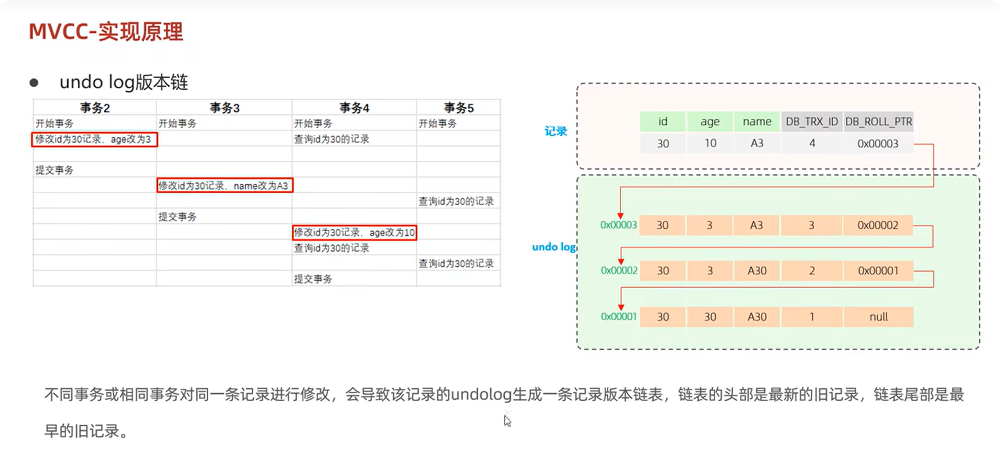

# MySQL学习笔记7【InnoDB】

## 1. 架构

### 1.1 内存部分

#### buffer pool

缓冲池是主存中的第一个区域，里面可以缓存磁盘上经常操作的真实数据，在执行增删查改操作时，先操作缓冲池中的数据，然后以一定频率刷新到磁盘，这样操作明显提升了速度。

缓冲池以page为单位，底层采取**链表**的数据结构管理page，这一点和xv6是一模一样的，根据状态，分为三类：

> - 空闲页free page
> - 干净页clean page，分配之后没有被修改过
> - 脏页dirty page，数据被修改过，与磁盘中的数据不一致

#### change buffer

更改缓冲区，字面意思，主要针对于二级索引页，当我们在buffer pool执行数据变更操作(DML)的时候，如果没有找到这个数据，并不会直接读取磁盘数据，而是将其写入到change buffer，等未来读取数据的时候，直接将数据合并，恢复到buffer pool中，再将数据刷新到磁盘中，由于二级索引页插入删除相对随机，所以如果每次写入都会进行磁盘IO的话，性能太差，而使用change buffer，就减少了磁盘IO，提高了读写效率。

#### 自适应哈希

自适应哈希索引，我们的InnoDB引擎默认是B+树索引，相对于哈希表慢一点，但是哈希表不支持范围查询，所以InnoDB为了提高查询效率，为buffer pool添加了一个自适应哈希索引，我们的InnoDB引擎会自己监控各个索引页上的索引，如果观察到hash索引可以提升查询速度，就会建立哈希索引，这个过程无需人工干预，但是我们需要知道这个参数是`adaptive_hash_index`，默认开启。

#### log buffer

保存要写入到磁盘中的两份日志：redo log和undo log，默认大小16M，会定期刷新到磁盘，如果更新插入较频繁，增加缓冲区大小可以减少磁盘IO，参数：

> - innodb_log_buffer：缓冲区大小。
> - innodb_flush_log_trx_commit：刷新到磁盘的时机。
>   - 1：每次事务提交写入
>   - 0：每秒写入
>   - 2：两者结合

---

###  1.2 磁盘部分

#### 系统表空间

主要处理非主键非唯一的二级索引的更改缓冲区，也就是change buffer，当然，这个和内存中的change buffer不一样，它主要用来存储我们的在真正写入表空间的变更操作，**为啥不直接写入表空间？**，原因是这样可以进一步避免频繁的磁盘IO，我们缓存的是变更操作，而不是整页的数据，并且在磁盘上，可以缓存大量变更。

#### 文件表空间

我们建立的每一张表都有一个独立的表空间，文件表空间都包含单个InnoDB表的结构，数据和索引，并且存储在文件系统的单个数据文件中，参数：`innodb_file_per_table`。

#### 通用表空间

如果我们没有自己去创建，是没有这个通用表空间的，需要通过`CREATE TABLESPACE`来创建，我们可以为表指定表空间

```sql
CREATE TABLE [name] (
	...
    ...
)TABLESPACE [spacename];
```

这样可以使得多个表共享一个ibd文件，避免ibd文件过多，当然，这些表依旧是独立的，我们可以将许多小型的表集中存储，可以减少磁盘碎片，简化管理，并且利于批量的备份恢复。

####  撤销表空间

在mysql实例初始化时会自动创建两个默认的undo表空间，初始大小16M，用于存储undo log日志，保证事务的原子性和一致性，主要用于支持事务的回滚操作。

#### 临时表空间

用于存储用户创建的临时表，比如说多表查询时会创建一个临时表，我们在执行查询/排序/GROUP BY等等的复杂操作时，可能会产生一个临时表存储中间结果，而这个临时表就存储在临时表空间当中，查询结束后，就会自动清理。

#### 双写缓冲区

InnoDB引擎将数据页从buffer pool刷新到磁盘前，先会将数据页写入到双写缓冲区文件，便于系统异常时恢复。

#### 重做日志

redo log，用来实现事务的持久性，由重做日志缓冲区和重做日志文件两部分组成，前者位于内存，后者位于磁盘，当事务提交之后，会将所有修改信息都存到该日志中，用于在刷新脏页到磁盘发生错误时的数据恢复使用。

而我们的redo log是一个循环写的机制，这一点和redis的AOF很像。

### 1.3 后台线程

将内存中缓存池的数据在合适的时机刷新入磁盘中。

#### Master Thread

核心后台线程，负责调度其他线程，还负责将缓冲池中的数据异步刷新到磁盘中，保持数据一致性，包括脏页的刷新，合并插入缓存，undo页的回收等。

#### IO Thread

在innodb引擎中，采取了AIO，也就是异步非阻塞IO，极大地提高了数据库的性能，我们的IO Thread主要负责这些异步请求的回调。

> - Read Thread：读操作
> - Write Thread：写操作
> - Log Thread：将日志缓冲区刷新到磁盘
> - Insert Buffer Thread：将写缓冲区的数据刷新到磁盘

 #### Purge Thread

回收事务已经提交的Undo Log，事务提交之后，之前记录的undo log不再使用，就用purge thread来回收

#### Page Cleaner Thread

协助Master Thread刷新脏页到磁盘的线程，减轻核心后台线程的压力。

----

## 2. 事务原理

### 2.1 事务

前文我们知道，事务是密不可分的集合，具有ACID的特性，原子性，一致性，隔离性，持久性。

其中，原子性，一致性和持久性是由我们的redo log和undo log支持实现的；而隔离性是由我们InnoDB的锁机制和MVCC(多版本并发控制)实现的。

### 2.2 redo log

重做日志，记录事务提交时的数据页的修改，用来实现持久性，由redo log buffer和redo log file两部分组成，前者内存，厚泽磁盘，事务提交之后，会把所有修改信息都存到该日志文件中，用于刷新脏页到磁盘，发生错误时进行数据恢复使用，大致流程如下：

> 1. 客户端向mysql服务端发起update操作
> 2. mysql查询buffer pool，发现没有我们需要更新的数据。
> 3. 启动后台线程，从后台读取我们需要的信息，随后写入到缓冲区，此时就可以直接对缓冲区进行操作，并且会将增删改的数据写入到redo log buffer当中，此时磁盘和内存数据不一致，称之为脏页。
> 4. 那么我们如果定期将内存的数据刷新到磁盘，此时出错了，如果没有redo log buffer，我们的事务已经提交，说明了无法得到数据持久性保证，但是我们有了redo log，我们的redo log buffer会直接将修改的数据刷新到磁盘中的redo log file，如果出错了，就会通过redo log file恢复数据，**为啥redo log buffer不直接刷新到真正的数据页？**因为我们真正的数据页刷新将会是随机的IO，而直接记录到日志上是顺序写，所以性能更高。
> 5. 而我们的redo log日志是类似循环写的模式，每隔一段时间都会被清理。

### 2.3 undo log

undo log日志解决原子性问题，叫做回滚日志，记录数据被修改前的操作，它可以提供回滚和MVCC(多版本并发控制)，undo log和redo log的记录物理日志不一样，他是逻辑日志，比如说我们insert一条信息，在undo log中就是delete的形式记录，当我们执行rollback，就可以读取到相应的内容进行回滚。

undo log在事务执行时产生，但是在事务提交时并不会立刻删除，因为这些日志还可能用于MVCC，并且undo log采取段的方式时机管理和记录，存在rollback段，内部包含1024个undo log。

---

## 3. MVCC(多版本并发控制)

### 3.1 当前读

读取的是记录最新版本的记录，会加锁保证其他并发事务不会修改，我们在事务隔离级别可重复读中使用事务，如果在进入事务之后，有数据被修改，那么我们读取到的数据并不是最新的，也就不是**当前读**，如果想要当前读，我们可以执行 `SELECT ... LOCK IN SHARE MODE` ，初次之外，还可以使用 `SELECT FOR UPDATE/INSERT/DELETE` 来实现当前读。

### 3.2 快照读

简单的selete就是我们的快照读，比如我们在可重复读的事务隔离级别中，就是典型的快照读，不加锁，是非阻塞读，当然，在我们的串行化的事务隔离级别中，快照读就会退化为当前读，在read committed中，每次select都会生成一个快照读。

### 3.3 MVCC

多版本并发控制，它会维护一个数据的多个版本，使得读写操作没有冲突，快照读为mysql实现mvcc提供了一个重要的非阻塞读功能，当，MVCC还依赖于数据库记录的三个隐式字段，undo log， readview。

#### 隐式字段

当我们创建表的时候，会指定相应的表结构，包括id，name，age的字段，我们可以显式的看到这些字段，但是实际上，mysql还未我们隐藏了三个额外增加的字段：

> **DB_TRX_ID**：最近修改事务ID，记录最后插入或修改这一行的事务ID。
>
> **DB_ROLL_PTR**：回滚指针，指向这条记录的上一个版本，配合undo log。
>
> **DB_ROW_ID**：隐藏主键，如果表结构没有主键，就会生成这个隐藏字段。

#### undo log

我们之前提过，undo log在一定情况下不会被立即删除，比如update和delete，产生的undo log不仅在回滚时需要，快照读的时候也需要，所以不会被立即删除，而insert只会在回滚的时候才需要，所以在事务提交的时候可以立即删除，下面来看看实例分析：

借用一下黑马程序员的图



以上的示例列举的进行修改操作时的MVCC的版本链的控制，而执行查询操作的时候，则涉及到了另一个组件**readView**

#### readview

读视图，是快照读SQL执行时MVCC提取数据的依据，记录并维护当前活跃的事务(未提交)的id，包含四个核心字段：

> **m_ids**：当前活跃的事务ID的集合
>
> **min_trx_id**：最小的活跃事务ID
>
> **max_trx_id**：预分配事务ID，当前最大事务ID + 1
>
> **creator_trx_id**：readview创建者的事务ID

版本链访问规则：

> trx_id(当前事务ID) == creator_trx_id：ok，说明数据是当前事务更改的。
>
> trx_id < min_trx_id：ok，说明数据已经提交。
>
> trx_id > max_trx_id：no，该事务是在readview生成后才开启的。
>
> min_trx_id <= trx_id <= max_trx_id && trx_id 不存在于m_ids中：ok，数据已经提交。

readview生成时机在不同隔离级别有所不同：

**read committed**：事务每次执行快照读时，都会生成。(这里建议去看看黑马的视频里面的分析)

**repeatable read**：在事务第一次执行快照读时生成readview，后续复用这个readview。

这样，原理就介绍完毕了。