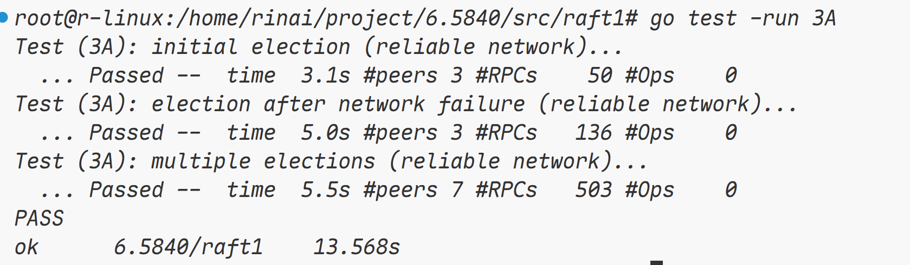

# lab3 Debug 记录

lab1 和 lab2 都没什么难度，到了 lab3A，我 debug 了一天才通过了测试，故来记录一下。

## lab3A

该实验需要我们实现领导者选举，包括多种场景，比如不可靠的网络，多节点选举。

在观察完 `src/raft1/raft.go` 之后，我认为首先需要补充的部分就是心跳，由于并没有给出心跳的实现，于是我们还需要参考其他的 rpc 请求的方式去实现 `AppendEntry` 此时仅仅是一个架子，并没有进行实现。由于我对 raft 还不是很熟，所以我边看论文，边给 ticker 循环写出了一个大概的框架。

很明显，我们需要在这个循环中执行两种操作

1. 一种是检测 leader 的心跳是否超时或者是否存在 leader，如果实际恰当，就需要发起选举，请求其他节点为自己投票；
2. 第二种是，如果该节点为 leader，则需要向所有节点发送心跳，

首先我们来实现第一种，就是发起选举的操作，什么时候可以发起选举？

如果当前还没有 leader，也就是我们刚刚初始化 raft 集群的时候，此时还没有 leader，我们就可以发起选举，发起选举的时候，我们除了调用 rpc 服务，还需要做几件事情：

1. 将自己的角色标记为 candidate
2. 为自己投票
3. 更新自己的 leaderIdx 为 -1（新的任期，必然没有 leader 或未知 leader）
4. 更新自己的 term

然后我在这里通过循环遍历去发起 rpc 调用，请求其他节点为自己投票，

> [!NOTE]
>
> 然而，之前我也提到过，我们需要在弱网场景下实现 raft 领导者选举，在后期 debug 的时候，我发现不可靠的网络中，rpc 调用可能会阻塞，导致所有 test 无法通过，所以，这里应该改为协程的形式，我们可以通过记录当前发起选举的 term，然后在对应的 rpc 返回的时候，如果发现我们当前节点的 raft 的 term 更新，说明这个返回的信息多半是超时返回回来的，直接舍弃即可，所以我们在这里需要使用协程，而不是循环遍历。

这里我们还有一点是需要做的，我们如果请求为我们投票的节点的 term 更高，应该怎么做？很简单，我们需要在 reply 中标记这一字段，如果对方的任期更大，说明我们已经“过时”了，我们需要立刻退级成 follower，并更新自己的任期，而且立刻修改自己的最近一次的心跳时间，防止自己立刻参与选举，同时每次更新任期的时候，都需要更新自己的所有状态，包括 leader 和为谁投票的字段。

最后，我们如果在中途检测到，我们获取的投票数已经过半，我们的这个节点就可以宣告胜利了，直接登顶为 leader，并立刻发起一轮心跳。

> [!NOTE]
>
> 对于这一点，后期针对于上面的 goroutine 的修改还有需要改善的地方，那就是我们需要检测当前获取过半的票数的 term，以及各种状态是否对得上来兜底，防止我们以及在新的任期了，但是旧的任期选举成功变成 leader 这种奇怪的情况发生。

然后我们需要处理的是，请求其他节点为自己投票的逻辑，我们需要搞清楚，什么时候其他节点可以投票，什么时候应该拒绝。

当请求投票时，如果 candidate 的 term 小于被请求的节点，那么这个节点应该拒绝投票，并返回自己的任期，告诉对方：“你的任期太老了，应该换成更新的任期”。

除此之外，当 candidate 任期大于该节点的时候，我们应该更新该节点的任期，并更新各种信息，比如投票的对象，leader，和 role。

最后，我们唯一判断是否应该投票的标准就是，他的投票的对象的字段是否为空，如果为空，那么就可以投票，否则拒绝，不管自己是 candidate 还是 leader，因为从根本来说，如果这个人是 leader 或者 candidate，他的投票的对象的字段始终都是自己，不可能为空。

最后，我们需要实现的是心跳的逻辑，这里我们也需要处理一些情况，同样应该使用协程去实现心跳，否则会因为各种原因导致 test 失败。

针对于心跳 rpc 的参数，我们需要传递我们的 term 以及 leaderIdx（因为对方可能还不知道我们是 leader，可能需要更改对方的状态和 term），虽说如此，term还可以检验当前的 leader 是否是旧任期的 leader，如果是这样，那么发送心跳失败时候，我们需要降级为 follower。

有几个关键的判断节点，就是旧任期的leader发来心跳，我们需要拒绝，并修改 reply 的参数，表示说：“你是旧时代的 leader，应该变成 follower 了！”，这样来告诉对方，让对方退化为 follower，否则，此次心跳必然是成功的。并且需要更新对方的状态，比如 role，leaderIdx，最近心跳的时间。
最后：

## lab3B

主题很明确，日志，我们需要为 raft 添加日志，日志是什么？当 leader 获取到客户端的命令时，将日志写入，然后异步将日志发送给其他节点，同时当过半数的节点写入了这条日志，就会认为这条数据安全，然后给客户端返回写入成功的消息并且推进 commitIdx。
我们主要的任务就是实现 Start 和补充 appendEntries 的实现。