# **Whalebox(仿Docker)的爆诞**

---

## 1. **万物起源第一步，先做测试**

### 1.1 **直击心灵的第一问，Namespace是什么？**

命名空间就像一层隔板，有了这层隔板，就会让隔板内的人以为自己独享这片天地，这层隔板有各种各样的，比如`声音隔离`，`视觉隔离`，`嗅觉隔离`等等，暂时可以这么理解。

IPC Namespace 是 Linux Namespace 机制的一部分，专门用于隔离进程间通信资源。它在容器技术中的作用是确保每个容器有自己的 IPC 资源，而不会与宿主机或其他容器共享，从而增强了安全性和资源隔离能力。

而像这样的命名空间还有很多，docker就是采取这些Namespace来实现隔离的。

容器是什么，docker又是什么？

想清楚这一点，我们才能紧接着做一些第一步的测试：隔离

```go
func main() {
	defer func() {
		if r := recover(); r != nil {
			color.Red("Error: %v", r)
			os.Exit(1)
		}
	}()
	cmd := exec.Command("sh")
	cmd.SysProcAttr = &syscall.SysProcAttr{
		Cloneflags: syscall.CLONE_NEWUTS | syscall.CLONE_NEWIPC,
	}
	cmd.Stdin = os.Stdin
	cmd.Stdout = os.Stdout
	cmd.Stderr = os.Stderr
	if err := cmd.Run(); err != nil {
		panic(err)
	}
}
```

这里我们意在启动一个新的进程，docker启动的容器有什么特点？隔离，这就是我们要做的第一步，我们通过`Cloneflags`字段来表明我们采取的隔离，这里我们采取了UTS隔离和IPC隔离，能够隔离不同进程通信隔离，比如说输入`ipcmk -Q`创建的消息队列可以在进程间隔离，而UTS可以令子进程随意修改主机名而不影响宿主机，是这一类型的隔离。

如图所示，**hostname隔离**

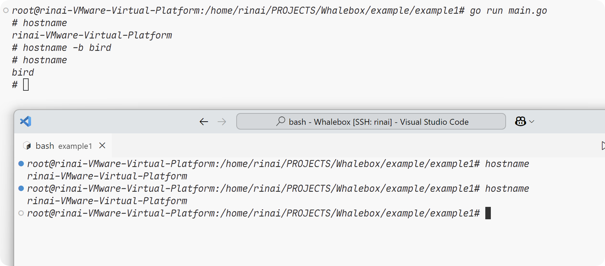

**通信隔离**：

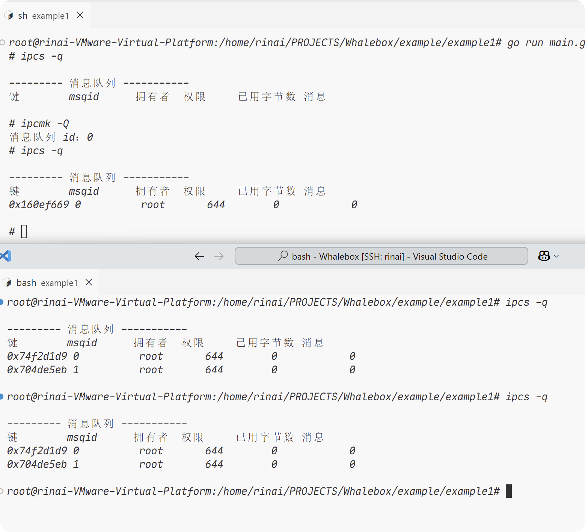

做完这一步测试之后，虽然一步把所有的隔离都写出来也很不错，但是量太多，这里仅仅是抛砖引玉，为了更简单易懂。

**PID隔离**，`syscall.CLONE_NEWPID`：能够隔离进程间的id，也就是说，id是可以重复的，但是此时如果打印pstree，还是会打印所有的进程树，显然，使用PID隔离是不够的。

**文件隔离**，`syscall.CLONE_NEWNS`：这里能够创建真正的文件隔离的命名空间，为什么pstree会打印所有的进程树？因为在linux里面一切皆文件！但是这里的文件隔离仅仅是创建了一个命名空间，我们还需要真正的通过命令去proc挂载到当前的命名空间上面，如图：

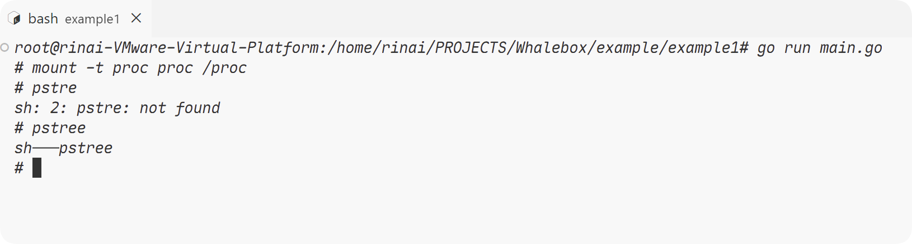

**User隔离**，`syscall.CLONE_NEWUSER`：如果我们想要在赋予一个用户可以在一个容器内使用root权限，但是呢，又不能让他在宿主机内使用root权限，这个时候，就需要用到User隔离了，当然，此时并不能仅仅是写一个系统调用的参数就结束了，我们还需要设定一个映射，来保证该进程在当前进程是什么权限，在宿主机又持有什么权限：

```go
		UidMappings: []syscall.SysProcIDMap{
			{
				ContainerID: 0,
				HostID:      0,
				Size:        1,
			},
		},
		GidMappings: []syscall.SysProcIDMap{
			{
				ContainerID: 0,
				HostID:      1000,
				Size:        1,
			},
		},
```

在属性中添加上面的参数即可令进程在容器内持有root权限，而不能持有宿主机的root权限，这样就能实现不同进程之间的用户隔离。

**网络隔离**，`syscall.CLONE_NEWNET`：通过这个系统调用，我们可以实现和宿主机的网络隔离，如图所示，新创建的进程里面啥也没有。

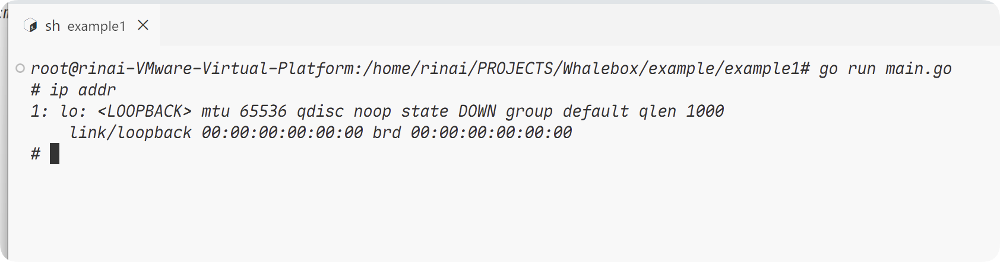

以下是这次测试的完整代码：

```go
package main

import (
	"os"
	"os/exec"
	"syscall"
	"github.com/fatih/color"
)

func main() {
	defer func() {
		if r := recover(); r != nil {
			color.Red("Error: %v", r)
			os.Exit(1)
		}
	}()
	cmd := exec.Command("sh")
	cmd.SysProcAttr = &syscall.SysProcAttr{
		Cloneflags: syscall.CLONE_NEWUTS | syscall.CLONE_NEWIPC |
			syscall.CLONE_NEWPID | syscall.CLONE_NEWNS |
			syscall.CLONE_NEWUSER | syscall.CLONE_NEWNET,
		UidMappings: []syscall.SysProcIDMap{
			{
				ContainerID: 0,
				HostID:      0,
				Size:        1,
			},
		},
		GidMappings: []syscall.SysProcIDMap{
			{
				ContainerID: 0,
				HostID:      1000,
				Size:        1,
			},
		},
	}
	cmd.Stdin = os.Stdin
	cmd.Stdout = os.Stdout
	cmd.Stderr = os.Stderr
	if err := cmd.Run(); err != nil {
		panic(err)
	}
}
```

---

### 1.2 **开天辟地之Cgroups!**

#### (1) **灵魂拷问之Cgroups是啥？**

利用之前的Namespace，我们可以轻易的做到资源隔离，但是docker还需要限制每个容器的空间，不让他们发生争抢，这又是如何做到的？这就需要用到Cgroups了。

**Cgroups组成**

- cgroup：进行进程分组管理，每一个cgroup有一组进程。
- subsystem：一组资源控制的模块。
- hierarchy：将一组cgroup建树，通过树状结构，可以做到继承，例如，cgroup1需要限制cpu使用率，而有一个进程既需要限制cpu，还需要控制I/O，此时可以新建一个cgroup2，并从cgroup1继承对cpu使用率的限制这一特性。

三者调用关系：hierarchy是一棵树，cgroup是一个节点，而subsystem为这棵树赋予属性(限制)，并且一种subsystem只能赋予一棵树上。

cgroup本质上其实是一个文件夹，而docker只是对其的应用，我们可以先直接用bash来试试这个所谓的cgroup

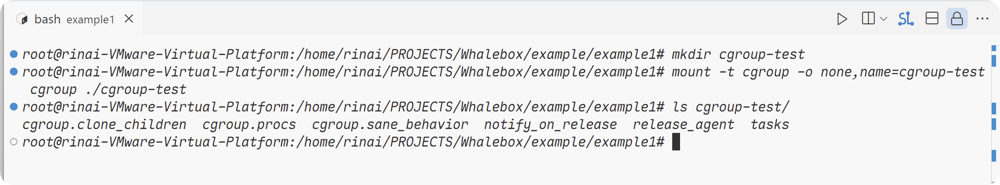

当我们在该文件夹下面创建cgroup-1和cgroup-2的时候，会将新建的文件夹标记为子cgroup，同时也会自动生成一系列文件：

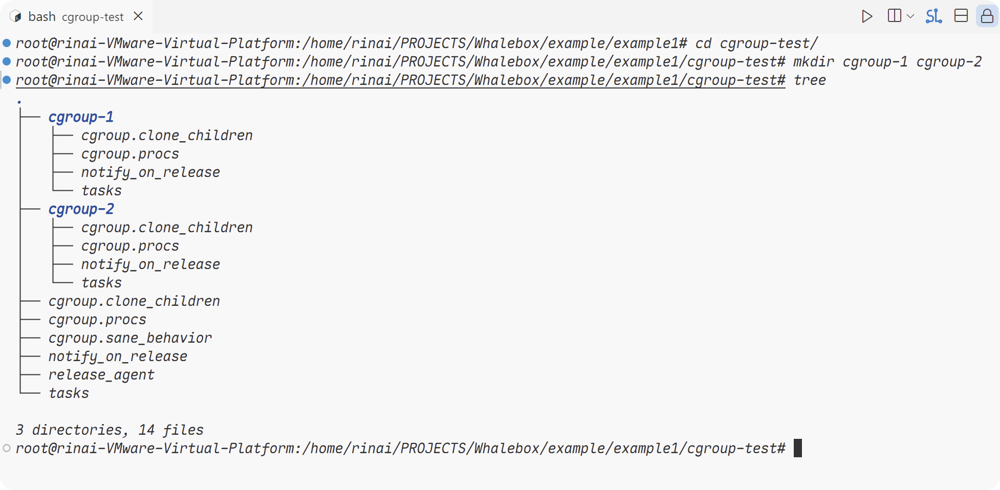

**这几个字段是啥？**

- `cgroup.clone_children`：默认为0，如果为1，则会继承父group的配置。
- `cgroup.procs`：包含直接属于当前节点cgroup的所有进程的ID。
- `notify_on_release `和`release_agent`：第一个参数用作标识该cgroup最后一个进程退出时，是否执行了`release_agent`，而第二个参数是一个路径，这俩结合用于清理不再使用的cgroup。
- `tasks`：表示这个cgroup下面的进程ID，如果将一个进程的ID写入其中，便会将这个进程加入这个cgroup。

当我们将当前的终端进程加入cgroup-1的时候：

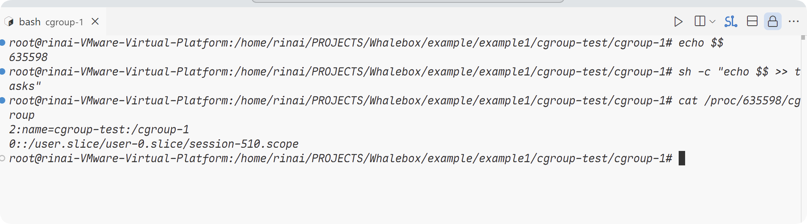

可以看见，他已经被添加到cgroup-1了！

那么现在，我们可以**进一步**的，将`subsystem`添加进去。

在这里你可以输入`mount | grep memory`找到对应的路径，我这里是` /sys/fs/cgroup`，然后进入该目录，创建一个`my_cgroup`然后就可以执行接下来的步骤了。

我这里是将stress占用的内存提高到了4GB，不然看不出太大的变化，我才发现stress有多个pid，我这里通过`pgrep -P [启动时的PID]`来查询剩下的stress的pid，不然限制不了，然后将这些pid用`echo [pid] | sudo tee /sys/fs/cgroup/my_cgroup/cgroup.procs`加入你新建的cgroup中间，然后先用`top`观察没限制的时候，再输入`sudo sh -c 'echo 100m > /sys/fs/cgroup/my_cgroup/memory.max'`将内存限制重定向到`memory.max`文件，我跟着书上的内容来，发现还是有挺多地方有变化的。

**限制前**：

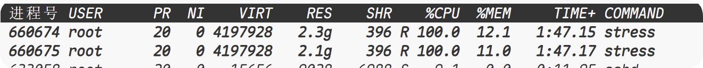

**限制后**：

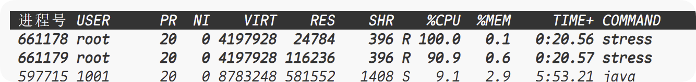

这里自己去试一试真的挺有趣的，感觉用vscode的自己加上白色的命令行，像个geek一样，哈哈。

----

#### (2) **随后，便是惊心动魄的Docker是如何应用Cgroups的？**

用过docker的朋友们都知道，我们在`docker run`的时候，往往会携带`-m`的参数，来限制容器所占用的内存大小。

docker会为每个容器在系统中的hierarchy创建cgroup。

哎，貌似是版本不一样，好多地方目录也跟书上的不一样

我这里创建了一个docker容器：

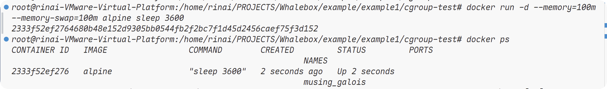

随后输入`ls /sys/fs/cgroup/system.slice/ | grep docker`

这个时候会出现我们容器的文件夹，格式为`docker-容器id`

在这个文件夹下面，这里我就输入`cd docker-2333f52ef2764680b48e152d9305bb0544fb2f2bc7f1d45d2456caef75f3d152.scope/`

然后ls，就是我们熟悉的页面了

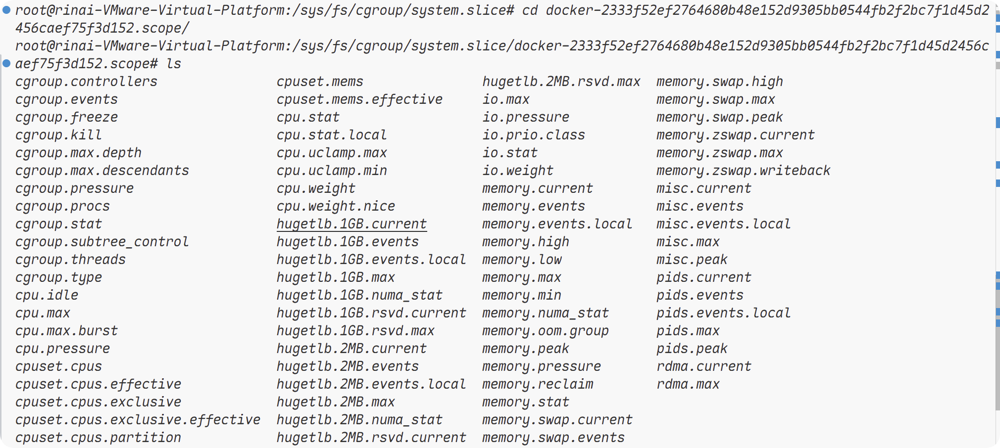

我们从刚刚的测试中是知道的，memory.max文件中藏着最大内存的限制：

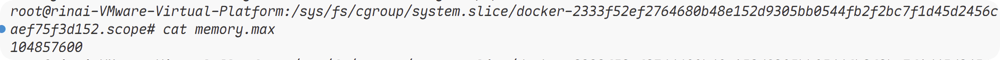

perfect！测试完成，docker完美的将我们设置的参数赋予了我们创建的cgroup。

---

#### (3) **再加点料，Go中新增Cgroup的限制**

这里我调试了半天，发现stress甚至还会产生很多子进程，如果按照书上的来，很多都跑不通，无敌了，下面是能够正确跑通的代码：

```go
package main

import (
	"fmt"
	"os"
	"os/exec"
	"path"
	"strings"
	"syscall"

	"github.com/fatih/color"
)

const CgroupPath = "/sys/fs/cgroup/"

func GetAllChinldpids(pids []string) []string {
	for i := 0; i < len(pids); i++ {
		children, err := exec.Command("pgrep", "-P", pids[i]).Output()
		if err != nil {
			if exitErr, ok := err.(*exec.ExitError); ok && exitErr.ExitCode() == 1 {
				continue
			}
			color.Red("Error: %v", err)
			os.Exit(14)
		}
		pids = append(pids, strings.Fields(string(children))...)
	}
	return pids
}

func main() {
	if os.Args[0] == "/proc/self/exe" {
		fmt.Println("pid:", os.Getpid())

		cmd := exec.Command("sh", "-c", `stress --vm-bytes 2048m --vm-keep -m 1`)

		cmd.SysProcAttr = &syscall.SysProcAttr{}

		cmd.Stdin = os.Stdin
		cmd.Stdout = os.Stdout
		cmd.Stderr = os.Stderr
		if err := cmd.Run(); err != nil {
			fmt.Println(err)
			os.Exit(11)
		}
	}

	cmd := exec.Command("/proc/self/exe")
	cmd.SysProcAttr = &syscall.SysProcAttr{
		Cloneflags: syscall.CLONE_NEWUTS |
			syscall.CLONE_NEWPID | syscall.CLONE_NEWNS,
	}
	cmd.Stdin = os.Stdin
	cmd.Stdout = os.Stdout
	cmd.Stderr = os.Stderr
	if err := cmd.Start(); err != nil {
		fmt.Println(err)
		os.Exit(13)
	} else {
		pids := GetAllChinldpids([]string{fmt.Sprintf("%d", cmd.Process.Pid)})

		fmt.Println("child pid:", pids)

		fmt.Println("pids:", pids)

		os.Mkdir(path.Join(CgroupPath, "TestMemoryLimit"), 0755)

		for _, pid := range pids {
			os.WriteFile(path.Join(CgroupPath, "TestMemoryLimit", "cgroup.procs"), []byte(pid), 0644)
		}

		os.WriteFile(path.Join(CgroupPath, "TestMemoryLimit", "memory.max"), []byte("100m"), 0644)
	}
	cmd.Process.Wait()
}
```

像这样，我们就能够手动启动一个进程，并且这个进程受到Cgroup的限制了！在bash中输入`go run main.go`，然后启动另一个终端，输入`top`。你会发现内存占用被限制了！

#### (4) **Union File System**

简单来说就是将其他文件系统合并到一个文件系统，被合并的文件叫做分支branch，用户在使用读取操作的时候，尽管底层是读取的同一个文件，但是实际上用户会认为他是在独享一个文件系统，而在用户真正对其进行写操作时，才会真正的开辟一个新的内存空间，来将被修改或者写入的数据(一整块地)放入这段空间，这就叫**COW(写时复制)**，而在docker中也有类似的实现，所有的容器共享一个基础镜像，这一层叫做**镜像层**，而在用户修改容器数据的时候，就会将这部分数据写入到**可写层**，从而达到节省空间的目的，当然，如果修改的数据与原镜像有管理，就会复制。

**AUFS**，他重写了早期的UnionFS，具有快速启动容器，存储性能高等优点，而docker早期正是采取的这一存储方式。

**实践一下吧！**

这里我选择alpine作为基础镜像，实际上用啥都行，这里就只需要在基础镜像的基础上，echo一段字符到文件里就行了。

首先随便创建一个新的目录，创建dockerfile文件：

```dockerfile
FROM alpine:latest

RUN echo "Ciallo World!" > newfile
```

随后，在这个目录下面输入`docker build -t changed-image .`的指令，然后就可以创建一个自己的镜像了.

然后我们可以通过`docker history changed-image`来查看这个容器的历史记录

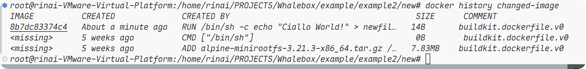

我们发现，我们的我们最上层的image layer仅仅使用了14B的空间，而旧的层被复用了，并没有为其开辟新的空间，这也证明了AUFS是高效地在使用磁盘空间的。

当我们创建一个容器的时候，docker会为这个容器创建一个`read only`的init层，存储环境相关信息，以及`read-write`层，执行所有的写操作。

**说干就干，自己实现！**

md，服了，我现在用的ubuntu不支持aufs，索性就用OverlayFS了。

首先新建一个目录，创建`container-layer`以及`image-layer{1..4}`，还有`mnt`和`workdir`，此时，还需要向每个`image-layer{1..4}`创建一个文件`image-layer{1..4}.txt`，并且echo `I'm image-layer{1..4}`，这样就可以了。

然后输入`sudo mount -t overlay overlay -o lowerdir=image-layer4:image-layer3:image-layer2:image-layer1,upperdir=container-layer,workdir=workdir mnt`将文件合并到mnt目录上。

此时输入`tree`，如果发现workdir目录下有点奇怪，可以试试查看该目录中文件的权限，修改看看！

尝试修改我们挂载目录下的文件，结果如下！(这里的image-layer的文件夹名称显示有问题)

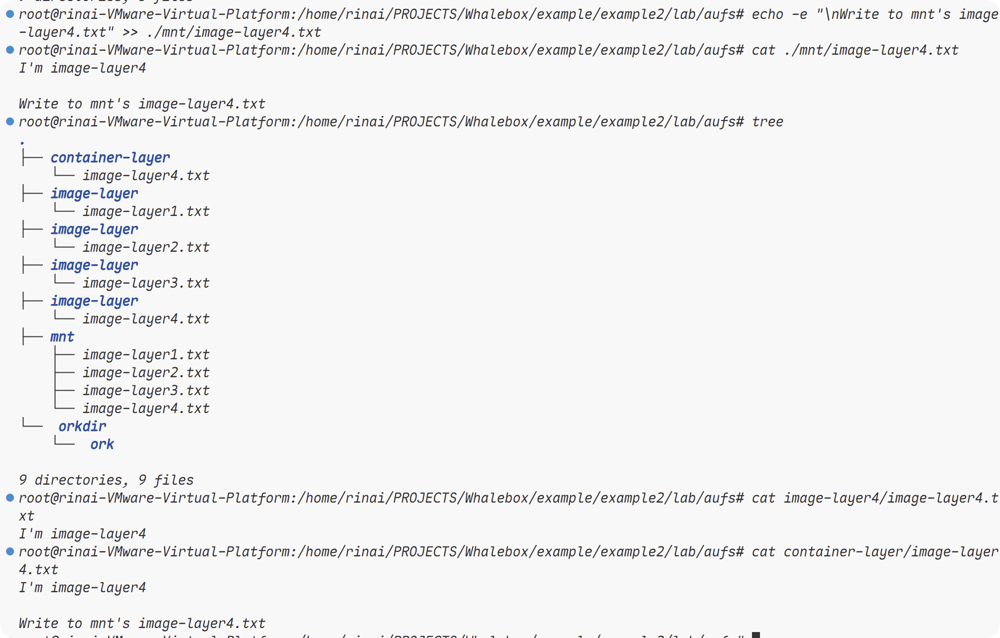

我们发现，挂载目录下的被修改的文件确确实实以及被修改了，而被挂载的image-layer4目录下的文件保持原样，并且container-layer(写入层)也确确实实新建了一个文件，这当然是符合我们预期的结果，到这里，我们就完成了我们的一个OverlayFS文件系统了。

到这里，写一个docker所需要的必备知识已经讲完了，开始吧！我们的构造容器之旅！

---

## 2. **容器，构建属于自己的小宇宙**

在开始之前，我们还需要知道linux中的`/proc`，相信熟悉linux的人都知道，proc并不是一个真正的文件系统，而是直接由内核提供的，包含了系统运行时的信息，他只存在于内存当中，也就是说，我们通过他，可以很轻松的得到这些信息，就相当于是他以文件系统的形式为我们访问内核数据的操作提供接口，以下一些信息需要我们了解，是直接复制的书上的内容，懒得打了)

>**/proc/N/cmdline**: 进程启动命令  
>**/proc/N/cwd**: 链接到进程当前工作目录  
>**/proc/N/environ**: 进程环境变量列表  
>**/proc/N/exe**: 链接到进程的执行命令文件  
>**/proc/N/fd**: 包含进程相关的所有文件描述符  
>**/proc/N/maps**: 与进程相关的内存映射信息  
>**/proc/N/mem**: 指代进程持有的内存，不可读  
>**/proc/N/root**: 链接到进程的根目录  
>**/proc/N/stat**: 进程的状态  
>**/proc/N/statm**: 进程使用的内存状态  
>**/proc/N/status**: 进程状态信息，比 stat/statm 更具可读性  
>**/proc/self/**: 链接到当前正在运行的进程  

我们接下来要实现的就是`docker run -ti /bin/sh`这个命令，通过这个命令我们可以进入到容器内部，并且通过命名空间实现资源隔离，通过Cgroups实现资源限制的功能。

由于这里我使用的是Ubuntu24.02，所以Cgroup这些都跟《动手写docker》这本书上的不太一样，所以我把代码重写了一遍，此处我会按照我们输入命令的流程来将代码一步一步讲解，并不是一个包一个包地讲解，所以请注意。

```go
.
├── cgroups
│   ├── cgroup.go
│   ├── def_limit.go
│   └── utils.go
├── cmd
│   ├── cmd
│   ├── main_command.go
│   ├── main.go
│   └── run.go
├── container
│   ├── container_process.go
│   └── init.go
├── example
│   ├── example1
│   │   ├── cgroup-test
│   │   ├── main.go
│   │   └── trace.log
│   └── example2
│       ├── lab
│       │   └── aufs
│       │       ├── container-layer
│       │       │   └── image-layer4.txt
│       │       ├── image-layer1
│       │       │   └── image-layer1.txt
│       │       ├── image-layer2
│       │       │   └── image-layer2.txt
│       │       ├── image-layer3
│       │       │   └── image-layer3.txt
│       │       ├── image-layer4
│       │       │   └── image-layer4.txt
│       │       ├── mnt
│       │       └── workdir
│       │           └── work
│       ├── main.go
│       └── new
│           └── dockerfile
├── Godeps
│   └── Godeps.json
├── go.mod
├── go.sum
├── pkg
│   └── log
│       ├── logger.go
│       └── record.log
└── README.md
```

这是我目前的项目结构，这里我采取了zap作为日志库，沿用了书里面使用的`github.com/urfave/cli`作为命令行工具。

那么此时便是要真正开始写docker了！

### 2.1 **世界的伊始，函数的入口**

main.go:目前的main函数：

```go
const (
	AppName = "Whalebox"
	Version = "0.1.0"
	Usage   = "A container runtime based on containerd"
)

func main() {
	app := cli.NewApp()
	app.Name = AppName
	app.Version = Version
	app.Usage = Usage

	app.Commands = []cli.Command{
        //这里是支持的命令，都是以结构体的形式存储的这些命令都在main_command.go中
		initCommand,
		runCommand,
	}

	app.Before = func(c *cli.Context) error {
        //在初始化容器之前的准备工作
		log.InitLogger()
		log.Info("Starting Whalebox...")
		return nil
	}
	//启动
	if err := app.Run(os.Args); err != nil {
		log.Error(err.Error())
	}
}
```

这里的日志库的初始化不做过多的介绍，而刚刚的命令则是我们需要关注的！对`github.com/urfave/cli`陌生的朋友们肯定很好奇，这是咋存储的？如下：

### 2.2 **归零者的控制台，自定义你的命令**

main_command.go:

```go
var initCommand = cli.Command{
	Name:   "init",
	Usage:  "Init container process run user's process in container. Do not call it outside.",
    //对我们的容器进行初始化的方法
	Action: initAction,
}

func initAction(c *cli.Context) error {
	log.Info("init command")
    //执行容器初始化。
	err := container.RunContainerInitProcess()
	if err != nil {
		log.Error(err.Error())
		return err
	}
	return nil
}

var runCommand = cli.Command{
	Name: "run",
	Usage: `Run a container With namespace and cgroup limit.
		    ./cmd run -ti [command]`,
    //这是输入命令后执行的函数
	Action: runAction,
    //这里的flag指的是我们在输入命令行时输入的选项！
	Flags: []cli.Flag{
		&cli.BoolFlag{
			Name:  "ti",
			Usage: "enable tty",
		},
		&cli.StringFlag{
			Name:  "m",
			Usage: "Set memory limit for container",
		},
		&cli.StringFlag{
			Name:  "cpuset",
			Usage: "Set CPU limit for container",
		},
		&cli.StringFlag{
			Name:  "cpushare",
			Usage: "Set CPU share for container",
		},
	},
}

func runAction(c *cli.Context) error {
	if len(c.Args()) < 1 {
		log.Error("Please specify a container image name")
		return errors.New("please specify a container image name")
	}
	var cmdArray []string
	for i := 0; i < len(c.Args()); i++ {
		cmdArray = append(cmdArray, c.Args()[i])
	}
	//此处是获取-ti的参数
	tty := c.Bool("ti")
	resource := &cgroup.ResourceConfig{
        //获取我们输入的各种参数
		MemoryLimit: c.String("m"),
		CpuShares:   c.String("cpushare"),
		CpuSet:      c.String("cpuset"),
	}
	//run就是在我们的run.go中的函数，他负责启动我们的容器
	Run(tty, cmdArray, resource)
	return nil
}

```

我们在启动容器的时候，实际上就是输入run命令，然后这个run命令会建立执行用exec.command执行init命令，并且将需要执行的命令传入管道(父子进程间的通信)，这样就可以做到让子进程执行我们传入的命令，从而实现一个容器！

### 2.3 **构建属于你的宇宙，容器进程的创建以及资源的控制**

run.go:

```go
func Run(tty bool, cmdArray []string, resource *cgroup.ResourceConfig) {
    //这里是创建一个管道以及命名空间的隔离，管道是方便我们发送命令的，在NewParentProcess里面，我们
	//已经完成了init命令的执行.
	parent, pipe := container.NewParentProcess(tty)
	if parent == nil {
		log.Error("Failed to create parent process")
		return
	}
	if err := parent.Start(); err != nil {
		log.Error(err.Error())
		return
	}
	fmt.Println(parent.Process.Pid)
    //根据上文，我们已经知道init命令已经完成，目前我们要做的，就是实施将命令发送给init子进程，并且将当前的进程
    //加入到我们指定的Cgroup中，并实现资源隔离！由于新版本的Cgroup的树形结构
    //所以我们此处在/sys/fs/cgroup目录下面创建whalebox文件夹，表示我们容器的根
    //在这个root下面又是我们的容器的存放，为了方便，以当前进程的pid作为文件夹的名称。
	cgroupManager := cgroup.NewCgroup("whalebox", strconv.Itoa(parent.Process.Pid))
	cgroupManager.Set(resource)
	sendInitCommand(cmdArray, pipe)
	parent.Wait()
	cgroupManager.Remove()
	os.Exit(0)
}

// 发信号给init进程，告诉它要执行的命令
func sendInitCommand(cmdArray []string, pipe *os.File) {
	commamd := strings.Join(cmdArray, " ")
	log.Info(fmt.Sprintf("Sending command to container: %s", commamd))
	pipe.WriteString(commamd)
	pipe.Close()
}
```

写了点注释，放在特定的位置还是比较好理解的~

然后进入到我们的`container.NewParentProcess`函数中！

container_process.go:

```go
func NewParentProcess(tty bool) (*exec.Cmd, *os.File) {
    //新建管道，用于进程间通信，待会我们还会自定义一个init命令，这个
    //命令也会创建一个管道用于接受命令。
	readPipe, writePipe, err := NewPipe()
	if err != nil {
		log.Error("NewParentProcess: Failed to create pipe: " + err.Error())
		return nil, nil
	}
    //这里这是在我们当前的进程中执行init命令，为啥要执行？
    //事实上，事实上，我们当前执行的命令是启动一个进程，然后实现资源隔离
    //和资源限制，而我们进一步执行init，则是进入容器
    //去初始化容器的环境，并且真正的执行我们用户的命令。
	cmd := exec.Command("/proc/self/exe", "init")
	cmd.SysProcAttr = &syscall.SysProcAttr{
		Cloneflags: syscall.CLONE_NEWUTS |
			syscall.CLONE_NEWPID | syscall.CLONE_NEWNS |
			syscall.CLONE_NEWIPC | syscall.CLONE_NEWNET,
        //为啥这里没有user隔离？
        //实际上书上这里也没有设置，设置user隔离会导致一些bug，这里就不设置了。
	}
	if tty {
		cmd.Stdin = os.Stdin
		cmd.Stdout = os.Stdout
		cmd.Stderr = os.Stderr
	}
	cmd.ExtraFiles = []*os.File{readPipe}
	log.Info(fmt.Sprintf("Command: %v", cmd))
	return cmd, writePipe
}

func NewPipe() (*os.File, *os.File, error) {
	read, write, err := os.Pipe()
	if err != nil {
		log.Error("NewPipe: Failed to create pipe: " + err.Error())
		return nil, nil, err
	}
	log.Info(fmt.Sprintf("New pipe: read: %d, write: %d", read.Fd(), write.Fd()))
	return read, write, nil
}
```

是否感觉到了熟悉的画面？是的，这就是我们之前试验的时候构建的一个带有命名空间资源隔离的进程！主要的讲解还是通过注释来比较好~

然后我们回到我们刚刚的run.go文件，我们是不是发现了还有一个地方等待我们去探索？没错，就是`cgroup.NewCgroup()`通过它，我们可以轻易地创建一个cgroup，并在其中实现资源隔离，如何实现资源隔离？

再向下看，还会看到我们的`cgroupManager.Set()`方法，我们便可以通过它，来实现我们的资源限制了！
当然，现在还不急，我们看看我们的Cgroup接口和resourceConfig是如何定义的

```go
package cgroup

type ResourceConfig struct {
	MemoryLimit string //内存限制
	CpuShares   string
	CpuSet      string
}

type CgroupInterface interface {
	Path() string
	//为该cgroup设置资源限制
	Set(resources *ResourceConfig) error
	//删除该Cgroup
	Remove() error
}
```

如上所示，我们定义了内存，cpu相关的限制，然后通过接口，我们可以轻易地知道，我们的cgroup的总体的实现是怎么样的，下面看看具体的cgroup实现！

```go
type Cgroup struct {
	path string
}
//通过类型断言，我们能够快速的实现我们的接口，并且可以检查实现了哪些接口
//在go代码中常用类型断言，这是一个很好的编程习惯！
var _ CgroupInterface = (*Cgroup)(nil)

// 新建一个cgroup，由于whalebox的子cgroup需要从whalebox继承内存管理/cpu管理等，所以需要手动将继承选项添加进去。
func NewCgroup(Root string, pid string) *Cgroup {
	Path := Root + "/" + pid
    //这里GetCgroupPath是另一个工具函数，我们待会再说
    //就是找到我们当前容器的cgroup的目录，如果没有，就创建！
	if CgroupPath, err := GetCgroupPath(Path, true); err == nil {
        //将我们的pid加入到当前创建的Cgroup
		if err := os.WriteFile(path.Join(CgroupPath, "cgroup.procs"), []byte(pid), 0644); err != nil {
			log.Error(fmt.Sprintf("failed to add process to cgroup: %v", err))
			return nil
		}
		//由于我们还需要实现资源隔离，但是默认我们创建的的whalebox是没有继承选项的，所以我们需要手动添加继承子系统选项
		if err := os.WriteFile(path.Join(CgroupPath[:len(CgroupPath)-len(pid)-1], "cgroup.subtree_control"), []byte("+memory +cpuset +cpu"), 0644); err != nil {
			log.Error(fmt.Sprintf("failed to set cgroup.subtree_control: %v", err))
			return nil
		}
	}
    //返回我们的cgroup实例
	return &Cgroup{
		path: Path,
	}
}

func (s *Cgroup) Path() string {
	return s.path
}

//这里是我们的设置资源隔离的选项的方法。
func (s *Cgroup) Set(resources *ResourceConfig) error {
	if err := s.SetMemoryLimit(resources); err != nil {
		return err
	}
	if err := s.SetCpuShares(resources); err != nil {
		return err
	}
	if err := s.SetCpuLimit(resources); err != nil {
		return err
	}
	return nil
}

// Remove implements CgroupInterface.
func (s *Cgroup) Remove() error {
	if err := os.RemoveAll(s.Path()); err != nil {
		log.Error(fmt.Sprintf("failed to remove cgroup %s: %v", s.Path(), err))
		return fmt.Errorf("failed to remove cgroup %s: %v", s.Path(), err)
	}
	log.Info(fmt.Sprintf("cgroup %s removed", s.Path()))
	return nil
}


// Set implements Subsystem, 此处为cgroup设置资源限制，也就是内存的限制
func (s *Cgroup) SetMemoryLimit(resources *ResourceConfig) error {
	if SubSystemPath, err := GetCgroupPath(s.Path(), true); err == nil {
		//设置内存限制
		if resources.MemoryLimit != "" {
			if err := os.WriteFile(path.Join(SubSystemPath, "memory.max"), []byte(resources.MemoryLimit), 0644); err != nil {
				return fmt.Errorf("failed to set memory limit: %v", err)
			}
			return nil
		}
		log.Debug("memory limit not set")
		return nil
	} else {
		return fmt.Errorf("failed to get cgroup path: %v", err)
	}
}


// Set implements Subsystem.
func (s *Cgroup) SetCpuShares(resources *ResourceConfig) error {
	if subsysCgroupPath, err := GetCgroupPath(s.Path(), true); err == nil {
		if resources.CpuShares != "" {
			if err := os.WriteFile(path.Join(subsysCgroupPath, "cpu.shares"), []byte(resources.CpuShares), 0644); err != nil {
				log.Error("Cpusub:" + "failed to set cpu shares: %v" + err.Error())
				return fmt.Errorf("failed to set cpu shares: %v", err)
			}
			return nil
		}
		log.Debug("cpu shares not set")
		return nil
	} else {
		log.Error("Cpusub:" + "failed to get cgroup path: %v" + err.Error())
		return fmt.Errorf("failed to get cgroup path: %v", err)
	}
}


// Set implements Subsystem.
func (s *Cgroup) SetCpuLimit(resources *ResourceConfig) error {
	if subsysCgroupPath, err := GetCgroupPath(s.Path(), true); err == nil {
		if resources.CpuSet != "" {
			if err := os.WriteFile(path.Join(subsysCgroupPath, "cpuset.cpus"), []byte(resources.CpuSet), 0644); err != nil {
				log.Error("CpusetSub:" + "failed to set cpuset: %v" + err.Error())
				return fmt.Errorf("failed to set cpuset: %v", err)
			}
			return nil
		}
		log.Debug("cpuset not set")
		return nil
	} else {
		log.Error("CpusetSub:" + "failed to get cgroup path: %v" + err.Error())
		return fmt.Errorf("failed to get cgroup path: %v", err)
	}
}

```

设置资源隔离的函数都是千篇一律的，看看就得了，都是之前测试过的内容，将我们的数据写入到相对应的文件中。

然后来看看我们的GetCgroupPath是如何实现的吧

utils.go

```go
const (
	cgroupRoot = "/sys/fs/cgroup"
)

// 通过cgroupPath获取cgroup的路径
func GetCgroupPath(cgroupPath string, autoCreate bool) (string, error) {
	if _, err := os.Stat(path.Join(cgroupRoot, cgroupPath)); err == nil || (autoCreate && os.IsNotExist(err)) {
		if os.IsNotExist(err) {
			if err := os.MkdirAll(path.Join(cgroupRoot, cgroupPath), 0755); err == nil {
				return path.Join(cgroupRoot, cgroupPath), nil
			} else {
				log.Error(err.Error())
				return "", fmt.Errorf("failed to create cgroup path %s: %v", path.Join(cgroupRoot, cgroupPath), err)
			}
		} else {
			return path.Join(cgroupRoot, cgroupPath), nil
		}
	}
	log.Error(fmt.Sprintf("cgroup path %s not found", path.Join(cgroupRoot, cgroupPath)))
	return "", fmt.Errorf("cgroup path %s not found", path.Join(cgroupRoot, cgroupPath))
}

```

由于我当前所处与Ubuntu24.02，所以可能cgroup的目录可能与各位不一样，我这里的cgroup根目录是在`/sus/fs/cgroup`上面的，所以只需要根据这个来找到我们容器的cgroup即可！

到这一步，我们的Run命令以及完成了遍历，那么此时就回到我们之前遗留的Init命令吧！


```go
var initCommand = cli.Command{
	Name:   "init",
	Usage:  "Init container process run user's process in container. Do not call it outside.",
    //对我们的容器进行初始化的方法
	Action: initAction,
}

func initAction(c *cli.Context) error {
	log.Info("init command")
    //执行容器初始化。
	err := container.RunContainerInitProcess()
	if err != nil {
		log.Error(err.Error())
		return err
	}
	return nil
}
```

我们可以看到，我们的init命令直接调用了container.RunContainerProcess进行了初始化

init.go

```go
func RunContainerInitProcess() error {
	cmdArray := readUserCommand()
	if cmdArray == nil {
        //如果我们传入的命令为空
		log.Debug("No command received from parent")
		return errors.New("no command received from parent")
	}
	log.Info(fmt.Sprintf("RunContainerInitProcess, cmd is: %s", cmdArray))
    //我们的文件挂载选项这里主要是为了方便我们之后的ps命令
    //因为默认，在我们独立的namespace中，创建进程是不会自动挂载的
	defaultMountFlags := syscall.MS_NOEXEC | syscall.MS_NOSUID | syscall.MS_NODEV
    //这里一定要注意！！！
    //书上直接扔一个syscall.Mount("proc", "/proc", "proc", uintptr(defaultMountFlags), "")
    //我直接照着写下来，结果把我主机上的挂载文件也全部搞没了😡😡
    //害我搞了半天。
    syscall.Mount("", "/", "", syscall.MS_PRIVATE|syscall.MS_REC, "")
	syscall.Mount("proc", "/proc", "proc", uintptr(defaultMountFlags), "")
    //找到我们需要执行的命令
	path, err := exec.LookPath(cmdArray[0])
	if err != nil {
		log.Error(err.Error())
		return err
	}
	log.Info(fmt.Sprintf("Find path: %s", path))
	//执行
	if err := syscall.Exec(path, cmdArray[0:], os.Environ()); err != nil {
		log.Error(err.Error())
		return err
	}
	return nil
}

func readUserCommand() []string {
    //获取一个读管道，通过该管道，我们可以读取
    //父进程传递的命令，因为我们刚刚是通过管道将我们需要
    //执行的命令传递给子进程的，所以这一步不可少！！
	pipe := os.NewFile(uintptr(3), "pipe")
	msg, err := io.ReadAll(pipe)
	if err != nil {
		log.Error("init read pipe error:" + err.Error())
		return nil
	}
	log.Info(fmt.Sprintf("Received command from parent: %s", msg))
	return strings.Split(string(msg), " ")
}

```

到这里，我们Run一个容器需要的代码就写完了，那么我们可以来看看效果！

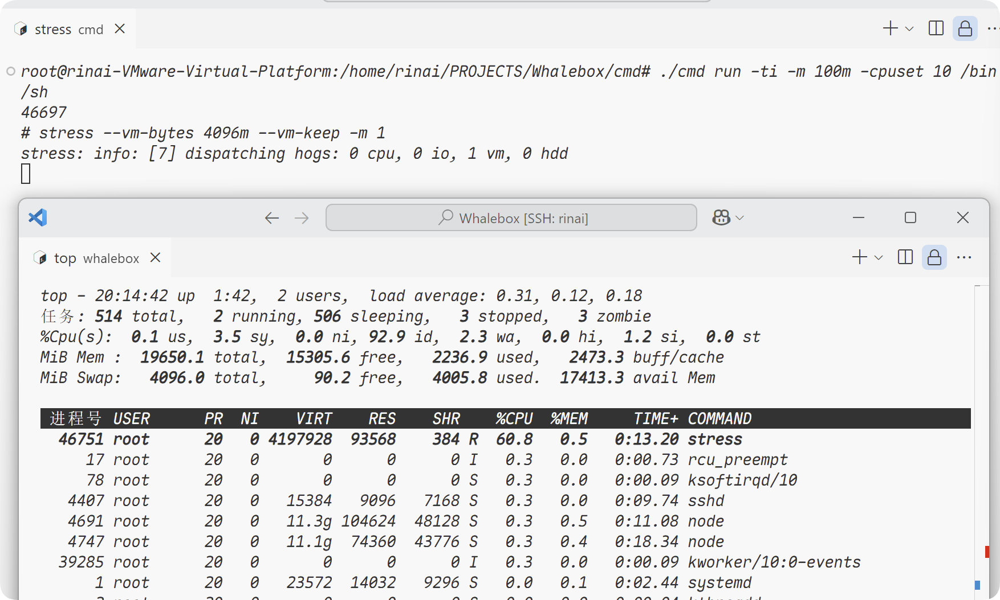

请注意，我们输入的时候并不能直接输入`./cmd run -ti -cpushare 10 stress --vm-bytes 4096m --vm-keep -m 1 &`这会导致你的-m参数被识别成memorylimit的参数，所以不行，否则只能给你的-m改一下参数名了~

中途踩了好多坑，包括但不限于这个`-m`参数，书上明明白白写着，抄下来，但是直接退出，这也太无敌了....还让我debug了半天，还是感谢自己在测试的时候就在总结这些知识点，让我有机会仔细找bug。

## 3. **镜像，为容器加上一层魔法~**

### 3.1 **busybox，我们构造镜像的起点**

我们现在确确实实能够创建一个容器，并且为他添加上资源的限制，甚至能够通过管道的形式，将命令传递给子进程，使得我们的命令更加灵活，那么问题又来了，我们在进入容器的时候会发现，无论我们如何输入ls，他总是会在当前目录下进行**领域展开**，然而我们在docker里面，却能够看似独享一个文件系统，那么，我们就迎来了接下来的内容--镜像。

首先我们需要一个真正的小系统，将这个小系统放在我们的容器中，然后我们能够访问这个小系统的文件，并且使用独立的挂载目录。

这里我们使用`busybox`，首先通过`docker pull busybox`拉取，然后输入`docker run -d busybox top -d`创建一个容器id，通过`docker export -o busybox.tar [容器ID]`将这个容器导出到当前的目录下，然后`tar -xvf busybox.tar -C busybox/`来将其解压，这个文件夹将在之后成为我们挂载的根目录，首先我们需要做的就是更改当前的工作目录，因为我们执行命令的时候，会寻找一个根目录来作为容器的工作目录，此时我们直接使用这个busybox的文件夹作为根目录，在你的`func **NewParentProcess**(tty bool) (*exec.Cmd, *os.File)`方法中添加`cmd.Dir = "你的busybox目录"`，然后我们就可以开始了！

我们将在init.go中补充以及修改内容，总体结构如下，这里重点还是以注释为主要的讲解办法。

```go
func RunContainerInitProcess() error {
	cmdArray := readUserCommand()
	if cmdArray == nil {
		log.Debug("No command received from parent")
		return errors.New("no command received from parent")
	}
	log.Info(fmt.Sprintf("RunContainerInitProcess, cmd is: %s", cmdArray))
	//这里将挂载的流程替换为函数，这里是唯一修改的地方！
    //该函数的其他地方不用看了，直接看SetupMount就可以
	SetupMount()

	path, err := exec.LookPath(cmdArray[0])
	if err != nil {
		log.Error(err.Error())
		return err
	}
	log.Info(fmt.Sprintf("Find path: %s", path))

	if err := syscall.Exec(path, cmdArray[0:], os.Environ()); err != nil {
		log.Error(err.Error())
		return err
	}
	return nil
}

func readUserCommand() []string {
	pipe := os.NewFile(uintptr(3), "pipe")

	log.Debug("pipe Create")

	msg, err := io.ReadAll(pipe)
	if err != nil {
		log.Error("init read pipe error:" + err.Error())
		return nil
	}
	log.Info(fmt.Sprintf("Received command from parent: %s", msg))
	return strings.Split(string(msg), " ")
}


//设置我们的工作目录挂载，并且设置挂载隔离
func SetupMount() {
    //获取当前的工作目录，也就是我们之前的cmd.dir设置的目录！
	pwd, err := os.Getwd()
	if err != nil {
		log.Error("SetupMount: Failed to get current directory: " + err.Error())
		return
	}
	log.Info("Current directory: " + pwd)
    //将我们的挂载目录和宿主机隔离，否则会影响到宿主机
    //这一步不加去运行容器，你的linux可以准备恢复到上一个快照了
	syscall.Mount("", "/", "", syscall.MS_PRIVATE|syscall.MS_REC, "")
    //又是一个自定义的函数，这一步主要是讲容器的根目录切换到我们的工作目录。
	pivotRoot(pwd)
	defaultMountFlags := syscall.MS_NOEXEC | syscall.MS_NOSUID | syscall.MS_NODEV
	if err := syscall.Mount("proc", "/proc", "proc", uintptr(defaultMountFlags), ""); err != nil {
		log.Error("SetupMount: Failed to mount proc: " + err.Error())
		return
	}
	if err := syscall.Mount("tmpfs", "/tmp", "tmpfs", uintptr(defaultMountFlags), ""); err != nil {
		log.Error("SetupMount: Failed to mount tmpfs: " + err.Error())
		return
	}
}


func pivotRoot(root string) error {
	if err := syscall.Mount(root, root, "bind", syscall.MS_BIND|syscall.MS_REC, ""); err != nil {
		log.Error("pivotRoot: Failed to bind mount root: " + err.Error())
		return err
	}
	pivotDir := filepath.Join(root, ".pivot_root")
	if err := os.Mkdir(pivotDir, 0777); err != nil {
		log.Error("pivotRoot: Failed to create pivot directory: " + err.Error())
		return err
	}
	if err := syscall.PivotRoot(root, pivotDir); err != nil {
		log.Error("pivotRoot: Failed to pivot root: " + err.Error())
		return err
	}
	if err := syscall.Chdir("/"); err != nil {
		log.Error("pivotRoot: Failed to change directory to /: " + err.Error())
		return err
	}
	pivotDir = filepath.Join("/", ".pivot_root")
	if err := syscall.Unmount(pivotDir, syscall.MNT_DETACH); err != nil {
		log.Error("pivotRoot: Failed to unmount pivot directory: " + err.Error())
		return err
	}
	return os.Remove(pivotDir)
}
```

嗯，到这一步，我们的对一个独立文件目录的需求就解决了

在bash里面启动容器，我们能够看见以下的内容

```go
root@rinai-VMware-Virtual-Platform:/home/rinai/PROJECTS/Whalebox/cmd# ./cmd run -ti sh
12855
/ # ls -l
total 44
drwxr-xr-x    2 root     root         12288 Sep 26 21:31 bin
drwxr-xr-x    4 root     root          4096 Mar 27 12:31 dev
drwxr-xr-x    3 root     root          4096 Mar 27 12:31 etc
drwxr-xr-x    2 nobody   nobody        4096 Sep 26 21:31 home
drwxr-xr-x    2 root     root          4096 Sep 26 21:31 lib
lrwxrwxrwx    1 root     root             3 Sep 26 21:31 lib64 -> lib
dr-xr-xr-x  560 root     root             0 Mar 27 14:18 proc
drwx------    2 root     root          4096 Mar 27 14:14 root
drwxr-xr-x    2 root     root          4096 Mar 27 12:31 sys
drwxrwxrwt    2 root     root            40 Mar 27 14:18 tmp
drwxr-xr-x    4 root     root          4096 Sep 26 21:31 usr
drwxr-xr-x    4 root     root          4096 Sep 26 21:31 va
```

但是我们还有一个需求--真正的镜像

在之前的实验中，我们知道，我们docker的容器在底层共享一个镜像，而在进行写入操作的时候，就会利用unionFS来实现将我们写入的数据放入到**可写层**，而不会改变这个镜像，而事实上在我们这里如果进行写入操作的话，就会对镜像造成一些修改，所以我们需要通过另一个工具来实现读写层的分离。

由于我的系统貌似不支持aufs，这里采取的是overlayfs，如果需要使用aufs的话，可以去参考《自己动手写docker》这本书，我在很大程度上也是看着这本书来写的。


### 3.2 **让Overlayfs为你实现读写层的分离！**

首先我们需要在container包下面创建一个volume.go，用来存储我们实现overlayfs的逻辑。

**应该咋做？**

首先我们需要回忆一下我们之前的实验做了些什么？

我们需要当前的镜像目录的同级加上**work**(工作目录)/**readOnlyLayer**(只读层，我们的镜像)/**WriteLayer**(写入层，实现COW)，实际上，我们就是创建了这几个目录，然后执行了overlayfs的初始化命令而已，说干就干！

```go
func NewWorkSpace(RootURL, mntURL string) {
	CreateReadOnlyLayer(RootURL)
	CreateWriteLayer(RootURL)
	CreateMountPoint(RootURL, mntURL)
}

func CreateReadOnlyLayer(RootURL string) {
	busyboxURL := RootURL + "busybox/"
	busyboxTarURL := RootURL + "busybox.tar"
    //查看文件是否存在
	exist, err := PathExists(busyboxURL)
	if err != nil {
		log.Error("CreateReadOnlyLayer, PathExists error: " + err.Error())
		return
	}
	if !exist {
        //不存在，先创建
		if err := os.Mkdir(busyboxURL, 0777); err != nil {
			log.Error("CreateReadOnlyLayer, Mkdir error: " + err.Error())
			return
		}
        //然后将其解压到刚刚创建的文件
		if _, err := exec.Command("tar", "-xvf", busyboxTarURL, "-C", busyboxURL).CombinedOutput(); err != nil {
			log.Error("CreateReadOnlyLayer, tar error: " + err.Error())
		}
	}
}

func CreateWriteLayer(RootURL string) {
	writeURL := RootURL + "writeLayer/"
	if err := os.Mkdir(writeURL, 0777); err != nil {
		log.Error("CreateWriteLayer, Mkdir error: " + err.Error())
	}
}

func CreateMountPoint(RootURL, mntURL string) {
	if err := os.Mkdir(mntURL, 0777); err != nil {
		log.Error("CreateMountPoint, Mkdir mntURL error: " + err.Error())
		return
	}

	workdirURL := RootURL + "work"
	if err := os.Mkdir(workdirURL, 0777); err != nil {
		log.Error("CreateMountPoint, Mkdir Workdir error: " + err.Error())
		return
	}
	//这里的参数设定可以参考之前我们输入的命令
    //就是初始化我们的overlay文件系统的命令。
    //这里就是设定相对应的层。
	builder := strings.Builder{}
	builder.WriteString("lowerdir=")
	builder.WriteString(RootURL + "busybox,")
	builder.WriteString("upperdir=")
	builder.WriteString(RootURL + "writeLayer,")
	builder.WriteString("workdir=")
	builder.WriteString(RootURL + "work")

	cmd := exec.Command("mount", "-t", "overlay", "overlay", "-o", builder.String(), mntURL)
	cmd.Stdout = os.Stdout
	cmd.Stderr = os.Stderr
	if err := cmd.Run(); err != nil {
		log.Error("CreateMountPoint, mount error: " + err.Error())
		return
	}
}

func PathExists(path string) (bool, error) {
	_, err := os.Stat(path)
	if err == nil {
		return true, nil
	}
	if os.IsNotExist(err) {
		return false, nil
	}
	return false, err
}
```

总体的逻辑其实是很简单的，更多的篇幅其实是用`Mkdir`去新建文件。

然而，我们到了这一步，我们确确实实具有了构造一个镜像的能力了，然而这并不够，我们需要将`NewWorkSpace()`放在一个合理的位置`container_process.go`中，具体位置如下：
```go
func NewParentProcess(tty bool) (*exec.Cmd, *os.File) {
	readPipe, writePipe, err := NewPipe()
	if err != nil {
		log.Error("NewParentProcess: Failed to create pipe: " + err.Error())
		return nil, nil
	}
	cmd := exec.Command("/proc/self/exe", "init")
	cmd.SysProcAttr = &syscall.SysProcAttr{
		Cloneflags: syscall.CLONE_NEWUTS |
			syscall.CLONE_NEWPID | syscall.CLONE_NEWNS |
			syscall.CLONE_NEWIPC | syscall.CLONE_NEWNET,
		// syscall.CLONE_NEWUSER,
		// UidMappings: []syscall.SysProcIDMap{
		// 	{
		// 		ContainerID: 0,
		// 		HostID:      0,
		// 		Size:        1,
		// 	},
		// },
		// GidMappings: []syscall.SysProcIDMap{
		// 	{
		// 		ContainerID: 0,
		// 		HostID:      1000,
		// 		Size:        1,
		// 	},
		// },
	}
	if tty {
		cmd.Stdin = os.Stdin
		cmd.Stdout = os.Stdout
		cmd.Stderr = os.Stderr
	}
	cmd.ExtraFiles = []*os.File{readPipe}
    //修改的地方！！！！！
    //这里我是使用了自己自定义的文件目录来存放镜像了
    //随便设置都可以。
	mntURL := "/home/rinai/PROJECTS/Whalebox/example/example3/mnt/"
	rootURL := "/home/rinai/PROJECTS/Whalebox/example/example3/"
	NewWorkSpace(rootURL, mntURL)
	cmd.Dir = mntURL
	log.Info(fmt.Sprintf("Command: %v", cmd))
	return cmd, writePipe
}

func NewPipe() (*os.File, *os.File, error) {
	read, write, err := os.Pipe()
	if err != nil {
		log.Error("NewPipe: Failed to create pipe: " + err.Error())
		return nil, nil, err
	}
	log.Info(fmt.Sprintf("New pipe: read: %d, write: %d", read.Fd(), write.Fd()))
	return read, write, nil
}
```

可以对比以下之前的代码，来进行比对。

但是，仅仅是这样吗？我们在退出容器的时候，还需要取消挂载，并删除这些文件。

```go
func DeleteWorkSpace(rootURL, mntURL string) {
	DeleteMountPoint(rootURL, mntURL)
	DeleteWriteLayer(rootURL)
	DeleteWorkdir(rootURL)
}

func DeleteMountPoint(rootURL, mntURL string) {
    //这一步是取消我们的挂载
	cmd := exec.Command("umount", mntURL)
	cmd.Stdout = os.Stdout
	cmd.Stderr = os.Stderr

	if err := cmd.Run(); err != nil {
		log.Error("DeleteMountPoint, umount error: " + err.Error())
		return
	}

	if err := os.RemoveAll(mntURL); err != nil {
		log.Error("DeleteMountPoint, RemoveAll mntURL error: " + err.Error())
	}
}

func DeleteWriteLayer(rootURL string) {
	writeURL := rootURL + "writeLayer/"
	if err := os.RemoveAll(writeURL); err != nil {
		log.Error("DeleteWriteLayer, RemoveAll writeURL error: " + err.Error())
	}
}

func DeleteWorkdir(rootURL string) {
	workdirURL := rootURL + "work"
	if err := os.RemoveAll(workdirURL); err != nil {
		log.Error("DeleteWorkdir, RemoveAll workdirURL error: " + err.Error())
	}
}

```

大部分都是删除的逻辑，然后我们需要将`DeleteWorkSpace()`放到一个我们的`Run()`函数中，这样，我们就能够真正的实现一个镜像了！！！

让我们来看看效果吧！

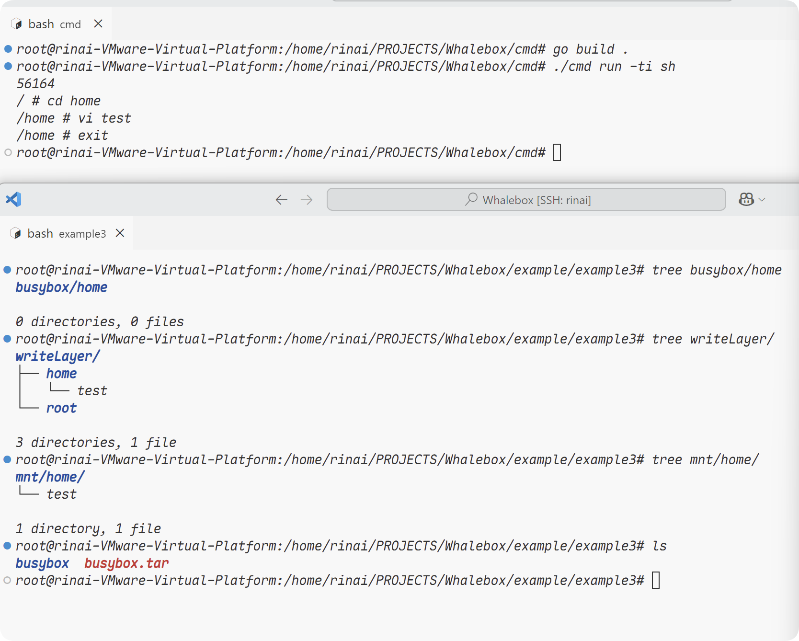

显然，我们确实能够精确的进入到容器中，并且实现底层的镜像公用，在执行写入的时候，也的确能够将我们的写入信息写入到我们指定的写入层，而在我们退出容器之后，我们与overlays相关的文件也都删除，不留痕迹，这是一件足够令人兴奋的壮举，我们已经跨越了许多困难，最终真的实现了一个镜像！

当然，故事到这里才刚刚开始。

