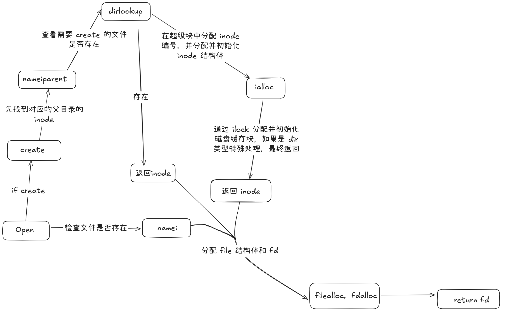

# MIT6.S081-lab8前置

注：本部分除了文件系统还包含了调度的内容。

## 调度

调度涉及到保存寄存器，恢复寄存器，就这一点而言，和我们的 trap 很像，但是实际上，我们实现并不是复用了 trap 的逻辑，我们可以在 kernel/swtch.S 里面找到关于上下文的保存与恢复的代码。

它是由什么调用的？调用链路如下：

> usertrap -> yield -> sched -> swtch

我们可以在 proc.h 中，找到关于我们保存的 context 结构体的痕迹：

```c
// 用于内核线程上下文切换时保存寄存器的结构体。
struct context {
  uint64 ra;   // return address，返回地址寄存器（保存 PC），由于 swtch 也相当于一个函数，所以此时保存的是 swtch的返回地址
  uint64 sp;   // 栈指针，指向该线程的内核栈顶

  // 以下是 callee-saved 寄存器，根据 RISC-V 调用约定需要在函数调用之间保持不变
  uint64 s0;
  uint64 s1;
  uint64 s2;
  uint64 s3;
  uint64 s4;
  uint64 s5;
  uint64 s6;
  uint64 s7;
  uint64 s8;
  uint64 s9;
  uint64 s10;
  uint64 s11;
};
```

由此我们可以看出，我们保存了一些临时值/栈指针以及返回的地址，以保证我们能够实现正确的上下文切换，返回。

但是这样就能切换了？我们可以来看看 sched 的代码，看看他干了些什么：

```c
void
sched(void)
{
  int intena;
  struct proc *p = myproc(); // 获取当前运行的进程指针

  // 下面是一系列 check，确保调用 sched 时的前提条件正确：

  // 必须持有当前进程的锁，否则可能导致竞态
  if(!holding(&p->lock))
    panic("sched p->lock");

  // noff == 1 表示当前只屏蔽了一层中断（通过 push_off()），是内核中强约束要求
  if(mycpu()->noff != 1)
    panic("sched locks");

  // 当前进程不应该是 RUNNING 状态，调用 sched 前必须先设置为 SLEEPING、RUNNABLE 等
  if(p->state == RUNNING)
    panic("sched running");

  // 中断应该已经被关闭，避免中断过程中切换上下文
  if(intr_get())
    panic("sched interruptible");

  // 保存当前中断开启状态，稍后恢复
  intena = mycpu()->intena;

  // 切换上下文：保存当前进程的 context，跳转到 CPU 调度器 context（在 scheduler 中）
  swtch(&p->context, &mycpu()->context);

  // 恢复中断开启状态
  mycpu()->intena = intena;
}
```

此时我们的 swtch 通过 mycpu 切换到另一个线程，这里的切换的线程是由谁决定的？这里需要回到我们 kernel 的启动主函数：

```c
void
main()
{
  // 只有引导 cpu 才会进行初始化操作系统
  if(cpuid() == 0){
    consoleinit();
    printfinit();
    printf("\n");
    printf("xv6 kernel is booting\n");
    printf("\n");
    kinit();         // physical page allocator
    kvminit();       // create kernel page table
    kvminithart();   // turn on paging
    procinit();      // process table
    trapinit();      // trap vectors
    trapinithart();  // install kernel trap vector
    plicinit();      // set up interrupt controller
    plicinithart();  // ask PLIC for device interrupts
    binit();         // buffer cache
    iinit();         // inode table
    fileinit();      // file table
    virtio_disk_init(); // emulated hard disk
    userinit();      // first user process
    __sync_synchronize();
    started = 1;
  } else {
    while(started == 0)
      ;
    __sync_synchronize();
    printf("hart %d starting\n", cpuid());
    kvminithart();    // turn on paging
    trapinithart();   // install kernel trap vector
    plicinithart();   // ask PLIC for device interrupts
  }
  // 最后所有的 cpu 都会执行调度器
  scheduler();        
}
```

我们可以发现，在 main 函数的末尾，会调用一个 scheduler ，也就是调度器，这个函数会无限循环，帮助整个操作系统去调度线程，所以我们这部分的核心就是研究 scheduler 是如何工作的：

```c
void
scheduler(void)
{
  struct proc *p;
  struct cpu *c = mycpu();  // 获取当前 CPU 的结构体

  c->proc = 0;  // 当前 CPU 还没有运行任何进程
  for(;;){      // 调度器是一个无限循环，不会退出
    // 上一个运行的进程可能关闭了中断，为了防止所有进程都阻塞导致死锁，这里强制打开中断
    intr_on();

    int nproc = 0;  // 当前活跃（非 UNUSED）的进程数量
    for(p = proc; p < &proc[NPROC]; p++) {
      acquire(&p->lock);  // 加锁，防止状态竞争

      if(p->state != UNUSED) {
        nproc++;  // 统计当前系统中还存在的进程数
      }

      if(p->state == RUNNABLE) {  // 找到一个可以运行的进程
        p->state = RUNNING;       // 将状态设置为正在运行
        c->proc = p;              // 标记当前 CPU 正在运行该进程

        // 切换上下文：保存当前 CPU 的 scheduler 上下文，跳转到进程的上下文继续执行
        swtch(&c->context, &p->context);

        // 一旦 swtch 返回，说明该进程让出了 CPU，调度器重新获得控制权
        c->proc = 0;  // 清除当前 CPU 上运行的进程指针
      }

      release(&p->lock);  // 解锁
    }
	// 如果系统中只剩 init 和 shell，没有用户进程
    if(nproc <= 2) {    // 调用 wfi（等待中断），进入低功耗状态，直到有中断发生再唤醒
      intr_on();
#ifndef LAB_FS
      asm volatile("wfi");
#endif
    }
  }
}
```

我们可以看到，我们其实最开始所有的 cpu 都运行在 scheduler 中，一旦发现需要运行的进程，就会启动调度循环，通过 swtch 切换到需要被调度的进程。而这里和 yield 是相辅相成的，当我们的进程运行时间耗尽或者执行完毕，就会在 yield 中执行 swtch 回到我们的调度循环，进而执行其他进程的调度或者陷入休眠，这里也是一个理解起来很有意思的点。

我们最开始完成了一系列启动程序之后（包括 shell），就会进入到调度程序中，如果进程中只有 shell 和 init 进程，那么所有的 cpu 没有什么可以调度的，就会陷入低功耗模式，一旦我们的 shell 通过 fork 创建了一个进程，这个 fork 也会将这个进程注册到全局的进程数组中，之后会执行 exec ，将我们需要的程序加载进去，这样，我们的 scheduler 就可以正常的去调度这个进程了！

## 休眠和唤醒

我们之前在学习中断的时候曾看见过 sleep 和 wakeup 这样的函数，他们实际上也和调度有着千丝万缕的关系，我们在等待事件的时候，会希望它能够不消耗 cpu 资源，而能够让其他的进程去占用这个 cpu ，于是，我们就引入了 sleep 和 wakeup 这两个函数，通过他们，我们可以让进程在等待时陷入睡眠，而当我们未来有一个进程完成了这个进程所需要的时间，我们就可以通过 wakeup去唤醒它，在 xv6 中，有这样一个简单的休眠和唤醒的机制：

```c
// 原子地释放锁并在 chan 上睡眠，chan 可以理解为进程陷入休眠的理由
// 唤醒时会重新获取锁。
void
sleep(void *chan, struct spinlock *lk)
{
  struct proc *p = myproc();
  
  // 必须获取 p->lock 来更改 p->state，然后调用 sched。
  // 一旦我们持有 p->lock，我们可以保证不会错过任何的 wakeup
  // （因为wakeup 会锁定 p->lock），
  acquire(&p->lock);
  
  // 在进入睡眠之前释放原始锁，允许其他进程运行。
  release(lk);

  // 将进程的状态设置为睡眠，并将其与提供的通道关联。
  p->chan = chan;
  p->state = SLEEPING;

  // 切换到调度器，让给其他进程运行
  sched();

  // 唤醒后进行清理。
  // 清除进程的通道，表示进程不再在该通道上睡眠。
  p->chan = 0;

  // 唤醒后重新获取原始的锁。
  release(&p->lock);
  acquire(lk);
}

// 唤醒所有在 chan 上睡眠的进程。
// 必须在没有任何 p->lock 的情况下调用。
void
wakeup(void *chan)
{
  struct proc *p;

  // 遍历进程表中的所有进程。
  for(p = proc; p < &proc[NPROC]; p++) {
    // 因为当前进程一定是在运行的，所以跳过当前进程（myproc）。
    if(p != myproc()){
      acquire(&p->lock);  // 获取锁，以安全地修改进程状态。
      
      // 如果处于睡眠且与给定的休眠原因一样，则唤醒。
      if(p->state == SLEEPING && p->chan == chan) {
        // 将进程状态更改为可运行（RUNNABLE），使其可以被调度。
        p->state = RUNNABLE;
      }
      // 在修改进程状态后释放锁。
      release(&p->lock);
    }
  }
}
```

大部分内容都已经在注释中标好了，但是仍然值得一提的是 chan， chan 指的就是进程陷入休眠的原因，我们如果想要因为一个操作而唤醒多个进程，就可以使用将这多个进程陷入休眠的原因写成一样的。

通过 sleep 和 wakeup 的机制，我们也可以实现信号量的机制。

另外，xv6 中有一个利用了这个机制实现了比较好的例子是 pipe ，当我们像管道中写入数据的时候，我们会尝试获取这个管道的锁，获取成功，则会开始下一步判断，如果管道缓冲区已经满了，就会唤醒读管道进行读取，然后令当前进程休眠从而释放锁，其实也不算很复杂，具体的逻辑如下：

```c
// 向管道中写数据。
// 参数：pi - 管道，addr - 写入数据的地址，n - 要写入的数据字节数
int
pipewrite(struct pipe *pi, uint64 addr, int n)
{
  int i = 0;
  struct proc *pr = myproc();  // 获取当前进程

  acquire(&pi->lock);  // 获取管道的锁，确保对管道的访问是互斥的
  while(i < n){  // 循环写入数据
    if(pi->readopen == 0 || killed(pr)){  // 如果管道的读端已关闭或者进程已被杀死
      release(&pi->lock);  // 释放锁
      return -1;  // 写入失败
    }
    // 如果管道已满（即写指针与读指针的差值等于管道大小），则进入休眠
    if(pi->nwrite == pi->nread + PIPESIZE){
      wakeup(&pi->nread);  // 唤醒可能在管道上等待的读取进程
      sleep(&pi->nwrite, &pi->lock);  // 进入休眠，等待管道有空闲空间
    } else {
      char ch;
      // 从进程的地址空间读取一个字节的数据
      if(copyin(pr->pagetable, &ch, addr + i, 1) == -1)
        break;  // 如果读取失败，退出
      pi->data[pi->nwrite++ % PIPESIZE] = ch;  // 将数据写入管道并更新写指针
      i++;  // 增加已写入字节数
    }
  }
  wakeup(&pi->nread);  // 唤醒可能在管道上等待的读取进程
  release(&pi->lock);  // 释放锁

  return i;  // 返回写入的字节数
}

// 从管道中读取数据。
// 参数：pi - 管道，addr - 读取数据的地址，n - 要读取的数据字节数
int
piperead(struct pipe *pi, uint64 addr, int n)
{
  int i;
  struct proc *pr = myproc();  // 获取当前进程
  char ch;

  acquire(&pi->lock);  // 获取管道的锁，确保对管道的访问是互斥的
  // 如果管道为空且写端没有关闭，进入休眠等待写入数据
  while(pi->nread == pi->nwrite && pi->writeopen){
    if(killed(pr)){  // 如果进程被杀死，退出
      release(&pi->lock);  // 释放锁
      return -1;  // 读取失败
    }
    sleep(&pi->nread, &pi->lock);  // 进入休眠，等待数据写入
  }
  for(i = 0; i < n; i++){
    // 如果管道为空，停止读取
    if(pi->nread == pi->nwrite)
      break;
    ch = pi->data[pi->nread++ % PIPESIZE];  // 从管道读取一个字节数据
    // 将数据写入进程的地址空间
    if(copyout(pr->pagetable, addr + i, &ch, 1) == -1)
      break;  // 如果写入失败，退出
  }
  wakeup(&pi->nwrite);  // 唤醒可能在管道上等待写入的进程
  release(&pi->lock);  // 释放锁
  return i;  // 返回读取的字节数
}
```

除此之外，我们也会注意到，我们的 sleep 会传入一个锁作为参数，为什么会这样？

我们需要在对进程 proc 加锁之后，才可以释放我们传入的那个锁：

以之前的将数据写到终端的 write 为例子，我们在缓冲区满的时候，会传入一个锁，我们需要提前去获取这个锁，来保证操作的缓冲区原子性，而不会和其他将要读或写这个缓冲区的进程发生竞态条件，如果发现缓冲区满了，我们会传入这个锁陷入 sleep ，在 sleep 之前，我们会拿到这个进程的锁，并且释放传入的锁，这样的做法可以**防止**在释放锁和获取进程的锁（之后会设置 sleeping 状态）的**空隙**发生，而其他想要读缓冲区的进程，如果在这个间隙拿到这个锁，去读取数据，并且去唤醒了这个 proc ，而此时我们的 sleeping 状态还没有设置，此时就会 lost wakeup ，导致无法正确唤醒进程。其实，以才提过的管道为例子也可以说明这个情况，我们在读写缓冲区的时候都需要获取锁，并且在一些情况下需要陷入休眠，去正确的获取和释放锁，仅此而已。

而在进入到 scheduler 的时候，我们的才会真正的去释放这个 proc 的锁，使得我们的 wakeup 终于可以去唤醒这个进程了，此时就解决了 lost wakeup 。

## 进程

关于进程，我们还需要介绍一些东西， wait/exit/kill 这三个调用。

我们在写第一个 lab 的时候，常常可以看见 exit 和 wait 这两个，所以从这两个开始， exit 是什么？就是令当前的进程正常退出，这个进程在执行 exit 过程中会变成僵尸状态，此时，他将无法被再次调度。

但是值得注意的是，我们在 exit 的之后，当前进程会被标记为僵尸进程，而不是 UNUSED ，我们的 fork 系统调用无法复用僵尸进程占用的空间，通常，我们的父进程执行 wait 的时候，我们的子进程会被正确回收。

```c
// 退出当前进程。该函数不会返回。
// 退出的进程会进入僵尸状态，
// 直到其父进程调用 wait()。
void
exit(int status)
{
  struct proc *p = myproc();  // 获取当前进程

  if(p == initproc)  // 如果当前进程是初始化进程，触发 panic，因为 init 进程不能退出
    panic("init exiting");

  // 关闭所有打开的文件。
  for(int fd = 0; fd < NOFILE; fd++){
    if(p->ofile[fd]){  // 如果该文件描述符有打开的文件
      struct file *f = p->ofile[fd];
      fileclose(f);  // 关闭文件
      p->ofile[fd] = 0;  // 将文件描述符置为 0，表示关闭
    }
  }

  // 清理当前进程的工作目录。
  begin_op();
  iput(p->cwd);  // 释放工作目录的 inode
  end_op();
  p->cwd = 0;  // 清除工作目录指针

  acquire(&wait_lock);  // 获取等待锁，确保进程退出时不会有竞争条件

  // 将当前进程的子进程交给 init 进程管理。
  reparent(p);

  // 父进程可能正在等待子进程退出，唤醒父进程。
  wakeup(p->parent);

  acquire(&p->lock);  // 获取当前进程的锁

  // 设置当前进程的退出状态，并将其标记为僵尸状态。
  p->xstate = status;  // 设置退出状态
  p->state = ZOMBIE;  // 将进程状态设置为 ZOMBIE

  release(&wait_lock);  // 释放等待锁

  // 跳转到调度器，永远不返回。
  sched();

  // 如果调度器返回，表示发生了错误，触发 panic。
  panic("zombie exit");
}
```

我们上面提到了父进程执行 wait 等待子进程退出，此时，所谓的僵尸进程的空间才会被真正释放：

```c
// 等待一个子进程退出并返回其 pid。
// 如果该进程没有子进程，则返回 -1。
int
wait(uint64 addr)
{
  struct proc *pp;
  int havekids, pid;
  struct proc *p = myproc();  // 获取当前进程

  acquire(&wait_lock);  // 获取等待锁，确保对进程表的访问是互斥的

  for(;;){
    // 扫描进程表，查找已退出的子进程。
    havekids = 0;
    for(pp = proc; pp < &proc[NPROC]; pp++){
      if(pp->parent == p){  // 如果进程 pp 是当前进程的子进程
        // 确保子进程没有处于 exit() 或 swtch() 状态
        acquire(&pp->lock);  // 获取子进程的锁

        havekids = 1;  // 当前进程有子进程
        if(pp->state == ZOMBIE){  // 如果子进程处于僵尸状态
          // 找到一个已退出的子进程
          pid = pp->pid;
          
          // 如果 addr 不为 0，尝试将退出状态（xstate）写入到父进程的内存中
          if(addr != 0 && copyout(p->pagetable, addr, (char *)&pp->xstate,
                                  sizeof(pp->xstate)) < 0) {
            release(&pp->lock);  // 释放子进程的锁
            release(&wait_lock);  // 释放等待锁
            return -1;  // 写入失败，返回 -1
          }

          // 释放子进程资源，包括将 proc 设置为 UNUSED
          freeproc(pp);
          release(&pp->lock);  // 释放子进程的锁
          release(&wait_lock);  // 释放等待锁
          return pid;  // 返回已退出的子进程的 pid
        }
        release(&pp->lock);  // 释放子进程的锁
      }
    }

    // 如果没有子进程，或者当前进程已被杀死，直接返回 -1
    if(!havekids || killed(p)){
      release(&wait_lock);  // 释放等待锁
      return -1;  // 没有子进程，或者进程已被杀死
    }
    
    // 没有找到已退出的子进程，当前进程进入休眠，等待子进程退出
    sleep(p, &wait_lock);  //DOC: wait-sleep
  }
}
```

通过以上的分析，我们可以知道，如果父进程不调用 wait ，而直接退出就会导致资源无法正确释放，而如果子进程不调用 exit ，也会导致资源无法正确释放，但是在比较完善的操作系统中，我们的孤儿进程通常都会被 init 进程接管，而没有显式调用 exit 而退出的进程，也会被操作系统识别为 ZOMBINE 状态而正常释放。

下面再来介绍一下 kill ，这是一个比较特殊的杀死进程，我们仅仅会将它的 killed 表示设置为 1 ，表示它已经被杀死，而不是将他的状态设置为 ZOMBINE 或者 UNUSED ，如果它正处于 SLEEPING 状态，则会唤醒它，使得它可以正常退出。

```c
// 杀死指定 pid 的进程。
// 目标进程不会立即退出，直到它尝试返回用户空间（见 trap.c 中的 usertrap()）。
// 该函数遍历进程表，找到匹配的进程 pid，
// 将其标记为“已杀死”，如果进程处于 SLEEPING（睡眠）状态，
// 将其状态更改为 RUNNABLE（可运行）。进程最终会在返回用户空间时退出。
int
kill(int pid)
{
  struct proc *p;

  // 遍历进程表中的所有进程。
  for(p = proc; p < &proc[NPROC]; p++){
    acquire(&p->lock);  // 获取进程的锁，确保线程安全。
    
    if(p->pid == pid){  // 检查当前进程是否与给定的 pid 匹配。
      p->killed = 1;  // 将进程标记为已杀死（设置标志）。
      
      // 如果进程处于 SLEEPING（睡眠）状态，则将其状态更改为 RUNNABLE（可运行）。
      // 这样可以确保进程被调度运行，并最终退出。
      if(p->state == SLEEPING){
        p->state = RUNNABLE;
      }
      
      release(&p->lock);  // 修改进程状态后释放锁。
      return 0;  // 返回 0 表示操作成功。
    }
    
    release(&p->lock);  // 如果当前进程的 pid 不匹配，释放锁。
  }
  
  return -1;  // 如果没有找到匹配 pid 的进程，返回 -1。
}
```

为什么要延后它的退出？如果立刻将他退出，可能会出现资源上的混乱，比如锁等资源无法被释放等问题，而我们通过这种方式可以正确地，优雅地退出这个进程，而需要做到这一点，需要在合理的位置进行进程是否被杀死的判断，比如说，在 usertrap 的时候会进行这一步判断，因为此时进程不会持有任何锁，也不在一些重要的操作的过程中，所以此时检查是很安全的。

## 线程

我们的 xv6 没有线程这一概念，或者说每个进程只有一个线程，所实现的基本都是进程的调度，切换，但是在 lecture 里面却介绍了这一概念，所以在这里也记一下。

在操作系统中，线程是由进程管理的，在 go 中，线程下还管理着协程，当然这不是我们的重点，同一个进程管理的线程地址空间是共享的，比如说，一个对一个变量进行修改，在另一个线程中，对这个变量的修改是可见的。

问题又来了，你说进程之间不共享内存，为什么 xv6 里面，多个进程之间都可以读取 proc 数组等全局变量？有这个疑问很正常，因为我们所有进程在内核态都是对应的同一个空间，也就是说，内核空间是共享的！这也是为什么我们不同的 cpu 可以针对于一个 proc 数组进行 scheduler 调度。当然，用户空间肯定不是共享的了。

对于在进程之中，多线程肯定会有竞态条件，因此，我们也会常常用到锁，这也是我们在写代码之中常用的方法。**那么线程一般有什么组成？**

> - PC指针，也就是程序计数器，表示我们当前线程执行到代码的位置。
> - 寄存器，用于 scheduler 调度时候的数据保存和恢复。
> - 栈，用于保存线程的函数调用栈，调用结束则会自动销毁，如果无限递归，则会导致线程的栈无限扩大。

而我们在执行线程切换的时候，无需去保存整个栈，只需要保存栈指针就可以了。值得一提的是，我们的线程切换其实和 xv6 里面的scheduler 的进程切换的实现很相似，可以类比一下理解。

lecture 大概就讲了这么些东西，其他的 scheduler 在之前已经提过了。

其他是我询问 gpt 了解到的（不一定对），由 xv6 我们可以知道，这里的 scheduler 实际上就是一个内核程序（通过 sched 可以切换到这个特殊程序，然后可以执行进程调度，常见的地方比如 sleep ，时间片轮转等，都会使用到它），我们每个 cpu 默认都会执行这个程序来进行调度，这里的调度实际上就是进程调度，而线程调度如何实现？如果想要实现线程级别的调度，我们就不应该使用全局的 scheduler 来直接基于全局的线程进行调度，而是在进程内部单独实现一段线程级别的 scheduler ，则是线程级别的调度器，具体实现，可以类比 xv6 的 scheduler ，通过这样一个程序，我们可以实现线程级别的调度。

## 文件系统

在之前的 lab 中，我们对文件系统的部分内容有了初步的了解，现在，我们将更深入地接触 xv6 的文件系统。

我们首先要看的第一个地方，就是 mkfs/mkfs.c ，其中有一个 main 函数，他并不是 xv6 中的一个命令，而是将我们的操作系统打包成一个镜像的一个程序，我们通过 makefile 可以发现这一点：

```makefile
fs.img: mkfs/mkfs README $(UEXTRA) $(UPROGS)
	mkfs/mkfs fs.img README $(UEXTRA) $(UPROGS)
...
qemu: newfs.img $K/kernel fs.img
	$(QEMU) $(QEMUOPTS)
```

我们可以看到，我们会通过 mkfs 这个程序来讲内核文件全部打包，而在这个 mkfs 中，还会自己打包用户态的命令，为什么需要打包？除去我们的 qemu 需要一个操作系统镜像之外，其实我们也可以运行这些代码，但是我们无法获得一个独立的文件或者系统环境，通过镜像打包，将内核/用户代码加载到镜像中，而在 qemu 中运行的 xv6 拥有一个独立的文件系统，从某种意义上来说，这更像一个操作系统。

我们在打包镜像之后，可以通过 qemu 去启动这个操作系统，在我们的 mkfs 中调用的 balloc 与实际 xv6 使用的文件系统没有什么关系，我们只需要看 kernel/fs.c 就可以了， **balloc** ：

```c
static uint
balloc(uint dev)
{
  int b, bi, m;
  struct buf *bp;

  bp = 0;
  for(b = 0; b < sb.size; b += BPB){
    bp = bread(dev, BBLOCK(b, sb));  // 读取磁盘上的块，隐含加锁
    for(bi = 0; bi < BPB && b + bi < sb.size; bi++){
      m = 1 << (bi % 8);
      if((bp->data[bi/8] & m) == 0){  // 检查块是否空闲
        bp->data[bi/8] |= m;  // 标记块已分配
        log_write(bp);  // 写入日志，记录操作
        brelse(bp);  // 释放缓冲区
        bzero(dev, b + bi);  // 清空分配的块
        return b + bi;  // 返回已分配的块号
      }
    }
    brelse(bp);  // 释放缓冲区
  }
  printf("balloc: out of blocks\n");
  return 0;  // 如果没有可用的块，返回 0
}
```

balloc 会遍历每个块，直到找到一个位图为 0 的空闲块，由于块是全局的，所以肯定会发生竞态条件，但是实际上，这里的 bread 和 brelse 已经为我们的块上好了锁，这里从我们之前做的实验就可以知道，所以无需担心。而这里的第一层循环表示一个位图块，包含了多个磁盘块，先从 bread 里面获取位图块，然后进入第二层循环，查找未被分配的磁盘块（每个bit表示是否被分配），如果找到了空闲块，则会做一些标记和处理，最后返回这个块号。

**bfree** 则是充当了释放块的角色

```c
static void
bfree(int dev, uint b)   // 释放磁盘块b
{
  struct buf *bp;        // 定义一个指向缓存缓冲区的指针bp，用于存储从磁盘读取的位图块
  int bi, m;             // bi是块在位图中的位置，m是用来设置位图的掩码

  // 从磁盘读取位图块
  bp = bread(dev, BBLOCK(b, sb));  // 读取包含块b分配状态的位图块（位图块存储在磁盘上）

  bi = b % BPB;           // 计算块b在当前位图块中的偏移位置，BPB是每个位图块包含的数据块数
  m = 1 << (bi % 8);      // 计算位图中对应块b的掩码，bi%8是计算当前位的位移量（一个字节8位）

  // 检查当前块是否已经被释放，若该块已经是空闲的，则报错
  if((bp->data[bi / 8] & m) == 0)   // 如果对应的位为0，表示该块已经是空闲的
    panic("freeing free block");  // 如果试图释放一个已经是空闲的块，程序崩溃（防止错误操作）

  // 将位图中该位置的位设置为0，标记该块为空闲
  bp->data[bi / 8] &= ~m;   // 更新位图，使用位掩码将该块的分配状态置为未分配（0）

  log_write(bp);            // 将更新后的位图块写入日志，以便后续恢复或崩溃恢复时使用

  brelse(bp);               // 释放缓冲区，完成对位图块的操作，允许其他操作使用该缓存
}
```

这里的操作逻辑和 balloc 类似，但是我们会发现，这里都用到了 log_write 这个函数，实际上，我们之后会进行介绍，这里先不赘述。

### inode 的数据结构

下一步，我们需要引入 Inode 的概念，他表示一个具体的文件的基本信息，我们磁盘或者内存都会有 inode 的概念，磁盘上的 inode 由 struct dinode 定义：

```c
// On-disk inode structure
struct dinode {
  short type;           // 文件类型：指示这是普通文件、目录文件还是设备文件等。可能的值包括 T_FILE, T_DIR, T_DEVICE 等。
  
  short major;          // 设备的主设备号：仅在类型是 T_DEVICE 时有效，表示设备文件的主设备号。它用于区分不同的设备类型，如磁盘、终端等。

  short minor;          // 设备的次设备号：仅在类型是 T_DEVICE 时有效，表示设备文件的次设备号。它进一步区分设备的不同实例，例如某个磁盘上的不同分区。

  short nlink;          // 链接计数：表示有多少个目录项引用该 inode。如果 nlink 为 0，表示该 inode 对应的文件不再被任何目录项引用，文件可以被删除。

  uint size;            // 文件大小：以字节为单位表示文件的大小，即文件内容的总字节数。

  uint addrs[NDIRECT+1];   // 数据块地址：存储文件内容所在的数据块的块号。由于文件系统的设计限制，数据块的数量是固定的。`NDIRECT` 表示 **直接块地址** 的最大数量，`addrs[NDIRECT]` 是一个 **间接块地址**，用于指向更多的数据块。
};
```

一个文件的数据有时会很大，此时就需要存储在多个磁盘块上面， addrs 存储的就是这些块的地址，每个磁盘块不能同时存多个文件的数据，只能被一个文件占用，但是一个文件可以占有多个磁盘块。

我们还可以来看看内存中的 inode ：

```c
struct inode {
  uint dev;           // 设备号：表示该 inode 所在的设备。如果文件系统存储在多个设备上，这个字段帮助区分具体的设备。
  
  uint inum;          // inode number：该 inode 的编号，是文件在文件系统中的唯一标识符。每个文件都有一个对应的 inode number。
  
  int ref;            // 引用计数：表示有多少个指针引用这个 inode。每当一个进程或文件描述符引用该 inode 时，引用计数增加，当引用计数降为 0 时，inode 会被释放。
  
  struct sleeplock lock; // 用于保护 inode 的字段：`lock` 是一个睡眠锁，确保多个进程/线程不能同时修改同一个 inode，避免并发冲突。
  
  int valid;          // inode 是否有效：表示该 inode 是否已经从磁盘读取。如果 `valid` 为 0，表示 inode 尚未从磁盘加载；为 1 表示该 inode 已经加载到内存中。

  short type;         // 文件类型：表示文件的类型，例如普通文件、目录文件、设备文件等。该字段是磁盘上 inode 的副本。
  
  short major;        // 主设备号：仅在 `type == T_DEVICE` 时有效，表示设备文件的主设备号。用于区分设备类型（如硬盘、终端等）。
  
  short minor;        // 次设备号：仅在 `type == T_DEVICE` 时有效，表示设备文件的次设备号。用于区分设备的不同实例（如硬盘的多个分区）。
  
  short nlink;        // 链接计数：表示有多少个目录项引用该 inode。每当有新的硬链接指向该 inode 时，`nlink` 增加。当 `nlink` 为 0 时，表示该 inode 可以被删除。
  
  uint size;          // 文件大小：表示文件的总字节数。这个字段保存了文件的内容的大小。
  
  uint addrs[NDIRECT+1]; // 数据块地址：保存文件数据的磁盘块地址。`addrs[]` 数组包含了指向文件数据块的块号。`NDIRECT` 是文件系统中可以直接存储的磁盘块数量，`addrs[NDIRECT]` 存储间接地址，用来引用更多的数据块地址。
};
```

我们内存中的 inode 会作为结构体 file 中的一部分，通过 file 我们可以得到 inode 的指针，我们可以来看看 file 结构体长啥样：

```c
struct file {
  enum { FD_NONE, FD_PIPE, FD_INODE, FD_DEVICE } type;  

  int ref;            // 引用计数：表示有多少个进程或文件描述符引用该文件。每当文件被打开时，`ref` 增加，文件关闭时，`ref` 减少，当 `ref` 为 0 时，文件资源被释放。

  char readable;      // 可读标志：表示该文件是否可以进行读取操作。通常是 `1` 表示可读，`0` 表示不可读。

  char writable;      // 可写标志：表示该文件是否可以进行写入操作。通常是 `1` 表示可写，`0` 表示不可写。

  struct pipe *pipe;  // 管道文件（`FD_PIPE` 类型的文件）：指向管道数据结构，表示文件是一个管道。管道用于进程间通信。

  struct inode *ip;   // inode 指针（`FD_INODE` 和 `FD_DEVICE` 类型的文件）：指向文件的 inode 结构体，inode 中存储了文件的元数据（如文件类型、大小、数据块地址等）。
  
  uint off;           // 偏移量（`FD_INODE` 类型的文件）：表示文件当前的读写偏移量。当文件进行读写时，偏移量会更新，指示文件操作的当前位置。

  short major;        // 设备号（`FD_DEVICE` 类型的文件）：如果文件是设备文件，`major` 存储设备的主设备号。主设备号用于区分设备类型（例如磁盘、终端等）。对于普通文件或目录，这个字段通常不使用。
};
```

### 关于文件的系统调用

通过上面的结构体及其注释，我们可以初步的了解，当我们 open 一个文件的时候，我们的引用计数会 + 1 ，并且我们还有一个全局的 file 数组，但是却是在内存中的，我们可以通过 **open** （他也是最复杂的关于文件的系统调用）这个系统调用，来看看打开文件的时候，我们是如何对磁盘进行操作，如何对内存的 file 进程操作的。

```c
uint64
sys_open(void)   // 打开文件的系统调用
{
  char path[MAXPATH];  // 存储文件路径
  int fd, omode;       // fd: 文件描述符，omode: 打开文件时的模式（如只读、只写、读写等）
  struct file *f;      // 指向文件结构体的指针
  struct inode *ip;    // 指向 inode 结构体的指针，用于存储文件的元数据
  int n;               // 文件路径的长度

  // 获取参数：omode (文件打开模式)
  argint(1, &omode);  // 获取用户传递的打开文件模式
  // 获取路径参数
  if((n = argstr(0, path, MAXPATH)) < 0)
    return -1;  // 如果路径获取失败，返回 -1

  begin_op();   // 开始文件系统操作

  // 如果打开模式包含 O_CREATE，尝试创建文件
  if(omode & O_CREATE){
    // 调用 create 函数创建文件，如果创建失败返回 -1
    ip = create(path, T_FILE, 0, 0);
    if(ip == 0){
      end_op();  // 结束文件系统操作
      return -1;  // 创建失败，返回 -1
    }
  } else {
    // 如果没有 O_CREATE 模式，尝试通过路径名找到文件对应的 inode
    if((ip = namei(path)) == 0){
      end_op();
      return -1;  // 文件不存在，返回 -1
    }
    ilock(ip);   // 加锁 inode，确保文件在访问期间不被其他进程修改

    // 如果文件是目录，且模式不是只读，返回 -1
    if(ip->type == T_DIR && omode != O_RDONLY){
      iunlockput(ip);  // 解锁并释放 inode
      end_op();
      return -1;  // 目录不能以写入模式打开
    }
  }

  // 检查设备文件的有效性
  if(ip->type == T_DEVICE && (ip->major < 0 || ip->major >= NDEV)){
    iunlockput(ip);  // 解锁并释放 inode
    end_op();
    return -1;  // 无效的设备文件，返回 -1
  }

  // 分配一个文件结构体
  if((f = filealloc()) == 0 || (fd = fdalloc(f)) < 0){
    if(f)
      fileclose(f);  // 如果文件分配失败，关闭文件
    iunlockput(ip);  // 解锁并释放 inode
    end_op();
    return -1;  // 文件描述符分配失败，返回 -1
  }

  // 设置文件结构体的相关字段
  if(ip->type == T_DEVICE){  // 如果是设备文件
    f->type = FD_DEVICE;     // 设置文件类型为设备文件
    f->major = ip->major;    // 设置设备文件的主设备号
  } else {  // 普通文件
    f->type = FD_INODE;      // 设置文件类型为 inode 文件
    f->off = 0;              // 初始化文件偏移量为 0
  }

  // 设置文件的读写权限
  f->ip = ip;  // 将文件的 inode 赋给文件结构体
  f->readable = !(omode & O_WRONLY);  // 如果是 O_WRONLY 模式，则不可读，否则可读
  f->writable = (omode & O_WRONLY) || (omode & O_RDWR);  // 如果是 O_WRONLY 或 O_RDWR 模式，则可写

  // 如果指定了 O_TRUNC 并且是普通文件，清空文件内容
  if((omode & O_TRUNC) && ip->type == T_FILE){
    itrunc(ip);  // 清空文件内容
  }

  iunlock(ip);  // 解锁 inode，文件准备好了
  end_op();     // 结束文件系统操作

  return fd;    // 返回文件描述符，文件已成功打开
}
```

里面涉及到了很多其他的函数，我们可以来大致梳理一下 sys_open 干了些什么。

首先，我们获取了打开模式的参数，比如创建，读写等，如果有创建字段，则会尝试创建文件，如果不存在文件并且具有创建字段，则会进行创建，否则，将会直接去去读取这个文件，并且分配一个 file 的结构体到内存中，最后设置一些字段则可以推出了，其中涉及到了很多关于文件很多重要的函数，并没有仔细说明，下面来看看：

**create** ，这也是一个相当复杂的函数，下面给出详细的注释。

```c
// 创建文件或目录
static struct inode* create(char *path, short type, short major, short minor)
{
  struct inode *ip, *dp;    // ip: 新创建的 inode，dp: 父目录的 inode
  char name[DIRSIZ];        // 用于存储文件或目录的名字

  // 获取路径的父目录和文件名
  if((dp = nameiparent(path, name)) == 0)
    return 0;  // 如果无法找到父目录，返回 0

  ilock(dp);  // 加锁父目录

  // 检查目标路径下是否已有同名文件或目录
  if((ip = dirlookup(dp, name, 0)) != 0){
    iunlockput(dp);  // 如果文件已经存在，解锁并释放父目录
    ilock(ip);  // 加锁已存在的文件的 inode

    // 如果是创建文件且已存在的文件类型是文件或设备文件，则返回该文件的 inode
    if(type == T_FILE && (ip->type == T_FILE || ip->type == T_DEVICE))
      return ip;  // 文件已存在，返回该文件的 inode

    iunlockput(ip);  // 如果文件类型不匹配，解锁已存在的 inode
    return 0;  // 如果目标文件已经存在且无法创建，则返回 0
  }

  // 分配一个新的 inode（如果没有同名文件）
  if((ip = ialloc(dp->dev, type)) == 0){
    iunlockput(dp);  // 如果分配 inode 失败，解锁父目录并返回 0
    return 0;
  }

  ilock(ip);  // 加锁新创建的 inode
  ip->major = major;  // 设备文件的主设备号
  ip->minor = minor;  // 设备文件的次设备号
  ip->nlink = 1;      // 初始化链接计数为 1，表示有一个目录项引用此 inode
  iupdate(ip);        // 更新 inode 的元数据

  // 如果创建的是目录文件，则需要创建目录项 "." 和 ".."
  if(type == T_DIR){  
    // 注意：不增加 "." 的链接计数，以避免形成循环引用
    if(dirlink(ip, ".", ip->inum) < 0 || dirlink(ip, "..", dp->inum) < 0)
      goto fail;  // 如果 "." 或 ".." 创建失败，跳转到 fail
  }

  // 在父目录中创建新的目录项，指向新创建的 inode
  if(dirlink(dp, name, ip->inum) < 0)
    goto fail;  // 如果创建目录项失败，跳转到 fail

  // 如果是创建目录，则更新父目录的链接计数
  if(type == T_DIR){
    dp->nlink++;  // 为父目录中的 ".." 目录项增加链接计数
    iupdate(dp);  // 更新父目录的 inode
  }

  iunlockput(dp);  // 解锁并释放父目录的 inode

  return ip;  // 返回新创建的文件或目录的 inode

 fail:
  // 如果在创建过程中出现任何错误，需要回滚已分配的 inode
  ip->nlink = 0;  // 将链接计数设为 0，表示该 inode 不再有效
  iupdate(ip);    // 更新 inode
  iunlockput(ip); // 解锁并释放已分配的 inode
  iunlockput(dp); // 解锁并释放父目录的 inode
  return 0;       // 返回 0，表示创建失败
}
```

表面的逻辑是很简单的，这里也来大致梳理一下，然后进入内部的一些函数的介绍。首先是通过 nameiparent 找到父目录，然后对其进行加锁，保证我们可以正确的读写这个文件，接下来检查是否有同名的文件，如果有，则检查类型是否一致，如果不一致，出现错误，返回 0 ，否则返回这个文件的 inode ，如果不存在，则会新分配一个 inode ，我们还需要判断创建的是否为目录，如果是，那就还需要做一系列的操作，最终才会返回我们的 inode。

大致梳理完成，随后，领域展开，介绍一下 nameiparent 是如何工作的，他实际上只会调用一个 namex 函数：

```c
// 查找并返回路径名对应的 inode。
// 如果 nameiparent != 0，返回父目录的 inode 并将路径中的最后一个元素（文件名或目录名）拷贝到 name 中。
// name 必须有足够的空间存放目录名，至少 DIRSIZ 字节。
// 该函数必须在事务中调用，因为它调用了 iput()。
static struct inode* namex(char *path, int nameiparent, char *name)
{
  struct inode *ip, *next;

  // 如果路径以 "/" 开头，表示从根目录开始查找
  if(*path == '/')
    ip = iget(ROOTDEV, ROOTINO);  // 获取根目录的 inode
  else
    ip = idup(myproc()->cwd);     // 否则，从当前工作目录开始查找

  // 路径分割并逐步查找目录中的元素
  while((path = skipelem(path, name)) != 0){  // skipelem 用于提取路径中的一个元素（如文件夹名或文件名）
    ilock(ip);  // 加锁当前目录的 inode

    // 如果当前目录的类型不是目录类型，说明路径无效，返回 0
    if(ip->type != T_DIR){
      iunlockput(ip);  // 解锁并释放当前目录的 inode
      return 0;
    }

    // 如果 nameiparent 非零，且路径已经遍历到最后一个元素，则返回当前目录 inode
    if(nameiparent && *path == '\0'){
      iunlock(ip);  // 解锁当前目录 inode
      return ip;    // 返回父目录的 inode
    }

    // 查找当前目录下是否存在 name 所指示的目录项
    if((next = dirlookup(ip, name, 0)) == 0){  // dirlookup 查找目录中的文件名并返回其 inode
      iunlockput(ip);  // 如果没有找到，解锁并释放当前目录的 inode
      return 0;         // 返回 0，表示路径无效
    }

    iunlockput(ip);  // 解锁并释放当前目录的 inode
    ip = next;       // 将当前目录切换为下一目录（即路径中下一个目录或文件）
  }

  // 如果 nameiparent 非零，表示我们需要返回父目录的 inode
  if(nameiparent){
    iput(ip);  // 释放当前目录的 inode
    return 0;  // 返回 0，表示路径不完整（只有父目录被查找到）
  }

  return ip;  // 返回最终查找到的文件或目录的 inode
}
```

我们这里已经很接近文件系统的一些底层函数了，我们的 namex 会返回传入的 path 的父目录（注意，我们这里的 path 包括了文件名字，并且最后文件的名字会拷贝给 name），我们的 iget 和 idup 会返回对应目录的 inode 。

**iget** ，在这里，我们传入的是根目录的设备名和编号， iget 可以通过它们来实现查找对应的 inode

```c
// 在设备 dev 上查找编号为 inum 的 inode，并返回它的内存副本。
// 此函数不加锁 inode，也不从磁盘读取 inode。
static struct inode* iget(uint dev, uint inum)
{
  struct inode *ip, *empty;

  // 获取 inode 表的锁
  acquire(&itable.lock);

  // 检查该 inode 是否已经在 inode 表中
  empty = 0;
  // 遍历 inode 表中的所有 inode
  for(ip = &itable.inode[0]; ip < &itable.inode[NINODE]; ip++){
    // 如果该 inode 已经在内存中，并且设备号和 inode 编号匹配
    if(ip->ref > 0 && ip->dev == dev && ip->inum == inum){
      ip->ref++;  // 增加引用计数
      release(&itable.lock);  // 释放 inode 表的锁
      return ip;  // 返回该 inode
    }
    // 如果当前 inode 没有被引用，并且还没有找到空闲的 inode，则记录第一个空闲的 inode
    if(empty == 0 && ip->ref == 0)
      empty = ip;
  }

  // 如果没有空闲的 inode，抛出错误
  if(empty == 0)
    panic("iget: no inodes");

  // 如果找到空闲的 inode，回收它
  ip = empty;
  ip->dev = dev;  // 设置设备号
  ip->inum = inum;  // 设置 inode 编号
  ip->ref = 1;  // 设置引用计数为 1
  ip->valid = 0;  // 设置为无效（未从磁盘读取）
  release(&itable.lock);  // 释放 inode 表的锁

  return ip;  // 返回新获取的 inode
}
```

如果没有在内存中找到，则会分配一个新的 inode ，并设置无效的单位，使得之后可以通过 bread 从磁盘中获取对应的数据。

对于 idup ，并没有什么特别之处，因为我们可以直接将其工作目录当成父目录。

我们可以在随后会调用的 ilock 中，找到 bread 的痕迹：

```c
// 锁定给定的 inode。
// 如果该 inode 还没有从磁盘读取，函数会从磁盘加载该 inode。
void ilock(struct inode *ip)
{
  struct buf *bp;          // 用来存储磁盘块的数据
  struct dinode *dip;      // 用来存储从磁盘读取的 inode 数据

  // 检查 inode 是否有效，如果无效，则抛出异常
  if(ip == 0 || ip->ref < 1)
    panic("ilock");

  // 获取 inode 的睡眠锁，确保独占访问
  acquiresleep(&ip->lock);

  // 如果 inode 尚未加载到内存中，则从磁盘读取它
  if(ip->valid == 0){
    // 从磁盘读取 inode 所在的磁盘块
    bp = bread(ip->dev, IBLOCK(ip->inum, sb));

    // 通过偏移量找到当前 inode 在磁盘块中的位置
    dip = (struct dinode*)bp->data + ip->inum % IPB;

    // 将磁盘 inode 的信息复制到内存中的 inode
    ip->type = dip->type;    // inode 类型
    ip->major = dip->major;  // 主设备号（设备文件）
    ip->minor = dip->minor;  // 次设备号（设备文件）
    ip->nlink = dip->nlink;  // 链接计数
    ip->size = dip->size;    // 文件大小
    memmove(ip->addrs, dip->addrs, sizeof(ip->addrs));  // 数据块地址

    // 释放读取到的磁盘块
    brelse(bp);

    // 标记该 inode 已加载
    ip->valid = 1;

    // 如果 inode 的类型为 0，表示无效的 inode，抛出异常
    if(ip->type == 0)
      panic("ilock: no type");
  }
}
```

每个文件都有单独的编号，所以能够从磁盘中找到这个文件 inode 的块，至此，我们便知道了，我们是如何从文件中读取 inode 的信息了。

而对于下一个我们要介绍的 skipelem ，它干的事其实很简单：

```c
// 从路径 path 中提取下一个路径元素，并将其存储到 name 中。
// 返回指向下一个路径元素的指针（去掉前导斜杠）。
// 如果路径已经结束，返回 0。
// 如果没有路径元素可提取，返回 0。
//
// 函数会跳过路径中的多余斜杠（例如 `///`），并且返回的路径没有前导斜杠。
// 调用者可以通过检查 *path == '\0' 来判断是否已经到达路径的最后一个元素。
//
// 示例：
//   skipelem("a/bb/c", name) = "bb/c", 设置 name = "a"
//   skipelem("///a//bb", name) = "bb", 设置 name = "a"
//   skipelem("a", name) = "", 设置 name = "a"
//   skipelem("", name) = skipelem("////", name) = 0
//
static char* skipelem(char *path, char *name)
{
  char *s;         // 用来存储当前路径元素的起始位置
  int len;         // 存储当前路径元素的长度

  // 跳过路径开头的所有斜杠
  while(*path == '/')
    path++;

  // 如果路径已经结束，返回 0
  if(*path == 0)
    return 0;

  // 记录路径元素的起始位置
  s = path;

  // 找到下一个斜杠或路径的结尾
  while(*path != '/' && *path != 0)
    path++;

  // 计算当前路径元素的长度
  len = path - s;

  // 如果路径元素的长度大于或等于 DIRSIZ（最大目录项大小），则只取前 DIRSIZ 个字符
  if(len >= DIRSIZ)
    memmove(name, s, DIRSIZ);  // 将路径元素拷贝到 name 中
  else {
    memmove(name, s, len);  // 将路径元素拷贝到 name 中
    name[len] = 0;          // 在 name 末尾加上字符串结束符
  }

  // 跳过路径中的多余斜杠
  while(*path == '/')
    path++;

  // 返回指向下一个路径元素的指针
  return path;
}
```

光是通过 xv6 的注释，我们就可以掠过这部分代码了，我们的 skipelem 做的事情就是提取和分离父目录下一级的文件或者目录，在 namex 中，直到找到文件或者发现文件不存在，否则会一直循环调用。

从 namex 中我们可以知道，dirlookup 在循环中扮演了重要的角色，所以我们可以看看 dirlookup 干了什么：

```c
// 父目录 dp 中查找名称为 name 的文件，并返回这个文件的 inode 
struct inode* dirlookup(struct inode *dp, char *name, uint *poff)
{
  uint off, inum;           // off: 目录项的字节偏移量，inum: 查找到的目录项的 inode 编号
  struct dirent de;         // 存储目录项的数据结构

  // 如果 dp 不是目录类型，直接 panic
  if(dp->type != T_DIR)
    panic("dirlookup not DIR");

  // 遍历目录 dp 中的所有目录项
  for(off = 0; off < dp->size; off += sizeof(de)){  // 每次读取一个目录项，偏移量递增
    // 从目录 dp 中读取目录项到 de 结构体
    if(readi(dp, 0, (uint64)&de, off, sizeof(de)) != sizeof(de))
      panic("dirlookup read");  // 如果读取失败，抛出异常

    if(de.inum == 0)
      continue;  // 如果目录项的 inode 编号为 0，表示该位置为空，跳过该目录项

    // 比较目录项的名字与目标名字是否匹配
    if(namecmp(name, de.name) == 0){
      // 如果匹配，则返回当前目录项的 inode
      if(poff)
        *poff = off;  // 如果提供了 poff 参数，则保存目录项的字节偏移量

      inum = de.inum;  // 获取目录项的 inode 编号
      return iget(dp->dev, inum);  // 通过 inode 编号获取 inode，并返回
    }
  }

  return 0;  // 如果没有找到匹配的目录项，返回 0
}
```

dirlookup 利用之前读取的更上一级目录的 inode ，随后在这个 inode 里面读取之前 skipelem 得到的 文件名，并且返回这个文件的 inode ，方便下一层查找。

综上所述，我们的 namex 实际上就是找到了这个文件上一级的目录的 inode ，我们返回调用 namex 的函数 -- create 。

之后我们又调用了一遍 dirlookup ，这是为了检查我们需要创建的文件是否已经存在，如果存在，我们就返回对应的 inode ，如果发现文件类型不匹配，返回错误。

然后则会调用 ialloc 分配一个 inode 结构体：

```c
// 在设备 dev 上分配一个 inode，并将其类型设置为 type。
// 返回一个已分配并引用计数已增加的 inode，
// 如果没有空闲的 inode，则返回 NULL。
struct inode* ialloc(uint dev, short type)
{
  int inum;              // 存储当前检查的 inode 编号
  struct buf *bp;        // 用于存储读取的磁盘块数据
  struct dinode *dip;    // 指向磁盘上 inode 数据结构的指针

  // 遍历所有 inode，寻找空闲的 inode
  for(inum = 1; inum < sb.ninodes; inum++){
    // 从磁盘上读取包含当前 inode 的磁盘块
    bp = bread(dev, IBLOCK(inum, sb));
    
    // 计算当前 inode 在磁盘块中的位置
    dip = (struct dinode*)bp->data + inum % IPB;
    
    // 如果找到空闲的 inode（类型为 0），则分配该 inode
    if(dip->type == 0){  // 表示该 inode 是空闲的
      memset(dip, 0, sizeof(*dip));  // 将 inode 数据清零（初始化）
      dip->type = type;  // 设置 inode 的类型为传入的 type（表示分配）
      
      log_write(bp);  // 将修改后的磁盘块写入日志，表示 inode 已分配
      brelse(bp);  // 释放读取的磁盘块缓冲区
      return iget(dev, inum);  // 返回已分配且引用计数已增加的 inode
    }
    
    brelse(bp);  // 释放读取的磁盘块缓冲区
  }
  
  // 如果没有找到空闲的 inode，打印错误信息并返回 NULL
  printf("ialloc: no inodes\n");
  return 0;  // 返回 NULL，表示没有可用的 inode
}
```

这里使用了一个宏 IBLOCK ，代表着找到对应的 inode 块，而之前 balloc 实行位图分配的时候则是使用的 BBLOCK 则会找到对应的位图块，他们都位于超级块上。

我们又发现了这里有一个 sb 的结构体，实际上，这是一个全局的数据结构，叫做**超级块**，我们可以看看它的数据结构：

```c
// 超级块（superblock）结构：描述文件系统的布局和基本信息
struct superblock {
  uint magic;        // 文件系统的魔术数字，必须是 FSMAGIC，用于验证文件系统的合法性
  uint size;         // 文件系统镜像的总大小（以块为单位）
  uint nblocks;      // 数据块的数量，即文件系统中可以存储数据的块数
  uint ninodes;      // inode 的数量，文件系统可以管理的文件数量（每个文件、目录等都有一个对应的 inode）
  uint nlog;         // 日志块的数量，用于存储文件系统的变更日志，确保数据的一致性
  uint logstart;     // 日志块的起始位置，即日志区开始的块号
  uint inodestart;   // inode 区的起始位置，即存储 inode 的区域的块号
  uint bmapstart;    // 空闲位图的起始位置，表示哪些块是空闲的，哪些已经被占用
};
```

回到这里，我们现在从超级块中找到一个空闲的磁盘块，此时我们还没有将数据写入进去，而是写入了内存中的缓冲层，我们之后调用 iget ，在这里，这个 iget 会发现我们的 inode 表中不存在这个内存缓冲表中，此时会为其设置一些标志位。

```c
// 查找并返回设备 dev 上编号为 inum 的 inode 的内存副本。
// 如果 inode 已经在内存中，则返回其内存副本；
// 如果 inode 不在内存中，则回收一个空闲的 inode 位置，
// 并初始化它，但不会从磁盘读取数据，也不会加锁。
static struct inode* iget(uint dev, uint inum)
{
  struct inode *ip, *empty;  // ip 是查找的 inode 指针，empty 是空闲 inode 的指针

  acquire(&itable.lock);  // 获取 inode 缓存表的锁，确保线程安全

  // 检查 inode 是否已经在内存缓存表中
  empty = 0;  // 初始化空闲 inode 指针为空
  for(ip = &itable.inode[0]; ip < &itable.inode[NINODE]; ip++){
    // 如果 inode 已经在内存缓存中，并且引用计数大于 0，设备号和 inode 编号匹配
    if(ip->ref > 0 && ip->dev == dev && ip->inum == inum){
      ip->ref++;  // 引用计数加 1，表示该 inode 被一个新的引用使用
      release(&itable.lock);  // 释放 inode 缓存表的锁
      return ip;  // 返回内存中已存在的 inode
    }
    
    // 记录第一个空闲的 inode（引用计数为 0）
    if(empty == 0 && ip->ref == 0)
      empty = ip;
  }

  // 如果没有找到空闲的 inode 位置，抛出错误
  if(empty == 0)
    panic("iget: no inodes");  // 缓存表已满，没有可用的 inode

  ip = empty;  // 使用空闲的 inode
  ip->dev = dev;  // 设置 inode 的设备号
  ip->inum = inum;  // 设置 inode 的编号
  ip->ref = 1;  // 引用计数设置为 1，表示当前 inode 被引用
  ip->valid = 0;  // 设置 inode 为无效状态，待加载数据时才有效

  release(&itable.lock);  // 释放 inode 缓存表的锁

  return ip;  // 返回新的 inode
}
```

这里，相当于真正的分配了一个 inode 了。

随后又回到 create ，我们真的为这个文件分配了一个 inode ，那么之后通过 ilock和 iupdate 等等一系列标志位的设置，也就是初始化。最后，我们还需要特殊处理关于创建目录的操作，也就是 dirlink ：

```c
// 将新的目录项（包括文件名 name 和 inode 编号 inum）写入到目录 dp。
// 成功时返回 0，失败时返回 -1（例如：磁盘空间不足）。
int dirlink(struct inode *dp, char *name, uint inum)
{
  int off;  // 偏移量，表示目录项在目录中的位置
  struct dirent de;  // 用于存储目录项的结构体
  struct inode *ip;  // 临时 inode 用于检查目录项是否已存在

  // 检查目录中是否已经存在该文件名
  if((ip = dirlookup(dp, name, 0)) != 0){
    iput(ip);  // 如果目录项已存在，释放引用并返回错误
    return -1;
  }

  // 查找目录中是否有空闲的目录项
  for(off = 0; off < dp->size; off += sizeof(de)){
    // 读取目录中的每个目录项
    if(readi(dp, 0, (uint64)&de, off, sizeof(de)) != sizeof(de))
      panic("dirlink read");  // 如果读取失败，触发 panic（系统崩溃）

    // 如果遇到未使用的目录项（inode 编号为 0），则是空闲位置
    if(de.inum == 0)
      break;  // 找到空闲位置，跳出循环
  }

  // 设置新的目录项内容
  strncpy(de.name, name, DIRSIZ);  // 将文件名复制到目录项中
  de.inum = inum;  // 设置目录项的 inode 编号

  // 将新的目录项写回到磁盘中
  if(writei(dp, 0, (uint64)&de, off, sizeof(de)) != sizeof(de))
    return -1;  // 如果写入失败，返回错误

  return 0;  // 返回 0 表示成功
}

```

此处是给目录添加一个目录项，主要是为了让 `cd ..` 和 `cd .` 正常工作，关于 create 到这里就大致介绍完了，回到我们的 `sys_open` 所以说 open 这个系统调用不愧是最复杂的，到目前为止，仅仅分析了前面一部分。但是其实，后面的调用逻辑都是比较简单的，没有 create 这样复杂。

为了方便查看，在这里再放一份 `sys_open` 的代码：

```c
uint64
sys_open(void)   // 打开文件的系统调用
{
  char path[MAXPATH];  // 存储文件路径
  int fd, omode;       // fd: 文件描述符，omode: 打开文件时的模式（如只读、只写、读写等）
  struct file *f;      // 指向文件结构体的指针
  struct inode *ip;    // 指向 inode 结构体的指针，用于存储文件的元数据
  int n;               // 文件路径的长度

  // 获取参数：omode (文件打开模式)
  argint(1, &omode);  // 获取用户传递的打开文件模式
  // 获取路径参数
  if((n = argstr(0, path, MAXPATH)) < 0)
    return -1;  // 如果路径获取失败，返回 -1

  begin_op();   // 开始文件系统操作

  // 如果打开模式包含 O_CREATE，尝试创建文件
  if(omode & O_CREATE){
    // 调用 create 函数创建文件，如果创建失败返回 -1
    ip = create(path, T_FILE, 0, 0);
    if(ip == 0){
      end_op();  // 结束文件系统操作
      return -1;  // 创建失败，返回 -1
    }
  } else {
    // 如果没有 O_CREATE 模式，尝试通过路径名找到文件对应的 inode
    if((ip = namei(path)) == 0){
      end_op();
      return -1;  // 文件不存在，返回 -1
    }
    ilock(ip);   // 加锁 inode，确保文件在访问期间不被其他进程修改

    // 如果文件是目录，且模式不是只读，返回 -1
    if(ip->type == T_DIR && omode != O_RDONLY){
      iunlockput(ip);  // 解锁并释放 inode
      end_op();
      return -1;  // 目录不能以写入模式打开
    }
  }

  // 检查设备文件的有效性
  if(ip->type == T_DEVICE && (ip->major < 0 || ip->major >= NDEV)){
    iunlockput(ip);  // 解锁并释放 inode
    end_op();
    return -1;  // 无效的设备文件，返回 -1
  }

  // 分配一个文件结构体
  if((f = filealloc()) == 0 || (fd = fdalloc(f)) < 0){
    if(f)
      fileclose(f);  // 如果文件分配失败，关闭文件
    iunlockput(ip);  // 解锁并释放 inode
    end_op();
    return -1;  // 文件描述符分配失败，返回 -1
  }

  // 设置文件结构体的相关字段
  if(ip->type == T_DEVICE){  // 如果是设备文件
    f->type = FD_DEVICE;     // 设置文件类型为设备文件
    f->major = ip->major;    // 设置设备文件的主设备号
  } else {  // 普通文件
    f->type = FD_INODE;      // 设置文件类型为 inode 文件
    f->off = 0;              // 初始化文件偏移量为 0
  }

  // 设置文件的读写权限
  f->ip = ip;  // 将文件的 inode 赋给文件结构体
  f->readable = !(omode & O_WRONLY);  // 如果是 O_WRONLY 模式，则不可读，否则可读
  f->writable = (omode & O_WRONLY) || (omode & O_RDWR);  // 如果是 O_WRONLY 或 O_RDWR 模式，则可写

  // 如果指定了 O_TRUNC 并且是普通文件，清空文件内容
  if((omode & O_TRUNC) && ip->type == T_FILE){
    itrunc(ip);  // 清空文件内容
  }

  iunlock(ip);  // 解锁 inode，文件准备好了
  end_op();     // 结束文件系统操作

  return fd;    // 返回文件描述符，文件已成功打开
}
```

随后，如果没有 create 这一字段，我们则会直接通过调用 namei 去找到对应的 inode ，这里的 namei 其实就是调用了之前介绍的 namex ，然后进行一系列检查，包括是否可读，可写，还需要将其写入到 file 数组等一系列操作，我们最终，会返回这个文件的文件描述符 fd 。

这里还有一些有意思的调用，比如 filealloc ：

```c
// 分配一个新的文件结构体并返回其指针
struct file* filealloc(void)
{
  struct file *f;  // 临时文件指针，用于遍历文件表

  acquire(&ftable.lock);  // 获取文件表的锁，确保线程安全

  // 遍历文件表中的每个文件结构体，寻找一个引用计数为 0 的文件结构体
  for(f = ftable.file; f < ftable.file + NFILE; f++){
    if(f->ref == 0){  // 如果文件结构体的引用计数为 0，表示该文件结构体未被使用
      f->ref = 1;  // 设置该文件结构体的引用计数为 1，表示它正在被使用
      release(&ftable.lock);  // 释放文件表的锁，允许其他线程访问文件表
      return f;  // 返回找到的文件结构体
    }
  }

  release(&ftable.lock);  // 如果没有找到空闲的文件结构体，释放文件表的锁
  return 0;  // 如果文件表已满，返回 0，表示没有可用的文件结构体
}
```

如上，我们从全局的 file 中分配了一个未被使用的 file ，在 `sys_open` 中，我们还会将他初始化。同时，在他调用的时候，还会调用 fdalloc ，这个函数在当前 proc 中在 fd 数组中分配了一个 file 的下标，叫做 fd ，这个 fd 在之后 write 和 read 系统调用的时候都会使用到：

```c
// 为给定的文件分配一个文件描述符。
// 在成功时接管调用者的文件引用。
static int
fdalloc(struct file *f)
{
  int fd;
  struct proc *p = myproc();  // 获取当前进程指针

  // 遍历进程的文件描述符表（ofile），寻找第一个空闲的位置
  for(fd = 0; fd < NOFILE; fd++){
    if(p->ofile[fd] == 0){  // 如果文件描述符位置为空（即没有被使用）
      p->ofile[fd] = f;     // 将文件对象 f 分配给该文件描述符
      return fd;            // 返回分配的文件描述符
    }
  }

  // 如果没有空闲的文件描述符可用，返回 -1
  return -1;
}
```

其实这个分配 fd ，我们还会联想到我们的 shell 其实在最开始就分配了 3 个关于输出输出的 fd ，而这些文件描述符也是通过 open 系统调用来分配的，在 user/sh.c 中就可以明显看出。

这里的调用链路比较复杂，忽略细节，简单画了张图帮助理解：



而当我们决定关闭一个文件的时候，我们会调用 fileclose ：

```c
// 关闭文件 f。 (减少引用计数，当引用计数为0时关闭文件)
void
fileclose(struct file *f)
{
  struct file ff;

  // 获取文件表锁，确保操作线程安全
  acquire(&ftable.lock);

  // 检查文件引用计数是否小于1，如果是，说明文件没有被正确引用，触发panic
  if(f->ref < 1)
    panic("fileclose");

  // 减少引用计数
  if(--f->ref > 0){
    // 如果引用计数仍大于0，释放锁并返回
    release(&ftable.lock);
    return;
  }

  // 将文件结构复制到临时变量 ff 中，以便后续操作
  ff = *f;

  // 将原文件的引用计数设为0，并标记文件类型为FD_NONE，表示文件已关闭
  f->ref = 0;
  f->type = FD_NONE;

  // 释放文件表锁
  release(&ftable.lock);

  // 如果文件类型是管道，则调用pipeclose关闭管道
  if(ff.type == FD_PIPE){
    pipeclose(ff.pipe, ff.writable);
  } 
  // 如果文件类型是inode或设备文件，则进行相应处理
  else if(ff.type == FD_INODE || ff.type == FD_DEVICE){
    // 开始一个文件系统操作
    begin_op();
    // 释放inode并更新文件系统
    iput(ff.ip);
    // 完成文件系统操作
    end_op();
  }
}
```

我们会发现，我们最终的文件写入磁盘是在 fileclose 的时候，这样就减少了我们频繁的磁盘的 I/O ，而我们在打开文件描述符的之后，都是通过缓存块进行读写，所以此时并没有什么不一致的问题，但是如果操作系统突然崩溃，那就不一定了。

我们可以看看 iput 是如何写入磁盘的：

```c
// 释放一个内存中的inode引用。
// 如果这是最后一个引用，inode表项可以被回收。
// 如果这是最后一个引用，并且该inode没有链接指向它，则在磁盘上释放inode（及其内容）。
// 所有调用iput()的地方必须在事务中进行，以防它需要释放inode。
void
iput(struct inode *ip)
{
  // 获取inode表的锁，确保操作的线程安全
  acquire(&itable.lock);

  // 如果这是唯一的引用且inode有效，并且没有其他链接指向它
  if(ip->ref == 1 && ip->valid && ip->nlink == 0){
    // 该inode没有链接且没有其他引用：截断并释放。

    // ip->ref == 1表示没有其他进程持有inode的锁，
    // 所以acquiresleep()不会阻塞或发生死锁。
    acquiresleep(&ip->lock);

    // 释放inode表的锁，因为操作需要访问inode的内部结构
    release(&itable.lock);

    // 截断inode所指向的文件内容，释放占用的磁盘块
    itrunc(ip);

    // 将inode的类型设置为0，表示该inode未分配
    ip->type = 0;

    // 更新inode，将它的元数据写回磁盘
    iupdate(ip);

    // 将inode标记为无效
    ip->valid = 0;

    // 释放inode的锁
    releasesleep(&ip->lock);

    // 重新获取inode表的锁，以便继续进行后续操作
    acquire(&itable.lock);
  }

  // 减少inode的引用计数
  ip->ref--;

  // 释放inode表的锁
  release(&itable.lock);
}
```

其中，忽视掉不重要的部分，我们只需要关心 iupdate 即可

```c
// 将修改后的内存中的inode写回磁盘。
// 必须在每次更改ip->xxx字段后调用，该字段会持久化到磁盘。
// 调用者必须持有ip->lock锁。
void
iupdate(struct inode *ip)
{
  struct buf *bp;
  struct dinode *dip;

  // 读取对应inode所在磁盘块的数据
  bp = bread(ip->dev, IBLOCK(ip->inum, sb));

  // 获取该inode在磁盘块中的位置
  dip = (struct dinode*)bp->data + ip->inum % IPB;

  // 将内存中的inode字段复制到磁盘的inode结构中
  dip->type = ip->type;
  dip->major = ip->major;
  dip->minor = ip->minor;
  dip->nlink = ip->nlink;
  dip->size = ip->size;
  memmove(dip->addrs, ip->addrs, sizeof(ip->addrs));

  // 将修改后的磁盘块写入日志，确保数据持久化
  log_write(bp);

  // 释放磁盘块的缓存
  brelse(bp);
}
```

### 崩溃与恢复

在这里，我们会将修改后的磁盘块写入日志，并且保存我们的数据到缓存块中。

为什么需要日志？这是我们在后面的一个问题，我们在这里并没有发现实际的写入磁盘，为什么？事实上，我们在读写文件的时候，需要处于事务之中，直到我们 commit 的时候，才会真正的写入磁盘，这和我们的 MySQL 的事务很像，在这里，事务结束的标志就是 `end_op` ，我们在 `end_op` 执行完成之后，才会真正将数据写入到磁盘中。

```c
// 在每个文件系统系统调用结束时调用。
// 如果这是最后一个未完成的操作，则提交事务。
void
end_op(void)
{
  int do_commit = 0;

  // 获取日志的锁，确保操作的线程安全
  acquire(&log.lock);

  // 减少未完成操作的计数
  log.outstanding -= 1;

  // 如果日志正在提交，触发panic，因为不能同时进行提交
  if(log.committing)
    panic("log.committing");

  // 如果没有剩余的未完成操作，表示所有操作都已完成
  if(log.outstanding == 0){
    do_commit = 1;        // 标记为需要提交日志
    log.committing = 1;   // 设置日志正在提交
  } else {
    // 如果还有其他操作未完成，可能有其他操作在等待日志空间，
    // 通过减少 log.outstanding 来释放已预留的空间。
    wakeup(&log);         // 唤醒等待日志的线程
  }

  // 释放日志的锁，避免长时间持有锁
  release(&log.lock);

  // 如果需要提交事务，则调用commit函数
  if(do_commit){
    // 在不持有锁的情况下调用commit()，因为不能在持有锁时进行睡眠
    // 真正写入磁盘
    commit();

    // 重新获取日志锁，确保接下来的操作安全
    acquire(&log.lock);

    // 设置日志提交状态为未提交，表示日志已提交完成
    log.committing = 0;

    // 唤醒其他等待日志的线程
    wakeup(&log);

    // 释放日志的锁
    release(&log.lock);
  }
}
```

其中，最核心的就是 commit 函数：

```c
// 提交日志事务，将修改的文件系统操作写入磁盘。
// 该函数在end_op中调用，用于将所有操作持久化到磁盘。
static void
commit()
{
  // 如果日志头（log.lh）中有待写入的操作（n > 0），表示有待提交的事务
  if (log.lh.n > 0) {
    // 将修改的缓存块写入日志
    write_log();   // 将缓存中修改的块写入日志

    // 将日志头信息写入磁盘，标记实际的提交
    write_head();  // 写入日志头到磁盘，完成真正的提交

    // 安装事务：将所有日志中的操作应用到磁盘的实际位置（即进行持久化）
    install_trans(0); // 将日志中的修改应用到实际的数据块（安装到磁盘位置）

    // 重置日志头中的事务计数，表示事务已完成
    log.lh.n = 0;

    // 再次写入日志头，清除已提交的事务信息
    write_head();  // 将日志头更新为清除状态，表示事务已完成
  }
}
```

我们在 write_log 里面会将我们之前操作过的缓存块全部写入日志的缓存块，随后写入磁盘：

```c
// 将修改的缓存块写入日志区域（磁盘）。
static void
write_log(void)
{
  int tail;

  // 遍历日志中的每一个缓存块
  for (tail = 0; tail < log.lh.n; tail++) {
    // 读取对应的日志块（存储日志的磁盘块）
    struct buf *to = bread(log.dev, log.start + tail + 1);  // 读取日志块

    // 从日志头获取每个修改过的块的位置（缓存块）
    struct buf *from = bread(log.dev, log.lh.block[tail]);  // 获取缓存块的磁盘位置

    // 将修改后的缓存块的数据复制到日志块中
    memmove(to->data, from->data, BSIZE);

    // 将日志块写回磁盘，持久化到日志设备
    bwrite(to);

    // 释放缓存块
    brelse(from);
    brelse(to);
  }
}
```

接下来调用的是 `write_head` 函数，它会将日志头写入磁盘。

```c
// 将内存中的日志头写入磁盘。
// 这是当前事务提交的真正时刻。
static void
write_head(void)
{
  // 读取日志头所在的块
  struct buf *buf = bread(log.dev, log.start);
  // 获取日志头结构体
  struct logheader *hb = (struct logheader *) (buf->data);
  int i;
  // 设置日志头中的事务块数量
  hb->n = log.lh.n;
  // 将内存中的日志块编号复制到日志头
  for (i = 0; i < log.lh.n; i++) {
    hb->block[i] = log.lh.block[i];
  }
  // 将更新后的日志头写回磁盘
  bwrite(buf);
  // 释放读取的缓冲区
  brelse(buf);
}
```

日志头是啥？我们的日志头实际上是用来记录那些数据块被修改，修改了多少数据库，以此来帮助系统在崩溃时可以恢复信息（我们可以直接看 logheader 的结构体的成员就可以知道这一点）

```c
// 日志头块的内容，既用于磁盘上的日志头块，也用于在内存中跟踪提交前的日志块编号。
struct logheader {
  int n;                     // 当前事务中修改的块的数量
  int block[LOGSIZE];        // 存储当前事务中涉及的块的块号，最多 LOGSIZE 个块
};
```

最后，我们真正将数据写入磁盘块的是 `install_trans` ：

```c
// 将已提交的日志块从日志区域复制到它们的目标位置（即实际的磁盘数据块）。
// 如果正在恢复操作（即系统崩溃后），则不会解除对目标缓存块的固定（pin），
// 否则会解除固定。
// 参数recovering：如果是崩溃恢复，传入1；如果是正常提交，传入0。
static void
install_trans(int recovering)
{
  int tail;

  // 遍历日志中的每个块
  for (tail = 0; tail < log.lh.n; tail++) {
    // 读取日志块（从日志磁盘块中读取数据）
    struct buf *lbuf = bread(log.dev, log.start + tail + 1);  // 读取之前记录修改的日志块

    // 读取目标数据块（目标数据块是日志中记录的修改位置）
    struct buf *dbuf = bread(log.dev, log.lh.block[tail]);  // 读取目标位置的块

    // 将日志块的数据复制到目标数据块
    memmove(dbuf->data, lbuf->data, BSIZE);  // 将日志中的数据复制到目标数据块

    // 将修改后的目标数据块写入磁盘
    bwrite(dbuf);  // 将目标数据块写入磁盘

    // 如果不是崩溃恢复操作，解除目标数据块的固定（pin）
    if (recovering == 0)
      bunpin(dbuf);  // 解除固定（允许该缓存块被其他进程使用）

    // 释放日志块和目标数据块的缓存
    brelse(lbuf);
    brelse(dbuf);
  }
}
```

我们会发现，这里竟然是通过 log.dev 以及 log.blockno 进行索引的，那我们回到最开始的代码会发现，根本没有使用 log.dev 和 log.blockno 去查找我们的磁盘缓存块，要回答这个问题，我们得回到我们之前没有读过的函数

> iget -> iupdate -> log_write

```c
// 将缓冲区 b 写入日志。记录块号并通过增加引用计数将其固定（pin）在缓存中。
// 在文件系统提交时，commit()/write_log() 会将修改写入磁盘。
// log_write() 替代了 bwrite()；典型的使用方式是：
//   bp = bread(...)
//   修改 bp->data[]
//   log_write(bp)
//   brelse(bp)
void
log_write(struct buf *b)
{
  int i;

  // 获取日志锁，确保日志的线程安全
  acquire(&log.lock);

  // 检查当前事务是否太大，超出了日志的容量限制
  if (log.lh.n >= LOGSIZE || log.lh.n >= log.size - 1)
    panic("too big a transaction");  // 如果日志中已有的块数量超过最大容量，则触发 panic

  // 检查是否处于有效的事务中，如果不在事务中，则触发 panic
  if (log.outstanding < 1)
    panic("log_write outside of trans");

  // 检查当前块是否已经在日志中，如果已经存在，则跳过，否则继续添加
  for (i = 0; i < log.lh.n; i++) {
    if (log.lh.block[i] == b->blockno)   // 如果当前块已经在日志中，表示日志吸收（忽略重复）
      break;
  }

  // 将当前块的块号记录到日志中
  log.lh.block[i] = b->blockno;

  // 如果当前块不在日志中，添加到日志并固定（pin）该缓存块
  if (i == log.lh.n) {  // 如果当前块是新的块，需要添加到日志
    bpin(b);  // 固定该缓存块（增加引用计数）
    log.lh.n++;  // 增加日志中的块数量
  }

  // 释放日志锁，允许其他线程操作日志
  release(&log.lock);
}
```

这里，我们会将我们的一个 log 的 block 更新成我们的数据缓存块对应的 block 编号。所以此时，我们并不需要根据我们的文件对应的 blockno 传入 commit ，而只需要根据 log 的编号找到对应的磁盘缓存块，随后进行写入磁盘就可以了，至于 log.dev 我们可以理解他的设备号与文件系统的数据块的设备号一致，我们可以在 initlog 中发现， log.dev 实际上就是 **ROOTDEV** ，而关于我们所以文件的 dev ，我们可以从 create 这个函数中推测出来，所有实体文件的 dev 都是由它的父目录继承过来的，而所有目录的根目录其 dev 则是 **ROOTDEV** ，我是这么理解的。

在将数据写入磁盘之后，要做的就是擦除我们的内存及硬盘的日志数据了。

以上仅仅是关于我们在将数据写入到磁盘的过程，我们还需要看看崩溃之后是如何恢复数据的，直接一点，我们直接看 `recover_from_log` 在何时会被调用，显然，是在 `initlog` 中，这个函数最终，会被 `forkret` 调用：

```c
void
forkret(void)
{
  static int first = 1;
  
  // 仍然持有来自调度器的 p->lock 锁，释放该锁
  release(&myproc()->lock);

  if (first) {
    // 文件系统初始化必须在常规进程的上下文中运行（例如，因为它会调用 sleep），
    // 因此不能在 main() 函数中运行。
    fsinit(ROOTDEV);  // 初始化文件系统，根设备为 ROOTDEV

    first = 0;  // 设置 first 为 0，表示文件系统初始化已完成
    // 使用内存屏障，确保其他核心看到 first 已更新为 0
    __sync_synchronize();
  }

  // 返回用户态，准备执行用户程序
  usertrapret();
}
```

这是一个很突兀的存在，凭什么没有在操作系统启动的时候被调用呢？我们的 `forkret` 事实上和我们的进程调度有关，我们的进程在最开始被 fork 之后，事实上是没有直接执行我们想要执行的代码的，这个进程因为在最开始持有锁，并且它的 ra 设置就是我们的 forkret ，所以只有在我们的进程执行完 `forkret` 之后，才会真正的执行相关的代码。

在这里，我们的进程会初始化文件系统，初始化文件系统的原因，已经摆明了，事实上，我们的 init 进程在 fork shell 的时候就会调用这个 `forkret` ，而这个 fsinit 在整个操作系统声明周期只会被执行一次，我们可以注意到，这个 first 是静态变量。

接下来，我们看看到底是如何进行恢复的：

```c
static void
recover_from_log(void)
{
  // 读取日志头信息，获取当前日志的块信息
  read_head();
  
  // 如果事务已经提交，从日志中恢复数据块到磁盘
  install_trans(1);  // 1表示正在恢复事务

  // 清空日志头中的事务信息
  log.lh.n = 0;

  // 将清空后的日志头写回磁盘，表示日志已清空
  write_head(); // 清空日志
}
```

相比于之前的代码，非常的简单，直接从磁盘中读取日志头信息，随后直接恢复事务即可。

### 其他一些函数

到这里，其实关于文件系统的大多数函数都已经介绍完了，值得一提的另一个函数是 bmap ，他会在 writei 和 readi 里面进行调用，我们常常会在 write 和 read 系统调用中看见这两个函数，但是这两个都是关于文件的，所以当时并没有详细介绍， write 如下：

```c
uint64
sys_write(void)
{
  struct file *f;
  int n;
  uint64 p;
  
  argaddr(1, &p);
  argint(2, &n);
  // 呼应上文，这里通过 fd 将我们对应的 file 结构体拿出来。
  if(argfd(0, 0, &f) < 0)
    return -1;

  return filewrite(f, p, n);
}

```

随后在 filewrite 中我们通过 fd 获取的 file 结构体 获取到对应的 inode 结构体指针，随后核心调用了一个 writei，然后我们可以看看它的逻辑：

```c
// 将数据写入 inode。
// 调用者必须持有 ip->lock。
// 如果 user_src == 1, 则 src 是用户虚拟地址；否则，src 是内核地址。
// 返回成功写入的字节数。
// 如果返回值小于请求的 n，说明发生了某种错误。
int
writei(struct inode *ip, int user_src, uint64 src, uint off, uint n)
{
  uint tot, m;
  struct buf *bp;

  // 如果偏移量超过 inode 的文件大小，或者偏移量 + 写入字节数小于偏移量，返回错误
  // 以及如果文件大小超出了最大限制，返回错误
  if(off > ip->size || off + n < off)
    return -1;
  if(off + n > MAXFILE*BSIZE)
    return -1;

  // 循环写入数据
  for(tot=0; tot<n; tot+=m, off+=m, src+=m){
    // 获取映射的磁盘块地址
    uint addr = bmap(ip, off/BSIZE);
    if(addr == 0)  // 如果没有地址（意味着磁盘空间不足），退出
      break;

    // 读取该块到缓冲区，并拿到对应缓冲区的指针
    bp = bread(ip->dev, addr);

    // 计算每次写入的字节数，最多写入块大小减去当前偏移量
    m = min(n - tot, BSIZE - off % BSIZE);

    // 将数据从用户空间或内核空间拷贝到缓冲区
    if(either_copyin(bp->data + (off % BSIZE), user_src, src, m) == -1) {
      brelse(bp);  // 释放缓冲区
      break;  // 出现错误时退出循环
    }

    // 将数据写入日志
    log_write(bp);

    // 释放缓冲区
    brelse(bp);
  }

  // 如果写入后，文件的偏移量大于当前的 inode 大小，则更新 inode 的大小
  if(off > ip->size)
    ip->size = off;

  // 写回 inode 到磁盘，即使大小没有改变，因为循环可能已经通过 bmap() 为 inode 添加了新的数据块
  iupdate(ip);

  // 返回写入的总字节数
  return tot;
}
```

这里我们主要是传入一个地址，表示源数据，将其写入到文件中，而我们的 bmap 主要的作用，就是通过偏移量和文件的 inode 去获取对应的磁盘块的地址，以此来得到对应的磁盘缓存块，随后便可以将数据从源地址写入这个磁盘缓存块：

```c
// inode 内容的映射：
// 每个 inode 对应的内容（数据）存储在磁盘的块中。
// 前 NDIRECT 个块号保存在 ip->addrs[] 中，接下来的 NINDIRECT 个块保存在 ip->addrs[NDIRECT] 中。
//
// 返回 inode ip 中第 nth 个块的磁盘块地址。
// 如果该块不存在，bmap 会为其分配一个新块。
// 如果磁盘空间已满，返回 0。

static uint
bmap(struct inode *ip, uint bn)
{
  uint addr, *a;
  struct buf *bp;

  // 如果访问的块小于 NDIRECT，直接使用 ip->addrs[] 中存储的块号
  if(bn < NDIRECT){
    // 如果该块未分配（addr == 0），则为该块分配一个新的磁盘块
    if((addr = ip->addrs[bn]) == 0){
      addr = balloc(ip->dev);  // balloc 函数为该块分配磁盘空间
      if(addr == 0)            // 如果分配失败，返回 0（表示磁盘空间不足）
        return 0;
      ip->addrs[bn] = addr;    // 将分配的块地址存储在 ip->addrs[bn] 中
    }
    return addr;  // 返回该块的磁盘块地址
  }

  // 如果访问的块超过 NDIRECT，使用间接块来查找
  bn -= NDIRECT;  // 跳过前 NDIRECT 个直接块

  // 如果块号仍然在 NINDIRECT 范围内，加载间接块
  if(bn < NINDIRECT){
    // 如果 inode 的间接块未分配，分配一个新的间接块
    if((addr = ip->addrs[NDIRECT]) == 0){
      addr = balloc(ip->dev);  // 为间接块分配空间
      if(addr == 0)            // 如果分配失败，返回 0
        return 0;
      ip->addrs[NDIRECT] = addr;  // 将间接块的地址保存到 ip->addrs[NDIRECT] 中
    }
    // 读取间接块
    bp = bread(ip->dev, addr);  // 从磁盘读取间接块
    a = (uint*)bp->data;  // 获取间接块的指针数组，存储块号
    // 如果间接块中对应的块未分配，为其分配一个新的磁盘块
    if((addr = a[bn]) == 0){
      addr = balloc(ip->dev);  // 为该块分配磁盘空间
      if(addr){
        a[bn] = addr;  // 更新间接块中的块号
        log_write(bp);  // 将修改写入日志
      }
    }
    brelse(bp);  // 释放缓冲区
    return addr;  // 返回该块的磁盘块地址
  }

  // 如果请求的块号超出范围，触发 panic
  panic("bmap: out of range");
}
```

很容易可以看见，和我们之前介绍过的 inode 的 addrs 有关，我们通过传入的偏移量，可以找到对应的磁盘块 addr ，如果没有分配，则使用 balloc 分配一个磁盘块就可以了，至于 balloc 则是我们最开始就已经介绍的函数了，这里就不多讲了。

其中涉及到很多关于锁的设计，我都没有细讲，因为我觉得这里主要是关于文件系统的内容，感觉如果再对锁讲解，就太过繁琐了，这方面，关于 xv6 的教材讲得倒是很详细，不过他也仅仅给了一个方向，最重要的是自己去看源码。

另外，在 fork 中，我们也可以看见 ofile 的引用数增加的身影：

```c
  for(i = 0; i < NOFILE; i++)
    if(p->ofile[i])
      np->ofile[i] = filedup(p->ofile[i]);
```

最后提及一下我们几乎没见过的系统调用 fsstat ，他会将文件的元数据拷贝到用户空间：

```c
// 获取文件 f 的元数据。
// addr 是一个用户虚拟地址，指向一个 struct stat 结构体，用于存储文件的元数据。
int
filestat(struct file *f, uint64 addr)
{
  struct proc *p = myproc();  // 获取当前进程的指针
  struct stat st;  // 用于存储文件的元数据

  // 如果文件类型是 FD_INODE 或 FD_DEVICE，表示该文件是一个实际文件或设备文件
  if(f->type == FD_INODE || f->type == FD_DEVICE){
    ilock(f->ip);  // 获取 inode 锁，防止其他进程修改 inode

    stati(f->ip, &st);  // 获取 inode 的元数据并填充到 st 结构体中

    iunlock(f->ip);  // 释放 inode 锁

    // 将获取的元数据拷贝到用户空间指定地址 addr
    // copyout 会将内核空间的数据拷贝到用户空间
    if(copyout(p->pagetable, addr, (char *)&st, sizeof(st)) < 0)
      return -1;  // 如果拷贝失败，返回 -1

    return 0;  // 成功获取并拷贝元数据，返回 0
  }

  return -1;  // 如果文件类型不是 FD_INODE 或 FD_DEVICE，返回 -1
}
```

---

