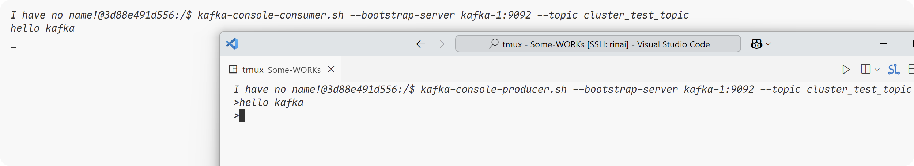

# Kafka

## 1. 基本知识

### 1.1 **前置知识**

1. topic表示一个类型/业务的数据的组
2. 为方便扩展，提高吞吐率，一个topic分为多个partition。
3. 配合分区的设计，提出消费者组的概念，每个消费者并行消费，同时，一个分区的数据，只能由一个消费者组的一个消费者来消费，除此之外，消费者和消费者相互独立，一个消费者消费之后，另一个消费者也可以消费这部分数据，在同一个消费者组里面，每个成员会被分配给不同的分区进行消费，在分区或者消费者变化的时候，也会对成员进行动态分配这些分区。
4. 为提高可用性，每个partition都会有若干个副本，分为leader(当前正在执行的partition)和follower(备用的partition)，当leader挂掉时，被选中的follower就会成为新的leader，跟redis的集群中的主从比较类似。
5. kafka的部分数据存储在zookeeper中，记录了正在运行的节点以及每个分区的leader选举等信息，值得一提的是，在kafka2.8.0之后，kafka就可以不依赖于zookeeper，独立进行运行了。

如果通过客户端自动创建的话，partition默认只有一个，而我们可以在命令行输入`kafka-topics.sh --topic create-test --bootstrap-server kafka-1:9092 --partitions 11 --create`来创建一个有11个分区的topic，而如果是想要更新已有的topic的partition大小，应该将`--create`修改为`--alter`，如果是在docker环境中，也可以在进入容器之后输入`kafka-topics.sh`来查看命令的参数。其他的比如`--describe`用于查看topic的详细信息，`--list`查看所有主题。

而我们也可以在命令行进行消费者和生产者的操作，生产者输入`kafka-console-producer.sh --bootstrap-server ip:port --topic [your topic]`，消费者则是将producer换成consumer即可，如下图所示：



除此之外，加上`--from-beginning`字段之后，consumer会加载所有的消息。

### 1.2 **生产者**

当生产者生产消息的时候，会经过producer->序列化器->拦截器(可选)->分区器->RecordAccumulator

分区器会将消息的数据进行分区，而对应的消息会被发到`RecordAccumulator`，此时还没有将数据发送，当数据积累到batch.size(默认16k)之后，Sender才会发送数据，当然，如果数据量比较少，滞留的时间超过`linger.ms`设定的时间，就会发送消息，但是默认`linger.ms`是0ms，也就是拿到消息就会立即发送数据，但实际可能因线程调度略有延迟。

当通过Sender发送数据时，会为每个Broker维护独立的请求队列。Kafka通过`max.in.flight.requests.per.connection`参数(默认5)控制每个Broker连接允许的最大未确认请求数。当某个Broker的`in-flight`请求数达到该限制时，针对该Broker的发送将暂停，直到收到对应的请求确认，之后才能继续发送新的请求。这个机制可以防止单个Broker堆积过多未确认请求，同时保证全局吞吐量，当然，如果等待的时间超过了`request.timeout.ms`(默认30s)，生产者则会认为请求失败，随后进行重试，当然应答有三个级别，0代表无需等待数据落盘就可以应答，1代表leader收到数据就可以应答，-1代表leader和follower全都同步完毕之后，才可以应答，另外，在底层链路中，我们发送请求会通过调用`selector`将消息发送给kafka集群。

#### **Go中的Kafka**

相较于kafka-go还是感觉sarama好用一点，虽然不支持context。

```go
func main() {
	brokers := []string{"localhost:29092", "localhost:29093", "localhost:29094"}
	topic := "cluster_test_topic"

	config := sarama.NewConfig()
	config.Producer.Return.Successes = true
	config.Producer.Partitioner = sarama.NewRoundRobinPartitioner

	producer, err := sarama.NewAsyncProducer(brokers, config)
	if err != nil {
		log.Fatalf("Failed to start Kafka async producer: %v", err)
	}
	defer producer.Close()

	// 监听成功和失败的消息
	go func() {
		for msg := range producer.Successes() {
			fmt.Printf("Message sent successfully: topic:%s partition:%d offset:%d\n", msg.Topic, msg.Partition, msg.Offset)
		}
	}()

	go func() {
		for err := range producer.Errors() {
			fmt.Printf("Failed to send message: %v\n", err)
		}
	}()
	wg := sync.WaitGroup{}
	wg.Add(1000000)
	// 发送消息
	for i := 0; i < 1000; i++ {
		go func() {
			for j := 0; j < 1000; j++ {
				msg := &sarama.ProducerMessage{
					Topic: topic,
					Value: sarama.StringEncoder(fmt.Sprintf("Hello Kafka!! My id is %d", i)),
				}
				producer.Input() <- msg
				defer wg.Done()
			}
		}()
	}
	wg.Wait()
}
```

这里是一个简单的go的生产者客户端，可以向kafka发送异步的发送消息(取决于`sarama.NewAsyncProducer`这一方法，如果需要同步调用，则需要做一些修改)，同时我们在启动生产者客户端的程序时，在终端上会显示我们的partition，而且可以明显的看见不同的消息，被分到了不同的partition上面，下面来细说一下分区的好处

#### **分区(Partition)**

Partition是Topic的子集，如果一个topic只设置在一个broker(机器)上面，则在传输巨大的数据量的时候，多台机器的负载不均匀，可能会导致broker压力过大，造成**性能瓶颈**，而且该Broker一旦故障，所有数据都会不可用，**可靠性低**。

所以引入了partition，一个topic可以具有多个partition，而每个partition可以存放在不同的broker上面，实现 **数据分布式存储**，这样，只要将消息均匀的发送到不同的partition上面，就能够实现broker的负载均衡，与此同时，默认情况下，如果消息带有key字段，那么kafka会根据这个key计算哈希值，将其放到合适的分区上面。

值得一提的是，和java客户端不同，go的Sarama客户端在不指定分区。并且不设定Key的时候，会采取轮询的策略来选择分区，而java客户端则是使用黏性分区来选择分区。

但是，我们在Sarama客户端，也可以自定义分区器，事实上，只需要自定义一个合乎规范的函数签名然后实现一个分区器的接口即可：
```go
// 自定义分区器
type MyPartitioner struct {
	topic          string
}

var _ sarama.Partitioner = (*MyPartitioner)(nil)

// Partition implements sarama.Partitioner.
func (m *MyPartitioner) Partition(message *sarama.ProducerMessage, numPartitions int32) (int32, error) {
	return 0, nil
}

// RequiresConsistency implements sarama.Partitioner.
func (m *MyPartitioner) RequiresConsistency() bool {
	return true
}
// 自定义构造函数
func NewMyPartitioner(topic string) sarama.Partitioner {
	return &MyPartitioner{
		topic: topic,
	}
}

func main() {
	...
	config.Producer.Partitioner = NewMyPartitioner
	...
}

```

另外，我们之前提到了拦截器，拦截器事实上就是在发送消息之前要处理的事情，我们可以在Sarama客户端中通过实现`func (m *MyInterceptor) OnSend(*sarama.ProducerMessage)`这个方法来实现自定义的拦截器！而使用这个拦截器，

具体操作如下：

```go
type MyInterceptor struct{}

func (m *MyInterceptor) OnSend(*sarama.ProducerMessage) {
	fmt.Println("OnSend")
}

var _ sarama.ProducerInterceptor = (*MyInterceptor)(nil)

func main() {
	...
	config.Producer.Interceptors = []sarama.ProducerInterceptor{
		&MyInterceptor{},
	}
	...
}
```

至于序列化器，就是把我们的消息转换成能够在kafka中进行传输的字节流，具体的逻辑在这里：

```go
		msg := &sarama.ProducerMessage{
			Topic: topic,
			Value: sarama.StringEncoder(fmt.Sprintf("Hello Kafka!! My id is %d", i)),
			Key:   sarama.StringEncoder(fmt.Sprintf("key-%d", i)),
		}
```

这里将我们的消息转换成kafka能够识别的数据，然后将其发送。

**生产者如何提高吞吐量？**

我们之前提过，kafka默认的`linger.ms`设置的是0，也就是收到数据立刻发送，但是，这样虽然能实时发送信息，但是这种模式就像一个大货车一次拉一小点东西，吞吐量肯定是不够的，所以我们可以对`batch.size`和`linger.ms`这两个参数进行调整来提高吞吐量，同时也可以进行压缩，来节省内存，从而提高吞吐量，而在go-Sarama客户端，对应producer的config可以这样调整：

```go
	config.Producer.Flush.Bytes = 16 * 1024
	config.Producer.Flush.Frequency = time.Millisecond * 50
	config.Producer.CompressionLevel = int(sarama.CompressionSnappy)
```

虽然java中可以设置缓冲区的大小，但是Sarama貌似没有这个选项。

#### **数据**

我们的数据应答类型在Sarama中是这样设置的(此处以-1为例)：

```go
config.Producer.RequiredAcks = sarama.WaitForAll
```

而重试类型默认为int最大值，我们可以通过下面的方式来设置：

```go
config.Producer.Retry.Max = 10
```

- **可靠性**：

  之前提到过，我们的应答ACK有三种模式：`0`，不需要等数据落盘，直接应答，`1`，当leader的数据落盘之后，不需要等待follower同步即可应答，`-1`则是需要等待leader和follower都已经同步完毕，才进行应答。

  - **0**：当消息发送出去，不等待kafka的相应，就认为信息已经完成，此时如果leader挂掉或者在数据落盘过程中挂掉了，那么相对应的数据也没有了，此时就一定会导致数据丢失，是最不可靠的。

  - **1**：此时leader已经将消息写入到本地，在此之前，如果leader挂掉了，发送方也会认为超时，然后重新发送，所以此时比上一种更加可靠，但是如果在同步的时候，leader挂掉了，也会造成数据丢失，允许丢失个别数据，如传输普通日志。

  - **-1**：此时会等待leader和所有的follower同步，才会返回ack信息，但是，缺点是如果一个follower挂掉了，就会导致整个partition重试，适用于对可靠性要求高地场景。

    **怎么解决这个问题呢？**

    **至少一次(At-Least-Once)**，事实上，Leader维护了一个动态的`in-sync replica set`表示和leader维持同步的follower集合，如果follower长时间不向leader申请通信或者同步请求，就会被leader踢出ISR，超时时间由`replica.lag.time.max.ms`设定，默认30s，这样就能一定程度地解决这个问题，可以类比为心跳机制。

    但是如果所有的follower都挂掉了，事实上，也就和**1**模式没有区别了，所以我们数据完全可靠的条件是：ack级别-1，分区副本大于等于2，ISR最小应答副本大于等于2。

    但与此同时还有一个问题就是**数据重复问题**，就是当所有节点都已经同步完成，但是恰好在应答的那一刻挂掉了，然后没有受到消息，生产者又发送一次数据，此时会发送到新的leader上，造成数据重复。
    


- **数据重复问题**

  **精确一次(Exactly-Once)**上面提到了，我们的**-1**模式可以保证数据不丢失，但是不保证不重复，而**1**模式可以保证数据不重复，而不能保证数据不丢失。而Kafka通过引入了**幂等性**和**事务**这两个特性。

  - **幂等性**：通过PID，Partition，SeqNumber来判断当前的消息是否重复，PID就是生产者的ID，而Partition代表分区号，SeqNumber单调递增，所以幂等性只能保证单分区单会话内不重复，如果遇见一个这些部分重复的，就会自动忽视这些消息，幂等性默认是开启的，但是仅仅只能在一个会话中保证，如果传输过程中挂掉，又重新启动了，怎么办？

    ```go
    config.Producer.Idempotent = true
    ```

  - **事务**：开启事务，必须要开启幂等性，由于需要保持不同会话，能够保持状态，所以我们还需要一个事务id，在发送信息时，需要先标注好事务的id，以保证不同会话的同一个消息的一致性。为了保持事务的状态，Kafka中还存在一个特殊的Topic，这个Topic中默认50个分区，将所有的事务保存到磁盘中，通过计算事务id的哈希值，我们可以找到对应的事务，并且由对应的**事务协调器**负责这个事务(一一对应)，这样即便客户端挂掉，重启之后也能继续处理未完成的事务，或者回滚事务，保证数据一致性。

    事务底层依赖于幂等性，即便如此，当producer重启后，即便PID不同，Kafka也能根据事务ID来识别消息是否相同。除此之外，Sarama客户端使用事务的流程如下：

    ```go
    func main() {
    	defer func() {
    		if err := recover(); err != nil {
    			color.Red("Error: %v", err)
    		}
    	}()
    	brokers := []string{"localhost:29092", "localhost:29093", "localhost:29094"}
    	topic := "cluster_test_topic"
    
    	config := sarama.NewConfig()
    	config.Producer.Return.Successes = true
    	config.Producer.RequiredAcks = sarama.WaitForAll
    	config.Producer.Retry.Max = 10
    	config.Producer.Partitioner = sarama.NewRoundRobinPartitioner
    	config.Producer.Idempotent = true
    	config.Net.MaxOpenRequests = 1
    	config.Producer.Transaction.ID = "my-transaction-id"
    	producer, err := sarama.NewAsyncProducer(brokers, config)
    	if err != nil {
    		log.Fatalln("Failed to start Sarama producer:", err)
    	}
    	defer producer.Close()
    
    	go func() {
    		for range producer.Successes() {
    			color.Green("Message delivered successfully")
    		}
    	}()
    	go func() {
    		for err := range producer.Errors() {
    			panic(err)
    		}
    	}()
    
    	producer.BeginTxn()
    	for i := 0; i < 100000; i++ {
    		msg := &sarama.ProducerMessage{
    			Topic: topic,
    			Value: sarama.StringEncoder("Hello kafka World!"),
    		}
    		producer.Input() <- msg
    	}
    	producer.CommitTxn()
    }
    ```

- 数据有序：在单个分区里面，数据是有序的，但是如果消费多个分区的数据，则无法保证有序。

- 数据乱序：之前提过，broker最多能够缓存五个请求，比如，当第三个请求失败，但是第四个请求成功了，此时就会造成乱序，有一种解决方案是将`max.in,flight.request.per.connection`设置为1，表示最多只能缓存一个请求，但是效率低下，但是如果启动幂等性的话，这个值就可以设置小于等于5，这就可以保证最近五个请求不乱序了，因为我们知道幂等性有一个参数是序号，所以能够解决乱序的问题。

#### **Broker**

zookeeper存储的kafka相关信息：

1. 记录有哪些服务器。
2. 记录每一个主题的leader以及ISR。
3. 辅助leader选举的controller。

在每个kafka实例启动后，都会向zookeeper注册broker，随后开始选择controller，按照先来后到的原则，谁先进行注册，哪个broker就会被选举为controller。

**Controller是什么？**controller是一个特殊的broker，一个集群中只有一个controller，由zookeeper辅助选举，如果当前controller宕机，kafka通过zookeeper监控controller的状态，此时，zookeeper会重新辅助选举新的controller。

同时controller负责监听brokers的节点变化，负责每个分区partition的leader的选举，每次某个broker宕机或者加入时，都会进行重新选举，在选举一个新的leader之后，Controller就会将这些信息上传到zookeeper，此时，还会将这些信息同步给其他节点，以便于controller挂掉之后，其他节点可以随时进行选举新的controller。

他还负责维护分区副本的管理，确保同步机制正常运行，维护kafka元数据，包括主题分区副本等信息，也负责处理topic和partition的创建删除和修改，同时，由于Controller仅仅负责管理，所以他的变更并不会影响到集群的正常运行，但是频繁的变更会影响kafka的性能。

在我们的生产者向其中发送信息的时候，follower会同步leader的信息，底层采用的是log的方式存储这些信息，log的底层说segment(以1个G为单位)，为了实现快速查找，里面还有index索引的概念，利用索引来进行检索。

**节点的服役与退役**，在我们的节点服役和退役的时候，partition并不会自动的进行调整，而是需要我们手动进行负载均衡，具体步骤如下

1. 首先需要在容器内创建一个`topics.json`文件，输入以下内容，但是通常容器内置没有文本编辑器，这个时候通过echo命令写入就可以了。

   ```json
   {
     "topics": [
       {"topic": "cluster_test_topic"} 
     ],
     "version": 1
   }
   ```

2. 随后执行`kafka-reassign-partitions.sh --bootstrap-server kafka-1:9092 --topics-to-move-json-file topics.json --broker-list "1,2,3" --generate`，相关参数可能需要根据实际情况修改，然后终端就会输出，当然，这里的kafka仅仅是提供了一种分配方法，实际上是可以自定义的。

   ```json
   {
     "version": 1,
     "partitions": [
       {"topic": "cluster_test_topic", "partition": 0, "replicas": [1], "log_dirs": ["any"]},
       {"topic": "cluster_test_topic", "partition": 1, "replicas": [2], "log_dirs": ["any"]},
       {"topic": "cluster_test_topic", "partition": 2, "replicas": [3], "log_dirs": ["any"]},
       {"topic": "cluster_test_topic", "partition": 3, "replicas": [1], "log_dirs": ["any"]},
       {"topic": "cluster_test_topic", "partition": 4, "replicas": [2], "log_dirs": ["any"]},
       {"topic": "cluster_test_topic", "partition": 5, "replicas": [3], "log_dirs": ["any"]},
       {"topic": "cluster_test_topic", "partition": 6, "replicas": [1], "log_dirs": ["any"]},
       {"topic": "cluster_test_topic", "partition": 7, "replicas": [2], "log_dirs": ["any"]},
       {"topic": "cluster_test_topic", "partition": 8, "replicas": [3], "log_dirs": ["any"]},
       {"topic": "cluster_test_topic", "partition": 9, "replicas": [1], "log_dirs": ["any"]},
       {"topic": "cluster_test_topic", "partition": 10, "replicas": [2], "log_dirs": ["any"]},
       {"topic": "cluster_test_topic", "partition": 11, "replicas": [3], "log_dirs": ["any"]}
     ]
   }
   ```

   形如这样的信息，将其echo到`reassign.json`中即可。

3. 随后执行`kafka-reassign-partitions.sh --bootstrap-server kafka-1:9092 --reassignment-json-file reassign.json --execute`命令执行分配。

4. 最后`kafka-reassign-partitions.sh --bootstrap-server kafka-1:9092 --reassignment-json-file reassign.json --verify`查看，如果所有分区都已经被正确分配，那么就算完成了！

   这里如果是新增节点的话，肯定需要在一开始就新增节点，但是如果是退役节点的话，一般是在分配完成之后进行退役。

**除此之外，还需要提到副本的问题**，副本是什么？副本就是一个分区partition的备份，一个partition会有leader和follower，当leader挂掉的时候，我们就会选举一个副本成为leader，这样就保证了高可用性，但是副本不宜过多，当我们副本过多，主从同步就需要更多的时间和磁盘资源来继续你同步，并且占用的空间大小也会增大，增加了系统资源的损耗和延迟，而当我们使用`waitforall`级别的可靠性，延迟就会更加明显。

我们第一次手动分配分区的时候，如果没有执行副本数量，那么就不会分配副本！

所以我们需要在创建之初就指定副本数量`kafka-topics.sh --bootstrap-server kafka-1:9092 --create --topic cluster_test_topic --partitions 12 --replication-factor 3`,当然，如果在创建的时候忘记了，也没关系，步骤和重新分配分区的流程是一样的，区别就是在第二步的时候，我们可以将kafka给定的json自定义；

```json
{
    "version": 1,
    "partitions": [
        {"topic": "cluster_test_topic", "partition": 0, "replicas": [1, 2, 3], "log_dirs": ["any", "any", "any"]},
        {"topic": "cluster_test_topic", "partition": 1, "replicas": [2, 3, 1], "log_dirs": ["any", "any", "any"]},
        {"topic": "cluster_test_topic", "partition": 2, "replicas": [3, 1, 2], "log_dirs": ["any", "any", "any"]},
        {"topic": "cluster_test_topic", "partition": 3, "replicas": [1, 2, 3], "log_dirs": ["any", "any", "any"]},
        {"topic": "cluster_test_topic", "partition": 4, "replicas": [2, 3, 1], "log_dirs": ["any", "any", "any"]},
        {"topic": "cluster_test_topic", "partition": 5, "replicas": [3, 1, 2], "log_dirs": ["any", "any", "any"]},
        {"topic": "cluster_test_topic", "partition": 6, "replicas": [1, 2, 3], "log_dirs": ["any", "any", "any"]},
        {"topic": "cluster_test_topic", "partition": 7, "replicas": [2, 3, 1], "log_dirs": ["any", "any", "any"]},
        {"topic": "cluster_test_topic", "partition": 8, "replicas": [3, 1, 2], "log_dirs": ["any", "any", "any"]},
        {"topic": "cluster_test_topic", "partition": 9, "replicas": [1, 2, 3], "log_dirs": ["any", "any", "any"]},
        {"topic": "cluster_test_topic", "partition": 10, "replicas": [2, 3, 1], "log_dirs": ["any", "any", "any"]},
        {"topic": "cluster_test_topic", "partition": 11, "replicas": [3, 1, 2], "log_dirs": ["any", "any", "any"]}
    ]
}
```

将replica的参数进行修改，这样就可以正确的分配副本了！然后execute，就完成了。

既然提到了副本，我们还需要引入一下leader选举的一些知识，一般来说，我们手动通过命令行分配副本或者partition，会默认采取负载均衡的策略，但是如果是在一些节点宕掉的时候，然后进行选举，就会采取抢占式的选举leader，这就可能会导致某一个broker负载过大，broker集群的负载不均衡，而我们可以通过重新执行replica的再分配或者定期执行`kafka-leader-election.sh --bootstrap-server kafka-1:9092 --election-type PREFERRED --all-topic-partitions`这个命令来实现负载均衡，同时这个命令也可以用于重启后恢复原本的分区状态；另外，还有几个参数可以解决这个问题：`auto.leader.rebalance.enable`默认为true，自动平衡，`leader.imbalance.per.broker.percentage`表示每个broker允许的不平衡的leader的比率，超出就会触发平衡机制，`leader.imbalance.check.interval.seconds`检查leader是否负载平衡的间隔时间。

另外，我们的生产者只会将数据发送给Leader，然后follower会与leader发送同步请求，如果长时间follower没有向leader通信或者发送同步请求，就会被踢出ISR，这个时间阈值参数是`replica.lag.time.max.ms`，而OSR表示同步过程中延迟过多的副本，replicas表示所有存储副本的节点，而ISR表示所有保持同步的节点，也就是说，如果机器挂掉，ISR会将这个节点移除，但是replicas不会！

**follower故障**：在leader和follower同步的时候，LEO是每个副本的最后一个offset + 1，而HW则是所有副本中最小的LEO，也就是说，所有的Follower的LEO虽然不一定一样，但是HW是一样的，HW也就是(High WaterMark)高水位线，当其中一个follower挂掉之后，会被踢出ISR，之后，其他的follower和leader会继续同步，维护一个HW，当之后，follower恢复了，此时会舍去挂掉的时候记录的HW之后的数据，然后重新开始同步，直到达到HW，就可以再次加入ISR。

**leader故障**：leader挂掉之后，会重新选拔一个新的leader，同时，leader和follower的数据，超过HW的部分都会被舍去，保证数据一致性，但是无法保证数据不丢失或者不重复。

**文件存储**

- Topic是逻辑上的概念，而Partition是物理上的概念，每个partition都对应一个log文件，其中存储的是生产者生产的数据，但是为了防止log文件过大，导致搜索效率低，每个partition的log又被分成了多个segment，单位为1个G，每个segment包括.index(索引),.log(存储数据)，.timeindex文件(时间戳索引，辅助定期删除)，值得注意的是，index并不是为每一条数据都设置了索引，而是使用了**稀疏索引**，默认每写入4kb数据，会往index文件写入一条索引，可以通过`log.index.interval.bytes`修改，同时index中保存的offset为相对的offset，这样既可以执行查找的功能，也可以节省内存，防止offset过大。
- kafka中的日志默认保存时间是七天，七天一到，就可以通过`delete`或者`compact`策略进行日志清理，默认是基于时间的**删除delete**策略，以segment所有记录中最大时间戳作为该文件的时间戳，以此为基准执行删除。另一种是基于大小的删除策略，超过设置的所有日志的总大小，删除最早的segment，类似LRU机制；而**压缩日志compact**策略则是将所有的Key相同的数据，只保留最新的Key，这样来压缩，类似redis的AOF重写。
- Kafka能做到高效的读写数据，原因如下：
  1. 本身为分布式集群，可以采取分区技术，并行度高。
  2. 读数据采取**稀疏索引**，可以快速定位要消费的数据。
  3. 顺序写磁盘，生产者生产数据以追加写的形式写入到log文件，相较于随机写，顺序写之所以快。是因为省去了大量磁头寻址的时间。
  4. Kafka采取了页缓存和零拷贝技术，**页缓存**就是生产者将数据发送时，先将数据写道内存页中，然后由操作系统内核决定何时刷新到磁盘，这样就不会在写入的时候触发磁盘I/O，同时，如果consumer读取数据，会先从页缓存中找，找不到再去磁盘中寻找，就减少了频繁的磁盘I/O，提高了读写效率；**零拷贝**，Kafka直接调用`sendfile()`让数据从页缓存直接发送到TCP socket，而不需要走用户态将数据交给应用层，再通过向下传输将数据发送给TCP socket，简单来说，零拷贝允许数据直接在内核空间传递，而减少了用户态和内核态数据的来回拷贝和切换，提高了读写效率。

### 1.3 **消费者**

#### **Kafka的消费方式是什么？**

一般来说，消息队列有两种消费方式，pull拉模式和push推模式，而kafka采取的是拉模式

**拉取**就是consumer主动从broker中拉取数据，这样，每个consumer可以根据自己的处理能力去拉去相应数据量大小的数据，保证了每个consumer的消费能力被充分利用

而**推模式**，为什么kafka不采取这种形式？因为推模式中，消息的发送速率由broker决定，很难适应所有消费者的消费速率，比如如果推送速度过低，由于消费者消费能力参差不齐，就会导致部分consumer的能力没法充分利用，但是如果推送速度稍微大一点，一些consumer由来不及处理消息。

但是即便如此，**拉模式**依旧有自己的缺点，当kafka没有数据的时候，消费者可能会陷入循环，一直返回空数据。

#### **工作流程**

每个独立的消费者都可以去消费数据，并且可以重复消费其他消费者消费的数据，**但是**，如果这两个消费者位列同一个消费者组中，则这个消费者组会被视为一个"消费者"，通俗来将，就是消费者组只能对同一份数据消费一次，也就是说，同一份数据不能被消费者组中的消费者消费两次，并且，每个消费者都会被分配一个partition，让他们去特定的partition去消费数据，同一个消费者组中的两个消费者不能同时消费一个partition。

另外，为防止kafka节点或者消费者挂掉后，消费者不知道上一次消费某个partition消费哪里了，最新版的kafka中还维护了一个`__consumer_offsets`来保存消费者消费到的数据的偏移量，而老版本的kafka将这个信息维护在zookeeper中，而维护在kafka主题中，方便管理维护，也减少了通信的时间消耗。

形成一个消费者组的条件是：消费者的GroupID相同，当然如果partition的数量超过了消费者组中的消费者的数量，被空出来的消费者不会参与消费。

**消费者是如何实现分区的分配的？**首先有一个coordinator，用来辅助消费者的初始化和分区的分配。最开始会从`__consumer_offsets`中，通过消费者组的id进行哈希计算，选择一个partition来存储消费者的offset数据，而负责管理这个partition的broker，也就成为了这个消费者组的coordinator，而选举完成之后，所有的consumer都会向这个coordinator发送JoinGroup请求，而coordinator又会从这些consumer中选举一个作为消费者组的leader，此后，coordinator会把要消费的topic情况发送给leader消费者，随后leader会制定一个消费方案，这里就涉及到一个**分区分配的策略**，随后就将分配的方案发送给每个consumer，然后进行消费，而且每个消费者都会定期和coordinator保持心跳机制，一旦超时，就会被移除。并且会触发**再平衡**(重新分配消费任务)。(当某个消费者消费过慢，也会触发)

**消费者组是怎么消费的？**

首先我们需要创建一个用于访问kafka集群的消费者客户端，这个客户端当然也有config配置，和生产者客户端类似，有每批次的拉取大小，拉取数据的超时时间，每批次最大拉取大小的信息，当拉取消息时，在kafka端会返回数据并放入一个拉取队列(缓冲区)中，随后经过拦截器和反序列化器，最终将消息返回到客户端，当然，处理完消息后，还需要提交offset偏移量(分为手动和自动)，告诉kafka集群当前消息已经被该消费者组消费。

下面是go-Sarama消费者客户端代码：

```go
// ConsumerGroupHandler 实现了 ConsumerGroupHandler 接口
type ConsumerGroupHandler struct{}

// Cleanup implements sarama.ConsumerGroupHandler.
func (h *ConsumerGroupHandler) Cleanup(sarama.ConsumerGroupSession) error {
	color.Green("消费者关闭！\n")
	return nil
}

// Setup implements sarama.ConsumerGroupHandler.
func (h *ConsumerGroupHandler) Setup(sarama.ConsumerGroupSession) error {
	color.Green("消费者启动！\n")
	return nil
}

// 消费消息并打印
func (h *ConsumerGroupHandler) ConsumeClaim(sess sarama.ConsumerGroupSession, claim sarama.ConsumerGroupClaim) error {
	for message := range claim.Messages() {
		fmt.Printf("Consumed message: %s\n", string(message.Value))
		// 手动提交偏移量
		sess.MarkMessage(message, "")
       sess.Commit()
	}
	return nil
}

var _ sarama.ConsumerGroupHandler = (*ConsumerGroupHandler)(nil)

func main() {
	defer func() {
		if err := recover(); err != nil {
			color.Red("Error: %v", err)
		}
	}()
	brokers := []string{"localhost:29092", "localhost:29093", "localhost:29094"}
	topic := "cluster_test_topic"

	config := sarama.NewConfig()
	config.Consumer.Return.Errors = true
    //保持偏移量是最新的位置
	config.Consumer.Offsets.Initial = sarama.OffsetNewest
	//初始化消费者组
	ConsumerGroup, err := sarama.NewConsumerGroup(brokers, "my-group", config)
	if err != nil {
		panic(err)
	}
    //此处采取for循环是因为在kafka的rebalance之后，consume会返回错误导致无法继续消费
    //所以此处需要采取循环。
	go func() {
		for {
            //指定topic
			err = ConsumerGroup.Consume(context.Background(), []string{topic}, &ConsumerGroupHandler{})
			if err != nil {
				color.Red("Error from consumer: %v", err)
			}
		}
	}()
	defer ConsumerGroup.Close()
	select {}
}
```

而如果想要消费特定分区，则不能采取consumerGroup的形式，而是单独使用Consumer，然后调用ConsumePartition，同样的，生产者也可以配置字段单独向一个partition发送信息。

#### **分区策略**

kafka中自带的分区策略有Range，Roundrobin，Sticky，CooperativeSticky，而Kafka可以同时使用多个分区分配策略，在Sarama客户但可以通过调整`config.Consumer.Group.Rebalance.Strategy`来修改采取的分区策略，默认是`Range+CooperativeSticky`

- **Range**：范围分配策略，针对于**每个主题**对每个分区和每个消费者进行编号排序，然后用消费者去对应每一个partition，总体来说就是(四个分区，三个消费者)：

  > Partition1 <-> Consumer1
  >
  > Partition2 <-> Consumer2
  >
  > Partition3 <-> Consumer3
  >
  > Partition4 <-> Consumer1

  虽然只针对一个topic而言，编号较低的Consumer可能消耗不大，但是如果对于上百个topic而言，低位的Consumer就多承担上百个partition，容易造成数据倾斜！

- **RoundRobin**：轮询分配策略，roundrobin是针对于所有的消费者订阅的topic而言，将所有的partition和consumer排序，然后按照range的轮询方法将partition分配给消费者。、

  以上两种在Rebalance时，都会重新分配所有的分区。

- **Sticky**：粘性分配策略，随机且均匀，初始分配时尽量负载均衡，但是在重分配时，会尽可能保留原有的分区分配，而仅仅调整部分的分区分配，这样可以减少分区迁移的开销，但是实现比较复杂。

#### **offset**

每个消费者组为了记录每个partition消费到了什么位置，都需要记录offset的位置，而这个offset在旧版本的kafka是存储在zookeeper里面的，在新版本的Kafka中，是存在`__Conustmer_offsets`的主题中的，里面有50个partition，而在这个topic中，是采取key-value的格式存储offset的值，key是groupid + topic +分区号，value对应的则是offset，同时，每隔一段时间，kafka内部还对这个topic进行compact压缩，这样能够保存最新的数据。

- **自动保存**：kafka提供了自动提交offset的功能，以便于我们能够专注于自己的业务逻辑，配置参数为：`enable.auto.commit`以及`auto.commit.interval.ms`表示是否开启自动提交功能，自动提交offset的时间间隔，默认开启和5s，在Sarama客户端中，对应的字段为：

  ```  go
  config.Consumer.Offsets.AutoCommit.Enable
  config.Consumer.Offsets.AutoCommit.Interval
  ```

  虽然很方便，但是缺点很明显，如果在还没有提交的时候，但是此时消费者挂了，就会导致重复消费！因此，我们的kafka也提供了手动提交的功能。

- **手动提交**：手动提交又分为同步和异步，通过手动提交，我们能够更好地控制offset的提交，通常我们是采取异步提交的方式来手动提交offset，但是Sarama库似乎并没有直接封装异步提交的API，需要我们去手动实现，而kafka-go这个包貌似是支持的。

- **指定Offset**：在Sarama中，可以通过设置`config.Consumer.Offsets.Initial`这个字段值，来设置我们此次消费的起始位置，默认是从最新的offset进行消费的。当然，此处只能指定分区和指定offset才能够使用，既然是指定offset，当然也可以通过**执行时间戳**来进行查找，在Sarama中，我们需要通过`sarama.NewClient(brokers, config)`创建一个client，然后调用`client.GetOffset(topic, partition, targetTime)`来获取当前时间戳的offset，随后执行执行消费操作,当然你也可以通过遍历topic的所有分区来实现在某一时间段之后的所有消息的消费。

- **重复消费和漏消费**：一般来说，自动提交offset会引起重复消费，而在自动提交的间隔期间，consumer挂掉了，重启就会出现重复消费的情况，同时，手动提交也可能引起重复消费，比如说，提交offset的时候，网络故障或者kafka宕机了，kafka就无法接受提交的offset，就会导致重复消费，而漏消费则是在消费消息之前提交了offset，如果在处理业务的时候崩溃，那么此时offset已经提交，就无法重新进行笑飞了，造成漏消费的情况，而不管自动提交还是手动提交都会有这种情况，所以一般来说是采取先处理完业务，再手动提交的方式。

  而一般来说，我们的解决方案就是采取**事务**的方式去处理这个问题，当然，这也要求下游的消费者，如MySQL，支持事务，否则是做不到事物的回滚的

- **消息积压**：消息积压就是说，消费的速度小于生产的速度，而我们在kafka中的数据滞留过久，就会被删除，所以我们需要考虑去提高消费者的消费能力：

  1. 消费能力不足，可以增加分区，同时增加消费者的数量
  2. 如果是数据处理不及时，可以提高每批次拉取消息的数量，批次拉取的数量过少，也会导致数据积压，同时我们在提高每批次拉取消息的数量的时候，也需要提高每批次拉取的数据大小。

### 1.4 **调优**

