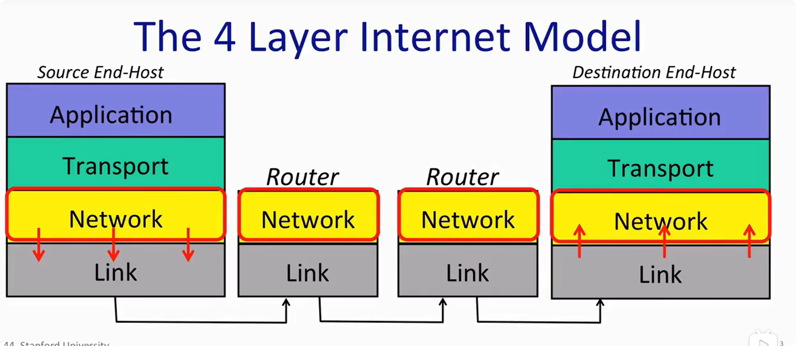

## CS144 - Lecture 1

由于没讲义，全看课了，系统性的总结有点难，记一些有趣的东西吧。

---

## 数据链路和网络层的传输

我们可以看见，对于发送方，我们的数据链路层为我们的网络层提供服务，在经过路由的时候，我们的路由的网络层会检查数据报的目的地址，然后根据目的地址决定下一跳的链路是怎么走的！直到到达目的地。而我们是如何决定的？我们的内核会维护一个路由表，它存在于内存之中，我们可以通过检索他来实现快速决定下一跳。而这一点，不仅对于主机，对于路由器也是一样的，路由器中实现了网络层和链路层，需要内存去维护路由表，也就是说，路由器甚至也是一个操作系统！

这里问了 gpt 一些子网的问题，如果国家不同，子网也会不同，经过的网关也会不同，数据的传输会经历什么？我们首先需要知道，网关分为很多层，子网也分为很多层，而计算机就是对应的叶子节点，一个网关对应了多个子节点，下面有子网关以及对应了多台计算机，全世界的计算机就相当于构成了一棵树，我们如果子网不同，在转发过程中就需要先转发到网关，如果依旧不在同一子网，就需要再转发到下一级网关，可以想象成 **小区->城市->省份->国家** 这几层结构。

同时，在看书的时候，我还看见过 ABC 类地址划分，后面又引出了 CIDR 类地址划分，更加灵活，可以按国家，然后国家按地区来分发这些 ip 。

引入另一个概念，**局域网**。

诸如云服务器，都是暴露在公网上面的，都独占一个公网 ip，所以可以直接访问，而比如学校，家庭，都是在局域网里面，通过网关与外部相连，这种情况下，外部请求没办法直接访问局域网，因为 NAT 就是这样，但是通过 NAT 我们可以直接访问外部，并且可以接受对方的返回信息，这里是通过 NAT 记录了映射实现的，当我们向外网发送请求，NAT 会将内网地址转换成公网地址作为源地址，然后发送出去，并且记录使用的公网的端口以及目的地址和端口，保证可以返回给正确的内网地址。

对于我们开在本地的虚拟机，如果使用 NAT 模式，就是在电脑内部又开了一个虚拟局域网，外部根本没办法访问你，除非你主动访问，所以还是这个没啥好担心的，我之前还怕 ip 直接写在 github 上面会被人攻击，专门去一个一个改。🤣

对于虚拟机另外两个常见的网络模式，桥接模式其实就是将你的虚拟机独立出去，去获取 ip，这样连着同一个 wifi，也就是你的同学也能够访问到你的虚拟机了。另一个仅主机模式，无法与外界通信，但是可以与主机通信，虽然完全隔离了，但是这种情况下没办法拉镜像，甚至 `git push` 都做不到，所以兼顾安全性和可用性，NAT 应该是最合适的。

另外一点，我们的 wifi 路由器的无线网络扮演了“线”的角色，我们局域网对应的 wifi 路由背后都会有 NAT，来实现与外部的通信，而我们连接 wifi 的时候，对应的 wifi 路由器会为你的主机分配 ip，也就是说，ip 仅仅是一个临时的 ip，并不具有持久性，随时都会变，但是对于局域网，我们并不需要持久的 ip，所以这是合理的，而我们的 wifi 路由器是如何分配的？我们的 wifi 路由器会实现 DCHP 动态主机配置协议，当你的主机没有 ip 的时候，会发送广播，而对应的路由器会为你分配一个临时的 ip 地址，当你断联，切换到另一个网络时，这个 ip 就会收回。而这个 DHCP 就相当于是你需要申请身份证，你有了身份证才可以进行通信。

除此之外，针对于我们的数据链路层在内核中还需要对网卡进行编程，如何做到对硬件编程？其实就是将硬件的一部分数据映射到了内核态的内存之中，通过对这部分特定内存进行读写，就可以实现对硬件进行编程了，诸如键盘，鼠标等设备，都是这样实现的。

说实话，看课之前，我看过《图解 tcp/ip》 和《图解 http》，里面涉及到的概念感觉还是不够清楚，对我来说不是很友好，果然，不愧是斯坦福，引入一些可以让我进一步思考的知识，我带着这些问题去查资料，问 ai，感觉很多东西都清晰起来，而且以前看书的时候感觉这些子网， NAT， DHCP 都挺无聊的，现在感觉还挺有意思的。

## 应用层浅析

承接上文，对于操作系统而言，传输层，网络层，数据链路层（除了硬件）都处于操作系统的内核部分，而应用层都位于用户态，是我们自己去编写的，常见的，有 http， webrtc， websocket， sse 都是应用层协议，一般的 web 开发库都会实现这些协议，比如 go 语言官方自带的 net/http 包就是实现了 http 协议。

我们的应用层实现的协议都是基于网络层实现的，换而言之，我们应用层实现的协议都会去调用网络层，也就是操作系统提供的系统调用接口 socket 套接字的 API，通过它我们可以基于 tcp 进行编程，也可以去实现一个应用层协议，甚至是————自定义你自己的应用层协议。这就是所谓的网络层为上层提供服务，其实就是调用的关系。

## 网络层

IP 被设计得很简单，他是不可靠，非连接的，但是他也有校验和机制，可以一定程度上进行检查，但是也只能检测 IP 头部，无法检验数据是否完整，但是他仍然会尽最大努力地传输数据。对于完整的数据监测，是传输层的任务了。