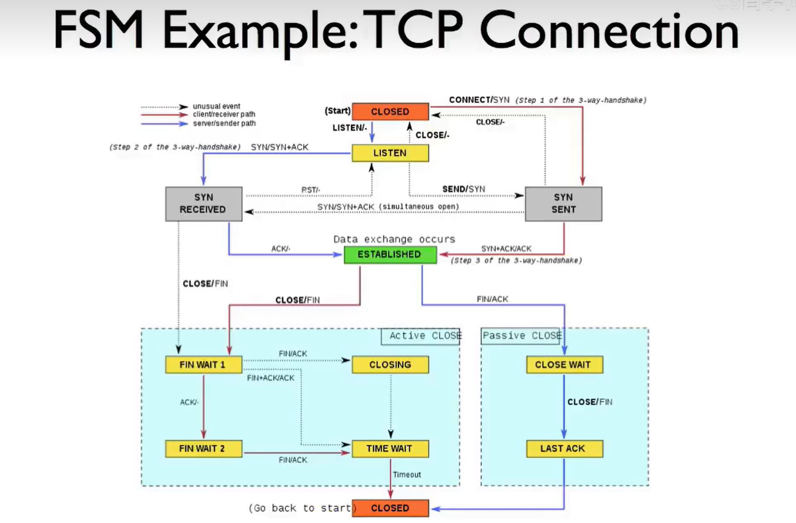
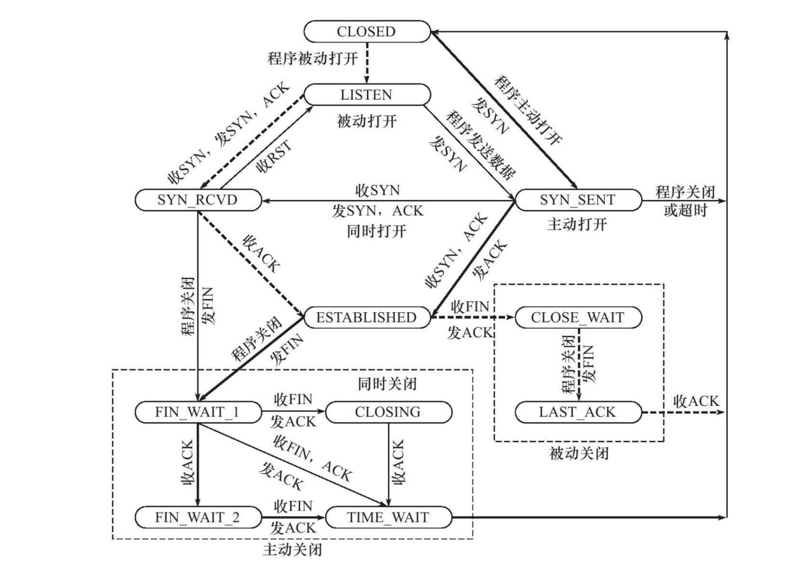
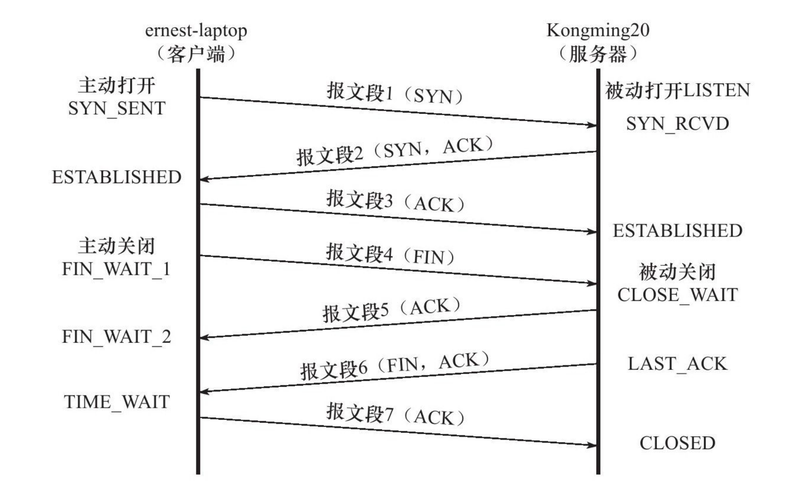

# CS144 - Lecture 1

## TCP

这里就简单讲了一下它的基本性质，没啥好说的

## UDP

提供不可靠的传输服务，我们的 DNS 服务和 DHCP 都是用的 UDP 协议。

对于 DNS 我们只是单纯地向 DNS 服务器发送域名，然后返回一个 IP，如果还需要建立 TCP 连接会很麻烦，但是如果使用 UDP 直接传输就很快，只需要简单的重传机制即可。DHCP当然也是这个原因，因为 DHCP 也是发送请求，然后给你分配一个 ip。

以前视频流音频流常使用 UDP 来传输，而现在使用 TCP 的更多，但是对于实时性要求比较高的，还是使用的 UDP。

## ICMP

这是一个有用的工具，比如在目标不可达或者重定向的时候，就会向发送方主机返回一些信息，以供我们可以知道发生了什么事情。当然，他被规定的很简单，他不会有重传机制，他会做的仅仅就是返回一个错误信息。比如我们之前使用过的 `traceroute` 以及 `ping` 都是利用 ICMP 实现的。

同时 ICMP 依赖于 IP 协议，他并没有独立的传输机制，所以传输的时候是封装在 IP 里面的。

## 校验和

把所有数据相加来验证数据没有损坏，但是可能出现两个段出错的数据相互抵消了。

值得注意的是，在 TCP 的校验和里面，其实除了 tcp 头部和报文，我们还需要将伪头部加入到计算之中，这个伪头部包含了源地址，目标 ip 以及协议号的内容，我们虽然会将它加入计算，但是并不会将他作为数据报发送出去，而是在目标主机的网络层从 ip 头部中提取信息，然后交给 tcp 进行计算。

## 循环冗余校验（CRC）

计算多项式的余数来判断数据没有损坏，比校验和准确。通常是在链路层使用 CRC，而 TCP/IP 使用校验和。	

## 消息认证码（mac）

利用算法从消息中提取信息出来并使用共享密钥进行处理然后附加在消息的后面，传输过去之后的时候，对方会提取 MAC，并且使用发送方和接收方才知道的共享密钥对信息再次处理，在计算出一个 MAC，如果不相同，则判断当前的信息已经受损或者已经被篡改（可以用于 TLS 传输层安全协议，即 https）

## TCP 的连接

关于 tcp 连接状态的状态转移，这里有三张图帮助我们直观的理解：

另一张更详细的图，摘自《 linux 高性能服务器编程》：

接下来一张图是我觉得最直观的,同样摘自《 linux 高性能服务器编程》：

## 端对端原则

