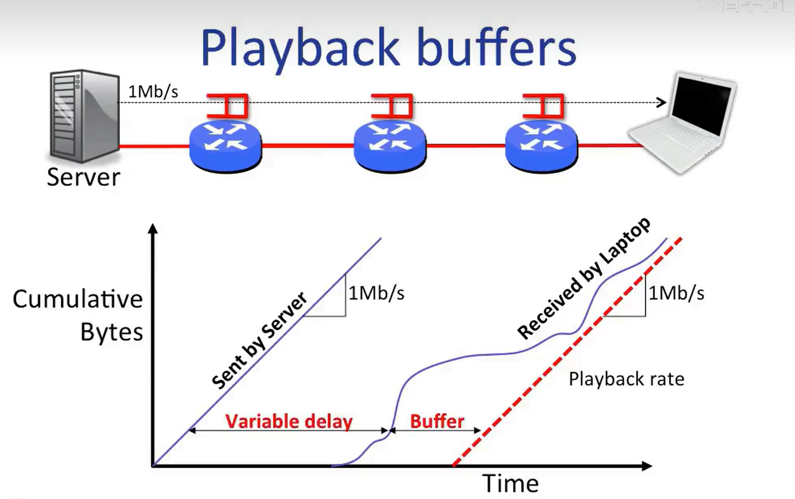

# CS144 - Lecture 3

这部分主要讲述分组交换。

## 电路交换

电路交换，被用在我们的电话网络中，基本特性是每个电话拥有自己私有，保证隔离的，独立的，端到端的数据速度，并且有三个阶段：

> 1. Dial，拨号，建立连接
> 2. communicate，通话
> 3. tear down，挂了，关闭连接

最早以前，我们的电话通过一根专用电线接入到一个交换中心，有专门的交换机操作员给你把电线接到你想要拨打电话的对象的电线。

更进一步，操作员没了，我们出现了一个自动电路交换机，为我们所有电话之间建立通路，通过拨号，我们可以连接到对方，而自动电路交换机会建立一个专用电路，并且维持连接状态，维持我们的通话，而当我们挂电话的时候，我们必须清除交换机上的所有状态。

如果我们直接将电路交换迁移到互联网上进行通信，我们会发现电路交换的状态管理令我们的网络管理起来很困难，并且对于每个请求，我们甚至都需要去维护一个电路交换机的映射状态，这非常浪费，如果我们建立了一个连接，但是我们实际上可以用它来观看直播，但事实上我们仅仅用来在远程主机打字，显然，利用效率非常低，所以我们的分组交换就来了。

## 分组交换

我们分组交换是借助路由器来进行数据的转发，而不需要依赖于一个专用电线，他是无状态的，不需要为每个连接维护连接，它可以为多个通信线路服务，也就是说，我们可以高效的利用这些链路，并且对于大量的数据报同时涌入路由，我们也会有足够的空间去缓存他们。 

同时使用分组交换，我们的互联网能够更灵活。

对于分组交换，我们需要知道的是它的延迟会有什么决定：链路上的传播延迟，分组延迟以及在准备发送给下一个路由的处于缓冲区的排队的延迟。

针对于视频流，我们看番的时候通常都会有一个白条，这个白条是什么？因为我们的分组交换存在一定延迟，而排队延迟会导致很大的不确定性，所以我们客户端会从服务器接受数据并保持有一个缓冲区，用来应对传输时的速率波动导致的视频卡顿，这里有一张图：

我们看见的 buffer 就是所谓的视频缓冲区，而当黑线越过了虚线，我们在手机或者电脑上看见"视频正在缓冲中"之类的消息，此时，我们的数据报就需要缓冲一段时间才会继续加载视频。

所以我们的应用程序就是通过这样的方式来尽量以固定的速率向我们播放视频。